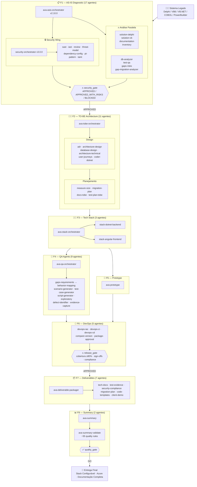

# AVA Fabric Agents

> **AVA Fabric Agents** — Pipeline de Migração Legado → **Stack Configurável** (.NET · Java · Python + Angular · React · Blazor)
>
> **55 agentes ativos** organizados em **8 fases sequenciais (F1→F8)** · _+ 4 DB engine skills_
>
> Avanade Migration Factory · Tecnologias suportadas: Delphi · VB6 · VB.NET · COBOL · PowerBuilder

---

## ◆ KPIs — Totalizadores por Fase

> ℹ︝ Contagens baseadas no **filesystem (2026-05-13)**. Wiki IMFAI (May 11, 2026): 44 agentes — desatualizado em F2 (wiki=8, filesystem=11).

| # | Fase | Agentes | Orquestradores | Sub-agentes | DB Skills | Artefato de Saída | Gate |
|---|---|:---:|:---:|:---:|:---:|---|---|
| F1 | 📋 AS-IS Diagnostic | **17** | 2 | 15 | 4 | AS-IS Master Report | `security_gate` |
| F2 | 🝛 TO-BE Architecture | **11** | 1 | 10 | — | TO-BE Blueprint | — |
| F3 | ⚙︝ Tech Stack | **3** | 1 | 2 | — | Código-fonte gerado | — |
| F4 | 🎨 Prototype | **1** | — | 1 | — | Protótipo navegável | — |
| F5 | 🧪 QA Agents | **9** | 1 | 8 | — | Evidências de teste | — |
| F6 | 📦 Deliverables | **7** | 1 | 6 | — | Pacote de entrega | — |
| F7 | 🚀 DevOps | **5** | — | 5 | — | Pipelines CI/CD + IaC | `release_gate` |
| F8 | 📊 Summary | **2** | 1 | 1 | — | HTML Report validado | `quality_gate` |
| | **TOTAL** | **55** | **7** | **48** | **4** | | **3 gates** |

---

> 🌿 **Modernização Parcial (Strangler Fig)**: para modernizar apenas um ou alguns bounded
> contexts sem executar o pipeline completo, consulte o
> [Guia de Modernização Parcial](docs/full-pipeline-guide.md#-moderniza%C3%A7%C3%A3o-parcial-strangler-fig-pattern).

## Stack — Totalmente Configurável

> **Não existe versão hardcodada.** Os agentes leem `tobe_stack` do `project-config.yaml` em runtime.

```yaml
# docs/architecture/ConfigStackDotNet.yaml — padrão de referência (editável por projeto)
tobe_stack:
  backend_language: "csharp"       # csharp | java | python | go
  backend_framework: "dotnet"      # dotnet | spring-boot | fastapi | etc.
  backend_version: "8.0"           # Qualquer versão LTS — agentes usam este valor
  frontend_framework: "angular"    # angular | react | blazor
  frontend_version: "17"
```

Cada projeto define sua stack em `projects/{project_name}/context/project-config.yaml` apontando para o config de referência. **Os agentes de F2 e F3 NUNCA hardcodam versões** — sempre leem `tobe_stack.backend_version`.

---

## Distribuição por Categoria

| Categoria | Qtd | Agentes |
|---|:---:|---|
| 🔵 Orquestradores | 7 | `ava-asis-orchestrator` · `ava-asis-security-orchestrator` · `ava-tobe-orchestrator` · `ava-stack-orchestrator` · `ava-qa-orchestrator` · `ava-deliverable-packager` · `ava-summary` |
| 🔷 Análise de Código AS-IS | 4 | `solution-delphi` · `solution-visualbasic` · `documentation` · `inventory` |
| 🗄 Dados & Qualidade AS-IS | 5 | `db-analyzer` · `test-qa` · `gaps-risks` · `gap-migration-analyzer` + **4 DB engine skills** |
| 🔒 Segurança AS-IS | 7 | `security-review` · `security-sast` · `security-iast` · `security-threat-model` · `security-dependency-config` · `security-pt-pattern` · `security-taint` |
| 🝛 Arquitetura TO-BE | 10 | `adr` · `architecture-design` · `database-design` · `architecture-technical` · `user-journeys` · `measure-size` · `migration-plan` · `docs-tobe` · `test-plan-tobe` · `coder-dotnet` |
| ⚙︝ Geração de Código | 2 | `stack-dotnet-backend` · `stack-angular-frontend` |
| 🧪 QA & Testes | 8 | `gaps-requirements` · `behavior-mapping` · `scenario-generator` · `test-case-generator` · `script-generator` · `exploratory` · `defect-identifier` · `evidence-capture` |
| 🚀 DevOps & Infra | 5 | `devops-iac` · `devops-ci` · `devops-cd` · `devops-compare-version` · `devops-package-approval` |
| 📦 Entregáveis | 6 | `deliverable-tech-docs` · `deliverable-test-evidence` · `deliverable-security-compliance` · `deliverable-migration-plan` · `deliverable-code-templates` · `deliverable-client-demo` |
| 📊 Consolidação | 1 | `ava-summary-validate` |

---

## Gates de Controle de Qualidade

3 gates bloqueiam o avanço entre fases críticas:

- `security_gate` (F1→F2): `APPROVED` \| `APPROVED_WITH_RISKS` \| **`BLOCKED`**
- `release_gate` (F6→F7): valida cobertura ≥80%, sign-offs e compliance
- `quality_gate` (F8→Entrega): audita ~55 regras no HTML final

---

## Diagrama do Pipeline



---

## Fluxo de Execução — Handoffs entre Fases

| Transição | Artefato de Handoff | Descrição |
|---|---|---|
| **INÝCIO → F1** | Sistema legado (código-fonte) | `ava-asis-orchestrator` (v2.10.0) dispara todas as análises AS-IS em paralelo via DAG event-driven: código, BD, inventário, testes e segurança. |
| **F1 → F2** | AS-IS Master Report | Relatório consolidado + `security_gate: APPROVED` entregue ao `ava-tobe-orchestrator`, que inicia o design TO-BE lendo `tobe_stack` do project-config. |
| **F2 → F3** | TO-BE Blueprint | Blueprint (C4, ADRs, DB Design, User Journeys, migration plan) dispara o `ava-stack-orchestrator`, que gera backend + frontend simultaneamente com a versão configurada. |
| **F3 → F4 + F5** | Código gerado (paralelo) | `ava-qa-orchestrator` (validação funcional, BDD, scripts) + `ava-prototype` (wireframes e demo). |
| **F4 + F5 → F6** | QA aprovado + Protótipo validado | DevOps: IaC Azure, pipelines CI/CD, deploy blue-green/canary, comparação legado × migrado, aprovação de pacotes. |
| **F6 → F7** | Pipeline CD aprovado | `ava-deliverable-packager` consolida: docs técnicos, evidências, compliance LGPD, plano executivo, templates e demo. |
| **F7 → F8** | Pacote de entrega completo | `ava-summary` gera HTML interativo Avanade. `ava-summary-validate` executa ~55 regras como gate final. |
| **F8 → ENTREGA** | Relatório final validado | Sistema migrado operacional na Azure, documentação completa, evidências de aceite e código-fonte transferido ao cliente. |

---

## Catálogo Completo de Agentes

### 📋 F1 — AS-IS Diagnostic (17 agentes ativos)

| Agente | Arquivo | Versão | Papel |
|---|---|:---:|---|
| `ava-asis-orchestrator` | `orchestrator-asis.md` | **2.10.0** | Orquestrador F1 — DAG event-driven |
| `ava-asis-solution-delphi` | `solution-delphi.md` | 1.3.0 | Análise Delphi/VCL |
| `ava-asis-solution-visualbasic` | `solution-vb.md` | 1.3.0 | Análise VB6/VB.NET |
| `ava-asis-documentation` | `documentation-asis.md` | 1.4.0 | Documentação Funcional |
| `ava-asis-inventory` | `inventory-asis.md` | 1.3.0 | Métricas e Inventário |
| `ava-asis-db-analyzer` | `db-analyzer/db-analyzer.md` | 1.3.0 | Banco de Dados |
| `ava-asis-gaps-risks` | `gaps-risks-asis.md` | 1.3.0 | Gestão de Riscos |
| `ava-asis-gap-migration-analyzer` | `gap-migration-analyzer.md` | 1.1.0 | GAP Analysis |
| `ava-asis-security-orchestrator` | `security/security-orchestrator-asis.md` | **3.0.0** | Orquestrador Security |
| `ava-asis-security-review` | `security/security-review-asis.md` | 2.3.0 | OWASP + LGPD |
| `ava-asis-security-sast` | `security/sast-asis.md` | 2.2.0 | Static Analysis |
| `ava-asis-security-iast` | `security/iast-asis.md` | 2.2.0 | Interactive Analysis |
| `ava-asis-security-threat-model` | `security/threat-model-asis.md` | 2.2.0 | Threat Modeling |
| `ava-asis-security-dependency-config` | `security/dependency-config-asis.md` | 2.3.0 | Supply Chain |
| `ava-asis-security-pt-pattern` | `security/pt-pattern-asis.md` | 2.2.0 | Pentest Validation |
| `ava-asis-security-taint` | `security/taint-asis.md` | 2.2.0 | Taint Analysis |

**DB Engine Skills (4 — especializações do db-analyzer, não contadas como agentes separados):**

| Skill | Arquivo | Versão | Especialidade |
|---|---|:---:|---|
| `ava-db-sqlserver` | `db-analyzer/skills/sqlserver-agent.md` | 1.2.0 | SQL Server 2008–2022 |
| `ava-db-oracle` | `db-analyzer/skills/oracle-agent.md` | 1.2.0 | Oracle 11g–19c+ |
| `ava-db-mysql` | `db-analyzer/skills/mysql-agent.md` | 1.2.0 | MySQL 5.7+/8.x |
| `ava-db-mariadb` | `db-analyzer/skills/mariadb-agent.md` | 1.2.0 | MariaDB 10.x+ |

> ⚠︝ `asis-diagnostic/agents/security-review-asis.md` está **DEPRECATED** (v1.4.0) — foi movido para `security/security-review-asis.md` (v2.3.0).

**DAG F1 (v2.10.0):**
```
Phase A — imediato (paralelo):
  solution-delphi/vb · test-qa · security-orchestrator (DEEP · 7 sub-agents)
  inventory · db-analyzer (+4 DB skills) · documentation:FT · documentation:VC

Phase B — event-triggered:
  on(FT✓)→doc:RT  on(VC✓)→doc:RF  on(RF✓)→doc:RN  on(RT+RF✓)→doc:PR  on(Phase A ALL✓)→gap-migration-analyzer

Phase C: on(Phase A ALL + RT+RF+RN✓) → gaps-risks → Consistency Gate (7 checks paralelos)
Phase D: Consistency Gate → Master Report → Timing Report
```

---

### 🝛 F2 — TO-BE Architecture (11 agentes — filesystem)

> ℹ︝ Wiki (May 11) lista 8 agentes para F2. O filesystem tem 11 — os agentes `ava-tobe-adr`, `ava-tobe-database-design` e `ava-tobe-user-journeys` existem e estão em uso mas ainda não foram adicionados ao wiki.

| Agente | Arquivo | Papel |
|---|---|---|
| `ava-tobe-orchestrator` | `orchestrator-tobe.md` | Orquestrador F2 |
| `ava-tobe-adr` | `adr-tobe.md` | 8 ADRs obrigatórios (Nygard): stack · BD · auth · CQRS · DDD · observabilidade · LGPD · migração |
| `ava-tobe-architecture-design` | `architecture-design-tobe.md` | Blueprint C4 TO-BE, bounded contexts, APIs — lê `tobe_stack` do config |
| `ava-tobe-database-design` | `database-design-tobe.md` | DDL normalizado, ERD `erDiagram` Mermaid, HTML bilíngue autocontido |
| `ava-tobe-architecture-technical` | `architecture-technical-tobe.md` | `.sln`, NuGet, `global.json` (pin SDK via `dotnet_sdk_version`), coding standards |
| `ava-tobe-user-journeys` | `user-journeys-tobe.md` | BDD Gherkin happy/sad path por jornada (`.feature`) |
| `ava-coder-dotnet` | `coder-dotnet.md` | Codegen na versão definida em `tobe_stack.backend_version` |
| `ava-tobe-measure-size` | `measure-size-tobe.md` | Function points, story points, sizing infra, custo Azure |
| `ava-tobe-migration-plan` | `migration-plan-tobe.md` | Waves Strangler Fig, T-shirt sizing, Gantt `.mmd` + `.drawio` |
| `ava-docs-tobe` | `docs-tobe.md` | OpenAPI, changelogs, README por módulo, wiki |
| `ava-test-plan-tobe` | `test-plan-tobe.md` | Plano de testes TO-BE |

**Triggers:** `SD` (Start Design) · `SR` (Status Report) · `FR` (Final Report)

**Outputs F2:**
- `outputs/tobe/docs/decisions/ADR-{001..008}-*.md` + `INDEX.md`
- `outputs/tobe/architecture/` (C4 `.mmd` + `.drawio`)
- `outputs/tobe/diagrams/mer-diagram-tobe.mmd` (ERD normalizado)
- `outputs/tobe/docs/db-design-report.md` + `.html` (bilíngue PT/EN)
- `outputs/tobe/user-journeys/` (report + `happy-path/*.feature` + `sad-path/*.feature`)
- `outputs/tobe/migration-plan.md` · `migration-gantt.mmd` · `migration-gantt.drawio`

---

### ⚙︝ F3 — Tech Stack (3 agentes)

| Agente | Arquivo | Papel |
|---|---|---|
| `ava-stack-orchestrator` | `orchestrator-stack.md` | Orquestrador F3 — backend + frontend em paralelo |
| `ava-stack-dotnet-backend` | `coder-dotnet-backend.md` | Backend na versão `tobe_stack.backend_version` (Clean Arch, EF Core, FluentValidation) |
| `ava-stack-angular-frontend` | `coder-angular-frontend.md` | Frontend `tobe_stack.frontend_framework` versão `frontend_version` |

> **Regras invioláveis backend (independente de versão):** `#nullable enable` · `async/await` (nunca `.Result`) · injeção via construtor · `FluentValidation` · `record` para Commands/Queries/DTOs

---

### 🧪 F4 — QA Agents (9 agentes)

| Agente | Arquivo | Sequência | Papel |
|---|---|:---:|---|
| `ava-qa-orchestrator` | `qa-orchestrator-agent.md` | Coord. | Orquestrador QA |
| `ava-qa-gaps-requirements` | `gaps-requirements-agent.md` | 1 | Análise de Requisitos |
| `ava-qa-behavior-mapping` | `behavior-mapping-agent.md` | 2 | BDD Mapping (Given-When-Then) |
| `ava-qa-scenario-generator` | `scenario-generator-agent.md` | 3‖ | Cenários Gherkin |
| `ava-qa-test-case-generator` | `test-case-generator-agent.md` | 3‖ | Casos de Teste |
| `ava-qa-script-generator` | `script-generator-agent.md` | 4 | xUnit · Playwright · k6 · ZAP · axe-core |
| `ava-qa-exploratory` | `exploratory-agent.md` | ‖ | Charters SBTM |
| `ava-qa-defect-identifier` | `defect-identifier-agent.md` | ‖ | Gestão de Defeitos |
| `ava-qa-evidence-capture` | `evidence-capture-agent.md` | ∞ | Evidências de Teste |

### F4 — QA e Automação / QA & Automation

**Módulo / Module:** `src/modules/ava-fabric-agents/qa-agents/`

| Agente / Agent | Sequência / Sequence | 🇧🇷 Descrição | 🇺🇸 Description |
|---|---|---|---|
| `ava-qa-orchestrator` | Coordenador | Estratégia de qualidade e roteamento para sub-agentes | Quality strategy and routing to sub-agents |
| `ava-qa-gaps-requirements` | 1 (seq) | Detecta lacunas em requisitos funcionais/não-funcionais + testabilidade arquitetural | Detects functional/non-functional requirements gaps + architectural testability |
| `ava-qa-behavior-mapping` | 2 (seq) | Traduz requisitos em Given-When-Then (BDD) | Translates requirements to Given-When-Then (BDD) |
| `ava-qa-scenario-generator` | 3 (par) | Cenários de teste por módulo e regra de negócio | Test scenarios per module and business rule |
| `ava-qa-test-case-generator` | 3 (par) | Casos de teste detalhados com dados de entrada/saída | Detailed test cases with input/output data |
| `ava-qa-script-generator` | 4 (seq) | Scripts xUnit · Playwright · k6 · ZAP · axe-core | xUnit · Playwright · k6 · ZAP · axe-core scripts |
| `ava-qa-defect-identifier` | Durante exec | Classificação de defeitos com triage e SLAs | Defect classification with triage and SLAs |
| `ava-qa-exploratory` | Paralelo | Charters SBTM de testes exploratórios | SBTM exploratory testing charters |
| `ava-qa-evidence-capture` | Contínuo | Evidências com storage e retenção LGPD | Evidence with storage and LGPD retention |

---

### 🎨 F5 — Prototype (1 agente)

| Agente | Arquivo | Papel |
|---|---|---|
| `ava-prototype` | `prototype-agent.md` | HTML navegável, Figma specs, demo script 20–25min |

---

### 🚀 F6 — DevOps (5 agentes) — `release_gate`

| Agente | Arquivo | Papel |
|---|---|---|
| `ava-devops-iac` | `iac-agent.md` | Terraform, Bicep, Ansible (AKS, SQL, Storage, KeyVault, VNets) |
| `ava-devops-ci` | `ci-agent.md` | Pipelines CI com quality gates (GitHub Actions + Azure DevOps) |
| `ava-devops-cd` | `cd-agent.md` | Blue-green, canary, smoke tests, rollback automático |
| `ava-devops-compare-version` | `compare-version-agent.md` | Paridade funcional legado × migrado (≥99.5%) |
| `ava-devops-package-approval` | `package-approval-agent.md` | Aprovação formal antes do build cycle por wave |

---

### 📦 F7 — Deliverables (7 agentes)

| Agente | Arquivo | Papel |
|---|---|---|
| `ava-deliverable-packager` | `packager-agent.md` | Orquestrador F7 — consolida artefatos com índice e checksums |
| `ava-deliverable-tech-docs` | `tech-docs-agent.md` | Documentação Técnica final |
| `ava-deliverable-test-evidence` | `test-evidence-agent.md` | Evidências empacotadas para aceite formal |
| `ava-deliverable-security-compliance` | `security-compliance-agent.md` | Segurança e LGPD para CISO |
| `ava-deliverable-migration-plan` | `migration-plan-publisher.md` | Plano de Migração em formato executivo |
| `ava-deliverable-code-templates` | `code-templates-agent.md` | Templates de Código reutilizáveis |
| `ava-deliverable-client-demo` | `client-demo-agent.md` | Demo, deck executivo, aceite formal e handover |

---

### 📊 F8 — Summary (2 agentes) — `quality_gate`

| Agente | Arquivo | Papel |
|---|---|---|
| `ava-summary` | `summary-agent.md` | Consolidador Master — HTML interativo autocontido |
| `ava-summary-validate` | `summary-validate-agent.md` | ~55 regras de validação non-regression |

> ⚠︝ `ava-coder-dotnet` **NÃO aparece no pipeline do summary** (regra C7.4 no `summary-agent.md`).

**Triggers:** `GS` (completo) · `SAS` (só AS-IS) · `STO` (só TO-BE) · `SI` (independente)

---

## Resumo por Fase (Filesystem)

| Fase | Nome | Agentes (filesystem) | Orquestrador | Artefato de Saída |
|---|---|:---:|---|---|
| F1 | AS-IS Diagnostic | 17 (+4 skills) | `ava-asis-orchestrator` v2.10.0 | AS-IS Master Report |
| F2 | TO-BE Architecture | 11 | `ava-tobe-orchestrator` | TO-BE Blueprint |
| F3 | Tech Stack | 3 | `ava-stack-orchestrator` | Código-fonte gerado |
| F4 | QA Agents | 9 | `ava-qa-orchestrator` | Evidências de teste |
| F5 | Prototype | 1 | — | Protótipo navegável |
| F6 | DevOps | 5 | — | Pipelines CI/CD + IaC |
| F7 | Deliverables | 7 | `ava-deliverable-packager` | Pacote de entrega |
| F8 | Summary | 2 | `ava-summary` | HTML Report validado |
| **Total** | | **55 + 4 skills** | | **Entrega Final** |

> 📌 Wiki IMFAI (May 11, 2026): total 44 agentes. Filesystem tem 3 agentes F2 adicionais (adr, database-design, user-journeys) + versões atualizadas não refletidas no wiki.

---

## Configuração / Setup

### 1. Clonar

```bash
git clone <url> ava-fabric-agents
cd ava-fabric-agents
```

### 2. Novo Projeto

```bash
cp -r projects/_template projects/Meu-Projeto
```

### 3. Configurar `project-config.yaml`

```yaml
project_name: "Meu-Projeto"
repository_path: "/caminho/absoluto/do/repo/legado"
legacy_technology: "delphi"        # delphi | cobol | vb6 | vbnet | powerbuilder
scope_modules: "all"
client_name: "Nome do Cliente"
language: "pt"                     # pt | en
```

### 4. Configurar Stack (opcional — editar o default)

```yaml
# docs/architecture/ConfigStackDotNet.yaml
tobe_stack:
  backend_language: "csharp"       # csharp | java | python | go
  backend_framework: "dotnet"
  backend_version: "8.0"           # Altere para "9.0", "10.0", etc.
  dotnet_sdk_version: "8.0.x"      # Pin de SDK para global.json
  frontend_framework: "angular"    # angular | react | blazor
  frontend_version: "17"
```

### 5. Executar

```
@ava-asis-orchestrator inicie o diagnóstico do projeto Meu-Projeto
```

> Para executar uma fase individualmente: `@ava-asis-orchestrator`, `@ava-tobe-orchestrator`, `@ava-qa-orchestrator`, etc.

---

## Triggers dos Orchestrators

### F1 — `ava-asis-orchestrator` (v2.10.0)

| Trigger | Descrição |
|---|---|
| `SA` | Iniciar análise AS-IS via DAG event-driven completo |
| `SA\|FULL` | Clean Start: apaga outputs anteriores e executa SA |
| `SR` | Relatório de progresso (Agent Completion Registry + timing) |
| `MR` | Gerar AS-IS Master Report final |
| `HG` | Acionar gate de aprovação humana |
| `FP` | Pipeline completo: SA → validação → fallbacks → Summary |

### F2 — `ava-tobe-orchestrator`

| Trigger | Descrição |
|---|---|
| `SD` | Iniciar design TO-BE completo (11 agentes em sequência) |
| `SR` | Status report da esteira TO-BE |
| `FR` | Relatório final TO-BE |

### F4 — `ava-qa-orchestrator`

`QS` · `GR` · `BM` · `TS` · `TC` · `AS` · `ET` · `EC`

### F8 — `ava-summary`

| Trigger | Descrição |
|---|---|
| `GS` | Summary HTML completo |
| `SAS` | Summary parcial — só AS-IS |
| `STO` | Summary parcial — só TO-BE |
| `SI` | Independente — aponta para diretório existente |

---

## Saídas / Outputs

```
projects/{project_name}/outputs/
├── asis/
│   ├── master-report.md                  ↝ Relatório consolidado AS-IS
│   ├── architecture-blueprint.md         ↝ C4 .mmd
│   ├── metrics.json                      ↝ KPIs para o Summary HTML
│   ├── risk-register.json                ↝ Risk Register (campos em inglês)
│   ├── security/
│   │   ├── security-findings.json        ↝ OWASP + CWE + reference_url + locations
│   │   ├── security-map.md               ↝ OWASP A01–A10
│   │   └── vulnerabilities.md
│   ├── docs/
│   │   ├── value-chain.md · functional-requirements.md · business-rules.md
│   │   ├── screen-navigation-map.md · screen-flow.mmd · screen-rules.md
│   │   └── prototype-asis/
│   └── db/
│       ├── er-diagram.mmd
│       ├── schema-inventory.md           ↝ 5 colunas: Table|Purpose|Key Cols|References|Risk
│       ├── db-type.json                  ↝ SGBD inferido de connection strings
│       └── db-analysis-report.md
├── tobe/
│   ├── architecture/                     ↝ C4 .mmd + .drawio
│   ├── diagrams/mer-diagram-tobe.mmd     ↝ ERD TO-BE (erDiagram Mermaid)
│   ├── user-journeys/
│   │   ├── user-journeys-report.md
│   │   ├── happy-path/{slug}-happy-path.feature
│   │   └── sad-path/{slug}-sad-path.feature
│   ├── source-code/                      ↝ Código gerado por bounded context
│   ├── migration-plan.md · migration-gantt.mmd · migration-gantt.drawio
│   ├── docs/
│   │   ├── decisions/
│   │   │   ├── INDEX.md
│   │   │   └── ADR-{001..008}-*.md       ↝ 8 ADRs Nygard obrigatórios
│   │   ├── db-design-report.md           ↝ Database Design TO-BE
│   │   ├── db-design-report.html         ↝ HTML bilíngue autocontido (PT/EN toggle)
│   │   └── openapi/ · technical-design-document.md
│   ├── prototype/
│   └── iac/                              ↝ Terraform · Bicep · CI · CD
├── qa/
│   ├── quality-strategy.md · qa-master-report.md
│   └── scripts/ (xUnit · Playwright · k6)
├── deliverables/
│   └── wave-{N}-package/
└── summary/
    └── AVA-FABRIC-SUMMARY-{project}-{date}.html
```

---

## Padrões / Standards

### Mermaid v11.14.0

Todos os agentes que geram `.mmd` DEVEM seguir [mermaid-guardrails.md](src/modules/ava-fabric-agents/shared/mermaid-guardrails.md) (AUTORITATIVO).

| ✅ Permitido | ❌ Proibido |
|---|---|
| `flowchart TB/LR/TD` | `graph` (legado) |
| `sequenceDiagram` · `classDiagram` · `erDiagram` | `stateDiagram` v1 legado |
| `gantt` · `gitGraph` · `stateDiagram-v2` | `xychart-beta` · `block-beta` · `architecture-beta` |
| `C4Context` · `C4Container` · `C4Component` · `C4Dynamic` · `C4Deployment` | `sankey-beta` · `packet-beta` · `zenuml` |

### Dual-Output — Mermaid + Draw.io

Para cada `.mmd` gerado DEVE existir o `.drawio` correspondente, gerado **independentemente** (nunca converter). Ver [drawio-governance.md](src/modules/ava-fabric-agents/shared/drawio-governance.md).

### Timestamps NTP

**NUNCA** usar clock interno do LLM. Todos os timestamps via:

```bash
python src/shared/utils/ntp_time.py
```

---

## Estrutura do Repositório

```
imfai-ava-fabric-apps-agentsFull/
├── module.yaml                             ↝ Configuração global
├── README.md                               ↝ Este arquivo
├── docs/
│   ├── agents-catalog.md                   ↝ Catálogo detalhado
│   ├── architecture/
│   │   └── ConfigStackDotNet.yaml          ↝ Stack de referência (editável por projeto)
│   ├── functional/
│   └── full-pipeline-guide.md
├── projects/
│   ├── _template/context/project-config.yaml
│   └── {project_name}/context/project-config.yaml
├── src/
│   ├── modules/ava-fabric-agents/
│   │   ├── asis-diagnostic/                ↝ F1: 17 agentes + 4 DB skills (+ 1 deprecated)
│   │   │   ├── agents/
│   │   │   │   ├── orchestrator-asis.md    (v2.10.0)
│   │   │   │   ├── solution-delphi.md · solution-vb.md · documentation-asis.md
│   │   │   │   ├── inventory-asis.md · test-qa-asis.md · gaps-risks-asis.md
│   │   │   │   ├── gap-migration-analyzer.md (v1.1.0)
│   │   │   │   ├── security-review-asis.md ⚠︝ DEPRECATED → usar security/
│   │   │   │   ├── db-analyzer/
│   │   │   │   │   ├── db-analyzer.md      (v1.3.0)
│   │   │   │   │   └── skills/             ↝ sqlserver · oracle · mysql · mariadb (v1.2.0)
│   │   │   │   └── security/               ↝ security-orchestrator (v3.0.0) + 7 sub-agents
│   │   ├── tobe-architecture/              ↝ F2: 11 agentes (filesystem) / 8 wiki
│   │   │   └── agents/                     ↝ orchestrator + adr + arch-design + database-design
│   │   │                                     + arch-technical + user-journeys + coder-dotnet
│   │   │                                     + measure-size + migration-plan + docs + test-plan
│   │   ├── tech-stack/                     ↝ F3: 3 agentes
│   │   ├── qa-agents/                      ↝ F4: 9 agentes
│   │   ├── prototype/                      ↝ F5: 1 agente
│   │   ├── devops-agents/                  ↝ F6: 5 agentes
│   │   ├── deliverables/                   ↝ F7: 7 agentes
│   │   ├── summary/                        ↝ F8: 2 agentes
│   │   └── shared/
│   │       ├── mermaid-guardrails.md       ↝ AUTORITATIVO: regras Mermaid v11.14.0
│   │       └── drawio-governance.md        ↝ AUTORITATIVO: governança draw.io
│   └── shared/
│       ├── schemas/                        ↝ agent-task · agent-result · wave-approval
│       ├── utils/ntp_time.py               ↝ Timestamps NTP obrigatórios
│       └── checklists/pre-kickoff.md
```

---

## Pré-requisitos

| Requisito | Versão | Uso |
|---|---|---|
| **GitHub Copilot** (VS Code / JetBrains) ou **Claude Code** | — | Execução dos agentes |
| **Git** | — | Controle de versão |
| **Python** | 3.10+ | Scripts de validação e timestamps NTP |
| **Node.js + npx** | 18+ | Mermaid CLI para pré-validação local de `.mmd` |

---

*Gerado pelo AVA Fabric Agents · Avanade Migration Factory · v1.0 · Recheck filesystem 2026-05-13*
