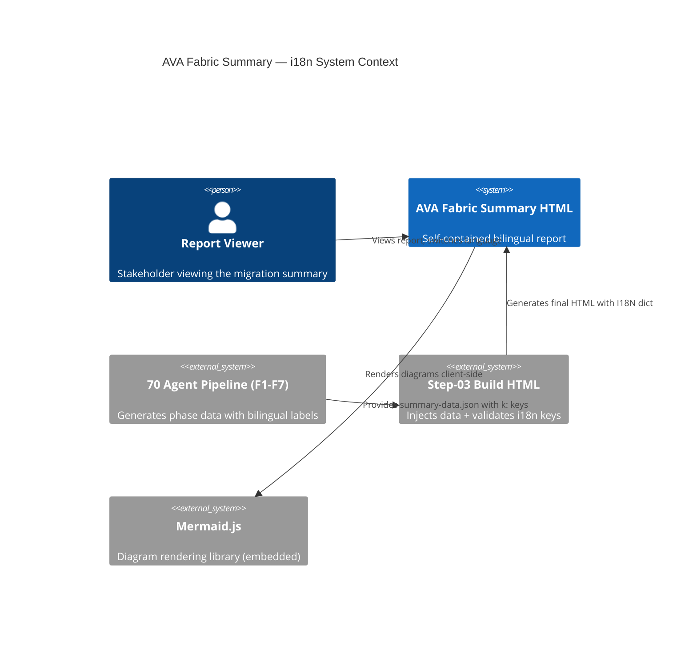
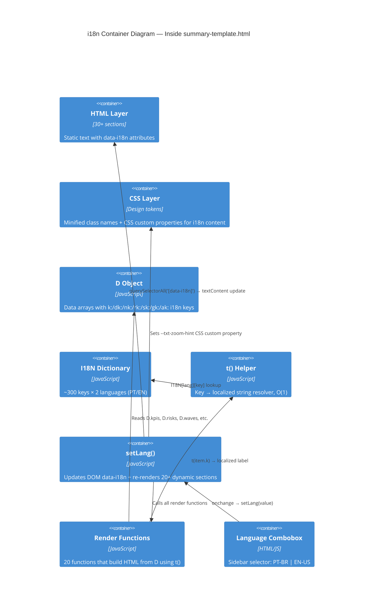

# Context Diagram — i18n System

## C4 Context: AVA Fabric Summary i18n

```mermaid
C4Context
    title AVA Fabric Summary — i18n System Context

    Person(user, "Report Viewer", "Stakeholder viewing the migration summary")

    System(summary, "AVA Fabric Summary HTML", "Self-contained bilingual report")

    System_Ext(agents, "70 Agent Pipeline (F1-F7)", "Generates phase data with bilingual labels")
    System_Ext(step03, "Step-03 Build HTML", "Injects data + validates i18n keys")
    System_Ext(mermaid, "Mermaid.js", "Diagram rendering library (embedded)")

    Rel(user, summary, "Views report, switches language")
    Rel(agents, step03, "Provides summary-data.json with k: keys")
    Rel(step03, summary, "Generates final HTML with I18N dict")
    Rel(summary, mermaid, "Renders diagrams client-side")
```

## C4 Container: Summary HTML Internal i18n Architecture

```mermaid
C4Container
    title i18n Container Diagram — Inside summary-template.html

    Container(html, "HTML Layer", "30+ sections", "Static text with data-i18n attributes")
    Container(css, "CSS Layer", "Design tokens", "Minified class names + CSS custom properties for i18n content")
    Container(dobj, "D Object", "JavaScript", "Data arrays with k:/dk:/nk:/rk:/sk:/gk:/ak: i18n keys")
    Container(i18n, "I18N Dictionary", "JavaScript", "~300 keys × 2 languages (PT/EN)")
    Container(tfn, "t() Helper", "JavaScript", "Key → localized string resolver, O(1)")
    Container(setlang, "setLang()", "JavaScript", "Updates DOM data-i18n + re-renders 20+ dynamic sections")
    Container(renderfns, "Render Functions", "JavaScript", "20 functions that build HTML from D using t()")
    Container(combo, "Language Combobox", "HTML/JS", "Sidebar selector: PT-BR | EN-US")

    Rel(combo, setlang, "onchange → setLang(value)")
    Rel(setlang, html, "querySelectorAll('[data-i18n]') → textContent update")
    Rel(setlang, renderfns, "Calls all render functions")
    Rel(renderfns, dobj, "Reads D.kpis, D.risks, D.waves, etc.")
    Rel(renderfns, tfn, "t(item.k) → localized label")
    Rel(tfn, i18n, "I18N[lang][key] lookup")
    Rel(setlang, css, "Sets --txt-zoom-hint CSS custom property")
```

## C4 Component: setLang() Flow

```mermaid
flowchart TD
    A[User selects language] --> B[setLang&#40;l&#41;]
    B --> C[Update global lang variable]
    C --> D[Scan data-i18n elements]
    C --> E[Scan data-i18n-title elements]
    C --> F[Scan data-i18n-placeholder elements]
    C --> G[Update html lang attribute]
    C --> H[Set CSS custom properties]
    D --> I[Re-render 20+ dynamic sections]
    I --> J[renderKPIs&#40;&#41;]
    I --> K[renderPhases&#40;&#41;]
    I --> L[renderFileExplorer&#40;&#41;]
    I --> M[renderRisks&#40;&#41;]
    I --> N[...17 more render functions]
    J --> O[t&#40;k.k&#41; → I18N resolution]
    K --> O
    L --> O
    M --> O
```
