# Deployment Diagram — i18n System

## Runtime Topology

The summary report has **no server-side deployment**. It is a self-contained HTML file opened in a browser.

```mermaid
flowchart LR
    subgraph "Build-Time (Agent Pipeline)"
        A[70 Agents F1-F7] -->|summary-data.json| B[Step-02 Extract]
        B -->|merged data + i18n keys| C[Step-03 Build HTML]
        C -->|validates i18n completeness| D[summary-template.html]
        D -->|produces| E["AVA-FABRIC-SUMMARY-*.html<br/>(~175KB self-contained)"]
    end

    subgraph "Runtime (Browser - Zero Server)"
        E -->|opens in| F[Any Modern Browser]
        F --> G[i18n Engine<br/>I18N dict + t&#40;&#41; + setLang&#40;&#41;]
        F --> H[Mermaid.js<br/>embedded, no CDN]
        F --> I[CSS Design Tokens<br/>Light/Dark theme]
        G <-->|language switch < 100ms| J[User Interaction]
    end
```

## Environments

| Environment | Notes |
|-------------|-------|
| Development | Agent runs locally in VS Code / Copilot Chat. HTML generated into `outputs/summary/` |
| CI/CD | HTML generation can run in pipeline as post-build step |
| Production | The HTML file IS the deliverable — opened directly by stakeholders |

## Resource Sizing

| Resource | Value |
|----------|-------|
| HTML file size | ~175 KB (template) → ~250–400 KB (generated with data) |
| I18N dictionary | ~15 KB for 2 languages (~300 keys × 2) |
| Mermaid.js (embedded) | ~1.1 MB (minified, inlined) |
| Total file | ~1.3–1.5 MB |
| Memory at runtime | ~5–10 MB (DOM + JS heap) |
| Language switch time | < 100ms target (20 render fns × ~5ms each) |

## HA/DR

Not applicable — the file is stateless and self-contained. Any copy is a complete backup. No data persistence, no server, no database.
