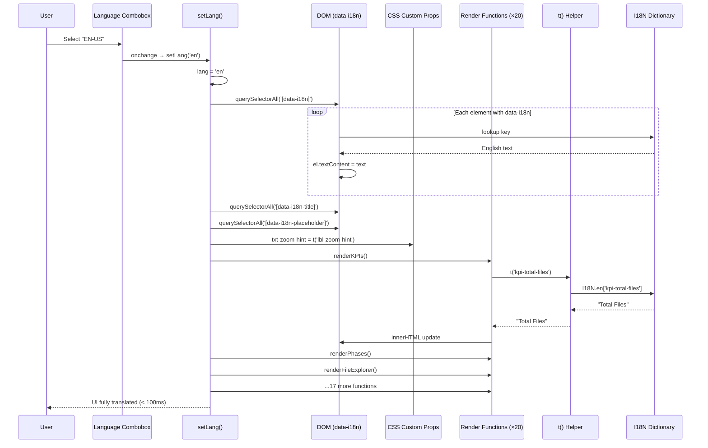
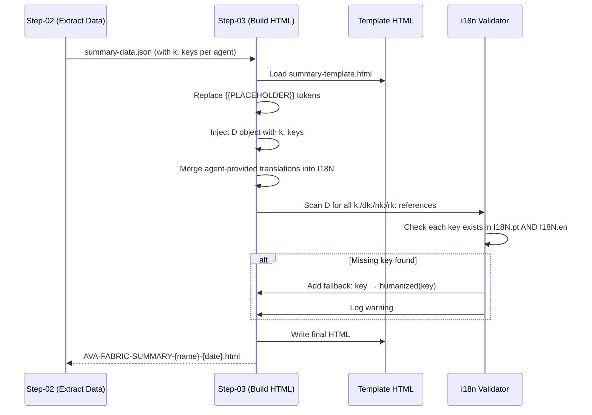
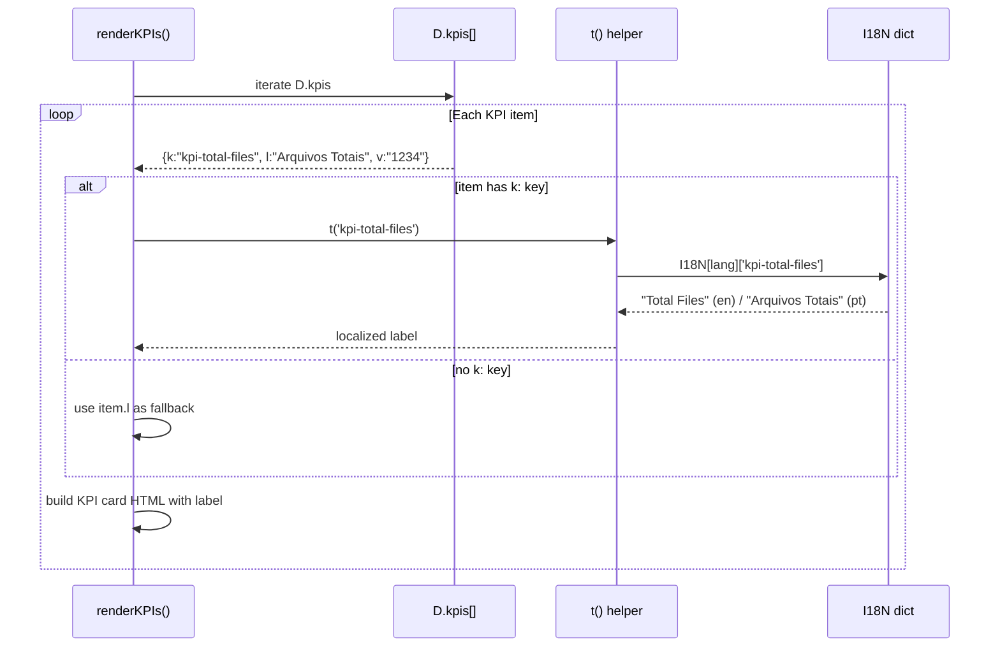

# Sequence Diagrams — i18n System

## Sequence 1: Language Switch Flow (Runtime)

```mermaid
sequenceDiagram
    participant U as User
    participant CB as Language Combobox
    participant SL as setLang()
    participant DOM as DOM (data-i18n)
    participant CSS as CSS Custom Props
    participant RF as Render Functions (×20)
    participant TF as t() Helper
    participant I18N as I18N Dictionary

    U->>CB: Select "EN-US"
    CB->>SL: onchange → setLang('en')
    SL->>SL: lang = 'en'
    SL->>DOM: querySelectorAll('[data-i18n]')
    loop Each element with data-i18n
        DOM->>I18N: lookup key
        I18N-->>DOM: English text
        DOM->>DOM: el.textContent = text
    end
    SL->>DOM: querySelectorAll('[data-i18n-title]')
    SL->>DOM: querySelectorAll('[data-i18n-placeholder]')
    SL->>CSS: --txt-zoom-hint = t('lbl-zoom-hint')
    SL->>RF: renderKPIs()
    RF->>TF: t('kpi-total-files')
    TF->>I18N: I18N.en['kpi-total-files']
    I18N-->>TF: "Total Files"
    TF-->>RF: "Total Files"
    RF->>DOM: innerHTML update
    SL->>RF: renderPhases()
    SL->>RF: renderFileExplorer()
    SL->>RF: ...17 more functions
    SL-->>U: UI fully translated (< 100ms)
```

## Sequence 2: Build-Time i18n Generation (Step-03)

```mermaid
sequenceDiagram
    participant S02 as Step-02 (Extract Data)
    participant S03 as Step-03 (Build HTML)
    participant TMPL as Template HTML
    participant VAL as i18n Validator

    S02->>S03: summary-data.json (with k: keys per agent)
    S03->>TMPL: Load summary-template.html
    S03->>S03: Replace {{PLACEHOLDER}} tokens
    S03->>S03: Inject D object with k: keys
    S03->>S03: Merge agent-provided translations into I18N
    S03->>VAL: Scan D for all k:/dk:/nk:/rk: references
    VAL->>VAL: Check each key exists in I18N.pt AND I18N.en
    alt Missing key found
        VAL->>S03: Add fallback: key → humanized(key)
        VAL->>S03: Log warning
    end
    S03->>TMPL: Write final HTML
    S03-->>S02: AVA-FABRIC-SUMMARY-{name}-{date}.html
```

## Sequence 3: Render Function i18n Key Resolution

```mermaid
sequenceDiagram
    participant RF as renderKPIs()
    participant D as D.kpis[]
    participant T as t() helper
    participant I18N as I18N dict

    RF->>D: iterate D.kpis
    loop Each KPI item
        D-->>RF: {k:"kpi-total-files", l:"Arquivos Totais", v:"1234"}
        alt item has k: key
            RF->>T: t('kpi-total-files')
            T->>I18N: I18N[lang]['kpi-total-files']
            I18N-->>T: "Total Files" (en) / "Arquivos Totais" (pt)
            T-->>RF: localized label
        else no k: key
            RF->>RF: use item.l as fallback
        end
        RF->>RF: build KPI card HTML with label
    end
```
