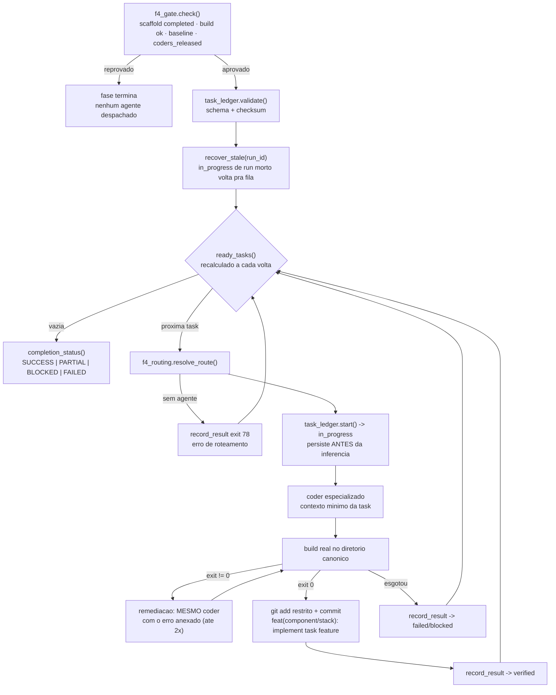

# Fase F4 — Tech Stack Code Generation (laço Ralph Wiggum por task)

> Companheiro de [`fase-scaffold.md`](fase-scaffold.md) (F4S) e de
> [`f4s-git-backed-codegen.md`](f4s-git-backed-codegen.md). A F4S continua como
> está: ela cria o esqueleto determinístico em `source-code/frontend` e
> `source-code/backend`, commita o baseline e pede aprovação. Este documento
> descreve o que acontece **depois** disso.

## O que mudou, e por quê

A F4 era um passo expandido em N passos estáticos no início da fase. Três
defeitos, todos mensuráveis no repositório:

| Defeito | Evidência |
|---|---|
| Os N despachos eram o **mesmo prompt** | `_expand_ledger_phase` não copiava `feature`; `build_prompt()` não recebia `task_id`; o razão nem guardava `feature`. O modelo não sabia qual fatia era dele. |
| Cada despacho carregava o **manifesto global** | 674.563 chars (~169k tokens) por despacho em `cadastro-funcionarios-04`, × 218 tasks ≈ 36,8M tokens de entrada. |
| Todas as stacks caíam no **mesmo agente genérico** | `agent_map` do `ava-pipeline.yaml` mapeava as nove stacks para `ava-f4s-codegen-agent`; os coders de `tech-stack/module.yaml` nunca eram carregados. |

Hoje a F4 é **um passo** que roda um laço: uma task por despacho, roteada para o
coder especializado da stack, com o contexto daquela task, verificada por build
real e commitada individualmente.

## Componentes

| Módulo | Papel |
|---|---|
| [`f4_gate.py`](../src/shared/tools/f4_gate.py) | Gate estrutural F4S → F4: scaffold `completed`, build inicial `succeeded`, baseline git, diretórios canônicos, `coders_released`. Fail-closed. |
| [`f4_routing.py`](../src/shared/tools/f4_routing.py) | O `ava-stack-orchestrator` em código: `component_type + target_stack → agente`, diretório canônico e comando de build. Sem fallback genérico. |
| [`f4_task_context.py`](../src/shared/tools/f4_task_context.py) | Contexto **mínimo** de uma task, em três níveis de orçamento. |
| [`f4_agent_result.py`](../src/shared/tools/f4_agent_result.py) | Contrato JSON da resposta do coder — evidência, nunca autoridade de status. |
| [`f4_loop.py`](../src/shared/tools/f4_loop.py) | Laço externo: relê o razão, recalcula a fila, seleciona, executa, registra. |
| [`task_ledger.py`](../src/shared/tools/task_ledger.py) | Razão `outputs/tobe/speckit/tasks-progress.json` — única autoridade de status. |
| [`f4s_deterministic_harness.py`](../src/shared/tools/f4s_deterministic_harness.py) | Build real + até 2 remediações + snapshot + commit no repo do baseline. |
| [`_run_f4_codegen_step`](../pipeline_runner%2019.py) | Integração no runner de produção (mesmo padrão da F5/F6). |

## Fluxo



## Invariantes

1. **Diretório canônico.** `task_type` decide: `frontend → source-code/frontend`,
   `backend → source-code/backend`. `target_stack` escolhe agente e comandos,
   nunca o caminho. `source-code/{stack}` é proibido e há teste de regressão
   varrendo o código-fonte atrás do antipadrão.
2. **O razão é a fonte viva.** Ele é relido do disco a cada iteração; concluir
   uma task libera as dependentes **no mesmo run**.
3. **Só ferramenta escreve status.** `record_result` recusa `recorded_by` que
   pareça agente, e `verified` só sai de `exit_code == 0`.
4. **Fail-closed.** Razão ausente, checksum divergente, gate reprovado, stack sem
   agente: a fase para com diagnóstico. Nenhuma dessas condições vira despacho
   único nem agente genérico.
5. **Conclusão é classificada.** `SUCCESS` só com todas as tasks `verified`;
   `blocked` é impedimento; `skipped` é decisão explícita, nunca falha de build.

## Escopo por tipo de task — `infra/**` é caminho legítimo

`f4_scope.classify()` decide o tipo **por evidência**, não pelo rótulo do
SpecKit: `T-W0-TF-001` chegava como `task_type: backend` com alvo
`infra/terraform/main.tf`, e obedecer ao rótulo fez o agente escrever
`backend/infra/terraform/main.tf` — dentro do canônico, no lugar errado, e
depois recusado no commit.

| tipo | raízes permitidas (relativas a `source-code/`) |
|---|---|
| `frontend` | `frontend/**` |
| `backend` | `backend/**` |
| `infra` | `infra/**`, `iac/**`, `deploy/**`, `terraform/**` |

Além disso valem sempre os `target_files` da própria task e os arquivos de raiz
compartilhados (`.gitignore`, `README.md`, …). Nada é movido automaticamente
para satisfazer validação.

## Reconciliação de artefatos

Depois de cada task, `f4_scope.reconcile()` cruza alvos declarados × diff real
do git × declaração do agente e classifica cada arquivo:

`expected_and_found` · `expected_but_missing` ·
`generated_in_alternative_valid_path` · `generated_outside_allowed_scope` ·
`modified_existing_file` · `unexpected_but_related` · `unexpected_and_unrelated`

Caminho alternativo válido (`frontend/angular.json` para um alvo declarado como
`frontend/app/angular.json`) **não é ausência**: o arquivo entra no commit, o
caminho real é registrado e a divergência fica em `alternativeArtifactPaths`.
Arquivo fora do escopo não é apagado nem ignorado — vai para
`excludedFromCommit` com motivo.

## Branch por task, baseline e integração

* **Baseline** — antes da primeira task de cada componente, `f4_baseline.ensure()`
  roda o build do scaffold e grava `baselineBuild*` em
  `source-code/.f4s/baseline-{componente}.json`. É o que separa "a task quebrou
  o build" de "o scaffold já estava vermelho".
* **Branch** — cada task de código roda em `task/<task-id>-<slug>`, criado a
  partir do branch principal local. Commit restrito aos arquivos reconciliados.
* **Integração** — `git merge --no-ff` no branch principal quando a task compila
  **ou** não introduz erro novo sobre um baseline já vermelho. Conflito aborta o
  merge, preserva o branch e manda a task para `review`. Nunca há `push`, nunca
  `--force`, e branch de task falhada é preservado como evidência.

## Estados de execução

`status` (legado) continua existindo para gates, suites e dashboards.
`executionStatus` é o vocabulário da F4:

| `executionStatus` | `status` legado | significado |
|---|---|---|
| `completed` | `verified` | build/validação passou, integrada |
| `completed_with_warnings` | `verified` | artefatos entregues; validação externa reclamou |
| `review` | `blocked` | tentada e não integrável; branch preservado |
| `failed_after_remediation` | `blocked` | limite de remediação da task esgotado |
| `blocked_by_dependency` | `blocked` | dependência **explícita** em estado terminal ruim |

Transições: `pending → running → remediation → running → {completed,
completed_with_warnings, review, failed_after_remediation}` e
`pending → blocked_by_dependency`. Ao fim da fase, `f4_loop._finalize()`
garante **zero** tasks em `pending` ou `running`.

## Completeness gate

Separa duas perguntas que antes eram uma só:

* **`execution_complete`** — todas as tasks têm estado terminal e estão
  registradas;
* **`functional_success`** — além disso, nenhuma exige revisão ou ficou
  bloqueada.

A fase encerra como `COMPLETED_WITH_REVIEW` quando processou tudo mas parte
precisa de gente — e isso **não** é `F4 BLOCKED`. Uma task falhada nunca
interrompe as independentes: o circuit breaker de "3 specs consecutivas" virou
telemetria (`consecutive_skips` no resumo).

## Baseline vermelho: integrar ≠ verificar

Quando o build falha, a comparação com o baseline é feita por **assinatura**
(`exit code` + impressão digital das linhas de erro), não por contagem de erros.
O motivo é concreto: `verify_dotnet_solution.py` reprova por prerequisito ou
estrutura com exit 10/20 e **zero** linhas `error CSxxxx` — comparar 0 com 0
concluía "não introduziu erro novo" para builds que nem chegaram a compilar.

| situação | `introducedNewErrors` | integra? | estado |
|---|---|---|---|
| build passa (exit 0) | não | sim | `completed` |
| baseline verde, build falha | **sim** | não | `failed_after_remediation` |
| baseline vermelho, **mesma** assinatura | não | sim | `review` |
| baseline vermelho, assinatura diferente | **sim** | não | `failed_after_remediation` |

A terceira linha é a que mudou de significado: a task é integrada (o trabalho
não se perde, e ela não é culpada pelo defeito do scaffold), mas **não** é
declarada concluída — sem exit 0 não existe `completed`, e o `exit_code`
registrado é sempre o real. Antes, esse caminho forçava `exit_code = 0`: em
`cadastro-funcionario-03`, 18 tasks foram integradas como sucesso sem que um
único build tivesse passado.

## Branch de execução anterior

Branch de task é evidência: nunca é apagado nem reaproveitado. Se
`task/<id>-<slug>` já existe e não descende do branch principal atual, a
execução cria `task/<id>-<slug>--r2` a partir do `main` corrente. Reusar o
branch antigo colocava o trabalho novo sobre um `main` velho e o merge de volta
conflitava — foi o que deixou `T-W0-SCF-007` em `review` com
`mergeStatus: conflict`.

## Falha de ambiente ≠ falha de código

`exit 127` (executável ausente) é classificado antes de o comando rodar
(`f4s_build_runner.executable_missing`) e devolvido como `toolchain_missing`.
Consequências:

- **nenhuma remediação é despachada** — nenhum agente conserta `ng: command not
  found` escrevendo código;
- **o laço para só a stack afetada** — faltou `ng`, o frontend para; as tasks de
  backend continuam;
- a fase termina `BLOCKED` com o executável nomeado e o número de tasks adiadas.

Além disso, **o verificador determinístico da stack vence o `verify_command` da
task** (`verify_angular_app.py`, `verify_dotnet_solution.py`). O `verify_command`
é prosa escrita pelo SpecKit; o verificador faz install → build → boot → health
(Angular) e structure → restore → build → test (.NET). Override continua valendo
para stacks sem verificador próprio.

Depois de instalar a toolchain, uma task `blocked` volta à fila por decisão
explícita do operador:

```bash
python src/shared/tools/task_ledger.py -p meu-projeto \
  --reset T-W0-FE-001 --reason "Node/Angular CLI instalados"
```

`attempts` zera; `attempt_history` e `evidence` são preservados, e o motivo fica
em `recovery_reason`.

## Comandos úteis

```bash
# tabela de roteamento conferida contra o agent_registry e o disco
python src/shared/tools/f4_routing.py --validate

# gate F4S -> F4 (exit 0 libera os coders)
python src/shared/tools/f4_gate.py -p meu-projeto

# razão: validação fail-closed, recuperação e veredito da fase
python src/shared/tools/task_ledger.py -p meu-projeto --validate
python src/shared/tools/task_ledger.py -p meu-projeto --recover --run-id run-atual
python src/shared/tools/task_ledger.py -p meu-projeto --completion
python src/shared/tools/task_ledger.py -p meu-projeto --migrate-legacy   # tasks-state.json
```

## Observabilidade

Por task, em `outputs/tobe/speckit/f4-execution-log.json`: `run_id`, `task_id`,
`spec_id`, `feature`, `task_type`, `target_stack`, agente selecionado, motivo do
roteamento, diretório canônico, tentativa, início/fim/duração, arquivos
alterados (do diff), comando, exit code, `commit_hash`, status anterior e final,
erro e `recovery_reason`.

No razão, cada task guarda `routing`, `evidence` (com `commit_hash` e o resultado
declarado pelo agente, separado da prova) e `attempt_history` — uma linha por
tentativa, nunca sobrescrita.

## Dois arquivos com o mesmo nome — não confundir

| Caminho | Schema | Dono |
|---|---|---|
| `outputs/tobe/tasks-progress.json` | 1.0.0 | **F4S** — estado do scaffold e do gate de aprovação (`scaffold_state.py`) |
| `outputs/tobe/speckit/tasks-progress.json` | 3.0.0 | **F4** — razão de progresso das tasks (`task_ledger.py`) |

`f4_gate.py` lê o primeiro; `f4_loop.py` dirige-se pelo segundo.
