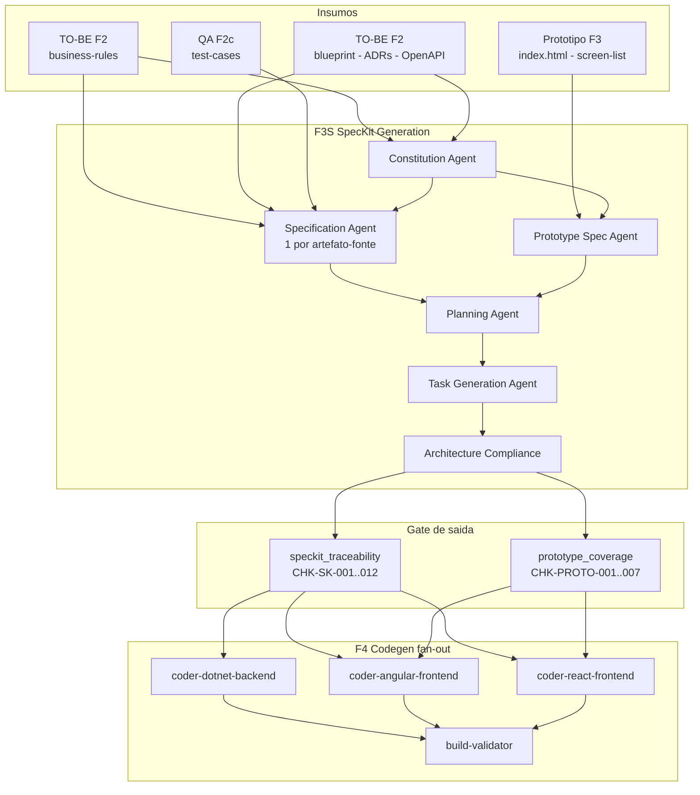
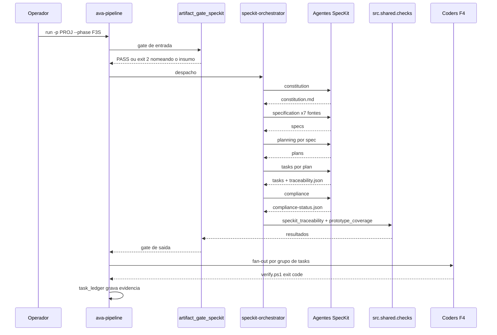

# SpecKit como camada de planejamento da esteira AVA Fabric

> Dossiê de arquitetura · 2026-08-12 · spec de implementação:
> [`specs/039-speckit-planning-layer/`](../../specs/039-speckit-planning-layer/spec.md)
> Evidência primária: `projects/nopcommerce-02-cli-ava/outputs/audit/auditoria-codigo-gerado.md`

Este documento entrega os 12 artefatos solicitados na análise. A spec 039 carrega o desenho
executável; aqui está o raciocínio, a evidência e a decisão.

---

## 1. Current State Assessment

A esteira tem 12 etapas declaradas em `src/shared/data/ava-pipeline.yaml`, 107 agentes
registrados em 9 módulos, e dois runners em produção — `ava-pipeline-runner-cli.py` (menu
interativo, `PIPELINE` fixo em Python, foi o que gerou o projeto auditado) e
`src/shared/tools/ava_pipeline.py` (CLI declarativo). Ambos compartilham o mesmo motor SDK.

O que a esteira **tem** e funciona:

| Ativo                                                      | Estado                                                                                      |
| ---------------------------------------------------------- | ------------------------------------------------------------------------------------------- |
| `agent_registry.py`                                      | fonte canônica única dos 107 agentes; valida AT-001..003                                  |
| `artifact_gate.py` (F1) / `artifact_gate_tobe.py` (F2) | gates determinísticos, 19 famílias de gate na F2                                          |
| `src/shared/checks/`                                     | 12 suítes de verificação com CHK-IDs e exit code                                         |
| `pipeline-dag/F1.yaml`                                   | DAG real com waves,`depends_on` e **fatia de contexto por agente**                  |
| `prototype-conversion-protocol.md`                       | protocolo P2C completo, com regras de autoridade e parsing                                  |
| `.specify/`                                              | SpecKit já instalado — para o desenvolvimento**do repositório**, não dos projetos |
| `readiness-gate.md`                                      | 12 critérios, C2 já exige artefato SpecKit                                                |

O que a esteira **não tem**:

- Nenhum contrato intermediário entre a prosa TO-BE e a geração de código.
- Nenhuma verificação de que um artefato declarado como insumo chegou de fato ao agente.
- Nenhuma decomposição da geração de código em unidades verificáveis.
- Nenhuma rastreabilidade verificável — a existente é declarativa e, medida, falsa.

### Execução auditada — os números

`execution-report_20260811_193456.md`, 21 fases, 105,8 min, 380 arquivos:

| Fase         | Agente                           | Input             | Resp             | OutMax            | Tempo              | Artefatos     |
| ------------ | -------------------------------- | ----------------- | ---------------- | ----------------- | ------------------ | ------------- |
| F2a          | ava-tobe-orchestrator            | 659.706           | 83.936           | 128.000           | 18,8 min           | 66            |
| F3           | ava-prototype                    | 615.024           | 45.630           | 128.000           | 8,7 min            | 10            |
| **F4** | **ava-stack-orchestrator** | **624.278** | **82.878** | **128.000** | **14,9 min** | **140** |

140 arquivos — a solução .NET inteira mais o frontend Angular — em **uma** resposta, a 65% do
teto de saída.

---

## 2. Gap Analysis

### G-1 · Os artefatos TO-BE não chegam ao gerador de código — CRÍTICO

`load_context()` percorre `sorted(outputs.rglob("*"))` e injeta o corpo dos **N primeiros**
arquivos com sufixo em `(.md, .mmd, .yaml, .json)`. N = 60 no runner de produção
(`ART_INJECT_MAX`), 30 no motor do CLI (`max_artifact_bodies`). Em ordem alfabética `asis/`
precede `tobe/`. Composição real dos 60 injetados em toda etapa depois da F1:

| Origem                                            | Qtd         |
| ------------------------------------------------- | ----------- |
| `asis/ast-raw/**` — dumps brutos do analisador | 30          |
| demais`asis/**`                                 | 30          |
| **`tobe/**`**                             | **0** |

A janela fecha em `asis/docs/screen-flow-manifest.json`. Posição dos insumos que a F4 exige:

| Artefato                                      | Posição | Chegou?                   |
| --------------------------------------------- | --------- | ------------------------- |
| `tobe/docs/api-map.md`                      | 116       | não                      |
| `tobe/docs/architecture-blueprint.md`       | 117       | não                      |
| `tobe/docs/architecture-decision-matrix.md` | 118       | não                      |
| `tobe/docs/backlog-tobe.md`                 | 119       | não                      |
| `tobe/docs/openapi/openapi-spec.yaml`       | 144       | não                      |
| `tobe/docs/regras-negocio.md`               | 145       | não                      |
| `tobe/docs/tech-framework-document.md`      | 151       | não                      |
| `tobe/docs/wave-plan.md`                    | 154       | não                      |
| `tobe/prototype/design-tokens.json`         | 164       | não                      |
| `tobe/prototype/screen-list.md`             | 167       | não                      |
| `tobe/qa/test-cases.md`                     | 169       | não                      |
| `tobe/prototype/index.html`                 | —        | **nunca elegível** |

`asis/docs/business-rules.md` caiu na posição 57 — a única razão de regras de negócio marcarem
17% em vez de 0%.

Este é o achado central do diagnóstico. Ele é mecânico, reproduzível e explica sozinho os sete
eixos reprovados. **Nenhuma melhoria de prompt o corrigiria.**

### G-2 · Geração monolítica — CRÍTICO

`pipeline_mode: "build-cycle"` está configurado e os 13 `build_cycle_templates` estão
declarados com `sequence:` em `tech-stack/module.yaml`. Nada disso rodou: o motor SDK carrega
apenas o `spec_path` do orquestrador e proíbe tools, então nem os 13 coders nem a cadeia de
build-cycle foram carregados. O `coder-angular-frontend.md` tem 4955 linhas e carrega as regras
do P2C — nunca entrou em nenhum contexto.

### G-3 · Rastreabilidade declarativa — ALTO

Citação da auditoria sobre a matriz gerada: *"marca todas as 15 linhas AS-IS→TO-BE→TC como ✅ …
nenhuma dessas classes existe no código gerado. A matriz é um falso positivo integral."*

### G-4 · Gate sem produtor — ALTO

`readiness-gate.md` C2 exige `outputs/tobe/docs/spec-kit/*.md`. Nada produz. O gate do
nopcommerce-02 retornou `APPROVED` com 92,5% e `"spec_kit_approved": true`.

### G-5 · Verificação simulada — CRÍTICO

Relatórios declarando `Build Status: ✅ PASS (Simulated — toolchain validation pending)` com o
`dotnet build` real falhando. Gate que aceita simulação não é gate.

### G-6 · Perda de informação entre fases

| Origem                | Destino | O que se perde                                                                     |
| --------------------- | ------- | ---------------------------------------------------------------------------------- |
| F1 regras de negócio | F4      | 13 de 18 regras nunca implementadas                                                |
| F2 ADRs               | F4      | 8 ADRs, aderência média 38%                                                      |
| F2 OpenAPI            | F4      | 15 de 21 operações ausentes; prefixo`catalog` violado nos dois lados           |
| F3 protótipo         | F4      | 7 de 15 telas ausentes;`design-tokens.json` não referenciado por nenhum arquivo |
| F2c casos de teste    | F6      | 40 de 46 TCs sem cobertura                                                         |

### Comparação com o SpecKit anterior (`ava-fabric-agents-v2`)

| Dimensão        | Implementação anterior                                 | Esta proposta                                                    |
| ---------------- | -------------------------------------------------------- | ---------------------------------------------------------------- |
| Agentes          | 4 (constitution, spec, plan, tasks)                      | 7 (+ prototype-spec, compliance, orchestrator)                   |
| Especificações | 1`spec.md` monolítico                                 | 1 spec por artefato-fonte consumido                              |
| Protótipo       | ausente                                                  | agente dedicado com procedimento de extração                   |
| Dependências    | texto livre —`requires: "constitution.md (approved)"` | `F3S.yaml` + gate determinístico                              |
| Rastreabilidade  | prosa                                                    | `traceability.json` com âncora verificável nos dois sentidos |
| Gates            | humanos,`human_gates_required: true`                   | humanos**e** 19 checks executáveis                        |
| Validador        | nenhum arquivo`.py`                                    | 2 suítes + 2 gates + 3 arquivos de teste                        |
| Saída           | `project-executions/{PROJECT}/`                        | `projects/{p}/outputs/tobe/speckit/`                           |

O que se aproveita da versão anterior: a sequência canônica, a ideia da constituição como
documento governante, o formato de task atômica com teto de story points, e a lição de que
gates apenas humanos não seguram uma esteira que roda em 105 minutos.

---

## 3. Future State Architecture



O gate de saída é a mudança estrutural: hoje a F4 começa incondicionalmente. Passa a começar
somente com as duas suítes verdes.

---

## 4. SpecKit Integration Architecture

Três camadas, cada uma com um mecanismo determinístico próprio:

**Camada de entrega** — `context_manifest.py`. Cada passo declara `inputs.mandatory` e
`inputs.advisory`. Insumo obrigatório ausente encerra o passo com exit code 2 antes de gastar
inferência, nomeando o artefato, o agente produtor e a fase. Substitui a heurística de "os N
primeiros em ordem alfabética" por allowlist explícita, e amplia a allowlist de sufixos para
incluir `.html`.

**Camada de planejamento** — o módulo `speckit`, grupo `F3S`, entre F3 e F4. Saída em
`projects/{project_name}/outputs/tobe/speckit/`.

**Camada de verificação** — `traceability.json` como espinha, duas suítes de check, gate de
entrada e gate de saída derivados de `pipeline-dag/F3S.yaml`.

Princípio de desenho, aplicado em toda decisão: **fluxo determinístico acima de autonomia do
agente**. Onde uma regra pode ser expressa como código que roda e retorna exit code, ela é
código — não instrução em prosa. O P2C prova o ponto: é um protocolo excelente, escrito com
cuidado, e não foi seguido porque os arquivos não chegaram e nada verificava se tinham chegado.

---

## 5. Agent Design Specifications

| # | Agente                         | Trigger | Responsabilidade                                                                                                                  |
| - | ------------------------------ | ------- | --------------------------------------------------------------------------------------------------------------------------------- |
| 0 | `ava-speckit-orchestrator`   | `SK`  | Gate de entrada, despacho na ordem do`F3S.yaml`, gate de saída, `execution-log.json`                                         |
| 1 | `ava-speckit-constitution`   | `GC`  | Princípios arquiteturais, padrões de tecnologia e de código, requisitos não-funcionais, restrições, decisões obrigatórias |
| 2 | `ava-speckit-specification`  | `GS`  | Uma especificação por artefato-fonte, 10 seções obrigatórias + as 6 do readiness-gate                                        |
| 3 | `ava-speckit-prototype-spec` | `GP`  | Telas, rotas, componentes, formulários, validações, estado, integrações, acessibilidade, cenários                           |
| 4 | `ava-speckit-planning`       | `GL`  | Um plano por especificação: estratégia, mapeamento arquitetural, módulos, impacto por arquivo, integrações, banco, testes   |
| 5 | `ava-speckit-tasks`          | `GT`  | Tasks atômicas, implementáveis, testáveis, rastreáveis + linhas do`traceability.json`                                       |
| 6 | `ava-speckit-compliance`     | `AC`  | Conformidade de specs/plans/tasks com a constituição;`compliance-status.json`                                                 |

### Agente 1 — Constitution

**Entradas obrigatórias:** `project-config.yaml`, `tobe/docs/architecture-blueprint.md`,
`tech-framework-document.md`, `architecture-decision-matrix.md`, `decisions/ADR-*.md`,
`security-architecture.md`, `src/shared/data/reference-architecture.yaml`.
**Saída:** `outputs/tobe/speckit/constitution.md`.

Seções: Princípios Arquiteturais · Padrões de Tecnologia com versões resolvidas do
`reference-architecture.yaml` · Padrões de Código · Requisitos Não-Funcionais mensuráveis ·
Restrições de Arquitetura · Decisões Obrigatórias derivadas dos ADRs, cada uma com o ADR de
origem citado · Regras de Camada (Clean Architecture, Article IX) · Quality Gates ·
Convenções de Nomenclatura · Definition of Done global.

Guardrails: nunca inventar versão de pacote — resolver do `reference-architecture.yaml`;
nunca contradizer um ADR aceito; toda decisão obrigatória cita a origem; ADR ausente é
`BLOQUEADO`, não suposição.

Entra em **toda** chamada de todo agente a jusante, inclusive nas N chamadas de codegen. É o
que sustenta a coerência entre arquivos gerados em contextos separados.

### Agente 2 — Specification

Despachado **uma vez por artefato-fonte**. Cada especificação carrega, no cabeçalho, o
artefato de origem e o `trace_id`; e, no corpo, as dez seções solicitadas mais as seis do
readiness-gate C2, para que um único arquivo satisfaça os dois contratos.

Guardrail decisivo: **nenhuma regra de negócio pode ser reescrita sem citar sua âncora na
fonte.** É o que torna CHK-SK-006 verificável — o check reabre o arquivo-fonte e procura a
âncora. Sem isso, rastreabilidade volta a ser narrativa.

### Agente 3 — Prototype Specification

Procedimento de extração, reusando `prototype-conversion-protocol.md` §2:

1. `screen-list.md` — localizar `^#\s+Prototype Screen List`; tudo acima é `## Warnings` e
   **não** é inventário. Indexar colunas por nome do cabeçalho, nunca por posição.
2. `index.html` — cada `<section class="screen" id="screen-*">` é uma tela; o rodapé
   `<!-- Prototype metadata -->` de cada seção dá Screen, BC, API, referência AS-IS e regras UX.
3. Navegação — call-graph de `showScreen()` mais o `screenNavMap`; as transições do fluxo de
   compra saem das chamadas `onclick`.
4. Formulários — Constraint Validation API já presente no protótipo (`validateForm`,
   `getFieldErrorMessage`); estados de erro em `showErrorModal`, com `ERR-YYYYMMDD-NNN`.
5. Tokens — `design-tokens.json` primeiro, `:root` do `index.html` depois, defaults do agente
   por último.
6. Endpoints — o contrato OpenAPI vence a coluna `API Endpoint` do `screen-list.md` em caso de
   divergência; a divergência é registrada, não silenciada.

`source_warnings[]` do `screen-list.md` são propagados para o `spec-prototype.md` — o motivo da
qualidade reduzida precisa sobreviver de F3 até F4 (CHK-PROTO-007).

### Agentes 4 e 5 — Planning e Task Generation

Um plano por spec, um arquivo de tasks por plano. Formato da task:

```
### T-<AREA>-<NNN> — <título imperativo>
- Descrição
- Artefato de entrada: <spec ou plan + âncora>
- Artefato de saída: <caminho de arquivo alvo>
- Critério de aceite: <verificável, com o comando que verifica>
- Dependências: [T-...]
- Rastreabilidade: spec_id · plan_id · rule_ids · api_ops · test_ids · screen_id
```

Regras herdadas da implementação anterior, agora com check por trás: máximo 2 story points por
task; nunca criar task sem critério de aceite verificável; nunca criar task sem linha no
`traceability.json` (CHK-SK-005 reprova).

### Agente 6 — Architecture Compliance

Confere specs, plans e tasks contra a constituição e emite `compliance-status.json` com
veredito por princípio. Executa **depois** dos checks determinísticos, nunca no lugar deles: o
que pode ser verificado por código já foi; este agente cobre o que exige julgamento — coerência
entre decisões, contradições entre specs, princípio declarado e não refletido em nenhuma task.

---

## 6. Orchestration Flow Diagram



---

## 7. Artifact Dependency Matrix

| Artefato SpecKit           | Fonte obrigatória                                                            | Fase produtora | Consumidor a jusante                       |
| -------------------------- | ----------------------------------------------------------------------------- | -------------- | ------------------------------------------ |
| `constitution.md`        | blueprint, tech-framework, decision-matrix, ADRs, security-architecture       | F2             | todos os agentes SpecKit e todos os coders |
| `spec-business-rules.md` | `asis/docs/business-rules.md` + `.json`, `tobe/docs/regras-negocio.md`  | F1, F2         | plan-business-rules, coder-dotnet          |
| `spec-api.md`            | `tobe/docs/openapi/*.yaml`                                                  | F2             | plan-api, coder-dotnet, coders de frontend |
| `spec-api-map.md`        | `tobe/docs/api-map.md`                                                      | F2             | plan-api-map, coders de frontend           |
| `spec-backlog.md`        | `tobe/docs/backlog-tobe.md`                                                 | F2             | plan-backlog                               |
| `spec-waves.md`          | `wave-plan.md`, `migration/wave-model.json`                               | F2             | plan-waves, marcação de wave nas tasks   |
| `spec-test-cases.md`     | `tobe/qa/test-cases.md`                                                     | F2c            | plan-test-cases, F6                        |
| `spec-prototype.md`      | `prototype/index.html`, `screen-list.md`, `design-tokens.json`, OpenAPI | F3, F2         | plan-prototype, coders de frontend         |
| `plan-*.md`              | a spec correspondente + constitution                                          | F3S            | tasks-*.md                                 |
| `tasks-*.md`             | o plan correspondente                                                         | F3S            | fan-out da F4                              |
| `traceability.json`      | todas as tasks                                                                | F3S            | CHK-SK-005..012,`tasks-progress.json`       |
| `tasks-progress.json`       | `traceability.json`                                                         | F3S            | laço de execução da F4, retomada        |
| `compliance-status.json` | tudo acima                                                                    | F3S            | gate de saída, Summary HTML               |

Insumo obrigatório ausente ⇒ exit 2 com o nome do agente produtor. Insumo `advisory` ausente ⇒
WARN registrado e propagado até o `ImplementationNotes` da F4.

---

## 8. Traceability Matrix

Cadeia exigida, verificada nos dois sentidos:

```
Regra de negócio  ->  Especificação  ->  Plano  ->  Task  ->  Arquivo alvo  ->  Cenário de teste
Tela do protótipo ->  spec-prototype ->  plan   ->  Task frontend           ->  Cenário de teste
```

| Direção  | Check         | Reprova quando                                             |
| ---------- | ------------- | ---------------------------------------------------------- |
| adiante    | CHK-SK-007    | uma`BR-*` do catálogo não alcança nenhuma task        |
| adiante    | CHK-SK-008    | uma operação do OpenAPI não alcança nenhuma task       |
| adiante    | CHK-SK-009    | um`TC-*` de `test-cases.md` não alcança nenhuma task |
| adiante    | CHK-PROTO-001 | uma tela`included` não aparece no `spec-prototype.md` |
| adiante    | CHK-PROTO-003 | uma tela não tem rota, task e cenário de teste           |
| de volta   | CHK-SK-005    | uma task não tem linha no`traceability.json`            |
| de volta   | CHK-SK-006    | uma linha aponta para âncora inexistente no arquivo-fonte |
| de volta   | CHK-SK-011    | o razão e a rastreabilidade divergem por`task_id`       |
| evidência | CHK-SK-012    | uma entrada`verified` não tem exit code real registrado |

A verificação de volta é o que impede a repetição do defeito da matriz atual: uma linha só
existe se a âncora for encontrada quando o check reabre o arquivo-fonte.

---

## 9. Audit Findings Correlation

| # | Categoria                     | Causa-raiz (evidência)                                                                               | Artefato afetado                | Mitigação SpecKit                                          | Risco residual                                                                    |
| - | ----------------------------- | ----------------------------------------------------------------------------------------------------- | ------------------------------- | ------------------------------------------------------------ | --------------------------------------------------------------------------------- |
| 1 | Missing Architecture Guidance | ADRs e decision-matrix nas posições 118/151, nunca injetados (RC-06)                                | ADRs, blueprint, tech-framework | Fase 0 +`constitution.md` + agente de compliance           | Constituição pode reafirmar decisão de forma imprecisa; compliance julga prosa |
| 2 | Missing Business Context      | `regras-negocio.md` na 145 nunca injetado; `business-rules.md` na 57 por pouco (RC-07)            | regras de negócio              | `spec-business-rules.md` com âncora + CHK-SK-007          | Regra mal transcrita se propaga; a âncora limita, não elimina                   |
| 3 | Missing Specifications        | nenhum contrato entre prosa TO-BE e codegen                                                           | todos                           | 7 specs, 10+6 seções, uma por fonte                        | Qualidade limitada pela fonte                                                     |
| 4 | Missing Task Decomposition    | 140 arquivos em resposta de 82.878 tokens, teto 128.000 (RC-01)                                       | todo o código gerado           | tasks atômicas + fan-out`foreach`                         | Coerência entre arquivos depende da constituição em toda chamada               |
| 5 | LLM Coding Limitations        | 8 erros C# reais:`OwnsMany` sobre `IReadOnlyCollection`, Swashbuckle x OpenApi 2.0.0              | backend .NET                    | fora do escopo — exige`build-validator` real              | **Maior risco residual**                                                    |
| 6 | Pipeline Orchestration        | coders e build-cycle nunca despachados sob`--engine sdk`; gate aceitou `PASS (Simulated)` (RC-02) | esteira inteira                 | fan-out despacha coders reais; razão só sobe com exit code | Aceitação de build simulado é defeito separado                                 |

Fora de escopo e registrado: 2 CVEs de severidade alta, hash de senha calculado e nunca
persistido em `RegisterCustomerHandler.cs:27-29`, credenciais em texto claro em
`outputs/tobe/source-code/.env`. Camada de planejamento não conserta isso retroativamente. As
credenciais precisam ser rotacionadas independentemente desta proposta.

---

## 10. Risk Assessment

| ID  | Risco                                                                             | Prob.                    | Impacto  | Mitigação                                                                  |
| --- | --------------------------------------------------------------------------------- | ------------------------ | -------- | ---------------------------------------------------------------------------- |
| R-1 | SpecKit entregue sem a Fase 0; números não mudam e a abordagem é desacreditada | Alta se não sequenciado | Crítico | Fase 0 é pré-requisito declarado; a spec bloqueia a ordem inversa          |
| R-2 | `F3S` em `PHASE_ORDER` quebra observabilidade ou relatórios                  | Média                   | Médio   | enumerar consumidores antes do merge; suíte completa na verificação       |
| R-3 | `artifact_gate_speckit` vira o sétimo espelho manual                           | Média                   | Alto     | deriva do`F3S.yaml` em runtime; teste de coerência                        |
| R-4 | Fan-out perde coerência entre arquivos                                           | Média                   | Alto     | constituição em toda chamada; sintoma aparece no build, não escondido     |
| R-5 | Custo de inferência sobe com N chamadas                                          | Média                   | Médio   | fatia menor por chamada; medir no piloto e registrar o delta real            |
| R-6 | Specs herdam degradação da fonte sem sinalizar                                  | Baixa                    | Médio   | CHK-PROTO-007 propaga`source_warnings[]`                                   |
| R-7 | MAJOR bump dos coders quebra projeto em andamento                                 | Baixa                    | Médio   | nota de migração; hard stop só dispara com a F3S na esteira               |
| R-8 | Agente contorna o razão e declara conclusão                                     | Baixa                    | Crítico | agentes não escrevem o razão; só o wrapper escreve, a partir de exit code |

---

## 11. ROI Analysis

### Custo

| Item                                        | Estimativa                                      |
| ------------------------------------------- | ----------------------------------------------- |
| Fase 0 — entrega de contexto               | 1 a 2 dias                                      |
| Fase 1 — módulo com 7 agentes e templates | 3 a 4 dias                                      |
| Fase 2 — schemas, 2 suítes, gates         | 2 a 3 dias                                      |
| Fase 3 — fan-out e harness                 | 2 a 3 dias                                      |
| Fase 4 — consumidores e Summary            | 1 a 2 dias                                      |
| **Total de engenharia**               | **9 a 14 dias**                           |
| Inferência adicional por execução        | +1 fase (F3S) com ~8 despachos de fatia pequena |

O fan-out da F4 troca 1 chamada de 624 mil tokens de entrada por N chamadas de fatia pequena.
O total de tokens de entrada tende a **cair**, porque hoje toda etapa recarrega 30 dumps de AST
que não usa. A medição real no piloto é tarefa da verificação — o número entra aqui depois, não
como estimativa.

### Retorno

O custo evitado é o retrabalho. Na execução auditada:

- 7 telas a refazer, 13 regras de negócio a implementar, 15 operações de API a criar, 40 casos
  de teste a escrever, 9 grupos de erro de build a corrigir.
- A auditoria estima P0 + P1 + P2 como um esforço comparável ao da própria geração — e o
  diagnóstico que a produziu custou uma auditoria manual completa.

Sem gates, esse retrabalho é descoberto **depois** da entrega, por auditoria humana. Com
gates, é impedido antes da F4 começar, ou exposto no exit code do primeiro grupo de tasks.

### Onde o ganho realmente vem

Estimativa honesta: **60% a 70% do ganho vem das Fases 0 e 3** — entregar os artefatos e
decompor o trabalho. A contribuição específica do SpecKit é rastreabilidade, verificabilidade e
contabilidade de completude: é o que torna a melhoria *verificável* e *repetível* em vez de
incidental. Entregar SpecKit sem as Fases 0 e 3 produziria um belo conjunto de documentos com
os mesmos números de auditoria.

### Decisão

| Dimensão                  | Efeito esperado                                        | Base                                                                                                 |
| -------------------------- | ------------------------------------------------------ | ---------------------------------------------------------------------------------------------------- |
| Taxa de compilação       | **Alto** — das Fases 0 e 3, não dos documentos | erros vieram de uma resposta truncada; chamadas menores mais validação real atacam a causa         |
| Conformidade arquitetural  | **Alto**                                         | blueprint e ADRs saem de 0% entregue para obrigatório                                               |
| Completude funcional       | **Alto**                                         | 15/21 operações e 7/15 telas nunca foram itens de trabalho; agora omissão reprova gate            |
| Cobertura de testes        | **Médio-alto**                                  | CHK-SK-009 força os 46 TCs a virar task; a qualidade do teste segue limitada pelo modelo            |
| Conformidade de segurança | **Médio**                                       | LGPD, Argon2id e multi-store viram task rastreada; a implementação correta ainda depende do modelo |
| Qualidade de código       | **Médio**                                       | insumos melhores elevam o piso; não tornam o modelo um engenheiro sênior                           |

**Recomendação: integrar**, na ordem declarada, com a Fase 0 como pré-requisito inegociável.

---

## 12. Implementation Roadmap

| Incremento  | Conteúdo                                                                                                      | Critério de saída                                                                   |
| ----------- | -------------------------------------------------------------------------------------------------------------- | ------------------------------------------------------------------------------------- |
| **0** | `context_manifest.py`, schema `inputs:`, os dois runners, `inputs` para F2a/F3/F4/F5/F6                  | `--dry-run` mostra o conjunto resolvido; `mandatory` ausente sai 2                |
| **1** | Módulo, 7 agentes, templates,`F3S.yaml`, registro, emenda da constituição, wrappers                       | `ava-pipeline list --phases` mostra a F3S; execução real emite a árvore completa |
| **2** | Schemas, 2 suítes, gates,`CheckContext` preguiçoso                                                         | suítes verdes; gate de saída bloqueia a F4 quando vermelho                          |
| **3** | `foreach`, `task_ledger.py`, `tasks-progress.json`, `ava-agents-progress.txt`, `verify.ps1`, preâmbulo | F4 em N passos; interromper e reinvocar retoma na task certa                          |
| **4** | C2 do readiness-gate, contratos dos coders,`artifact-map.yaml`, Summary                                      | execução completa no piloto; sete eixos remedidos                                   |

Critério de aceite do piloto, contra os mesmos eixos da auditoria: `dotnet build` com 0 erros;
telas presentes ≥ 14/15; regras de negócio implementadas ≥ 15/18; operações OpenAPI ≥ 19/21;
as duas suítes verdes, com zero task órfã e zero fonte não referenciada.
