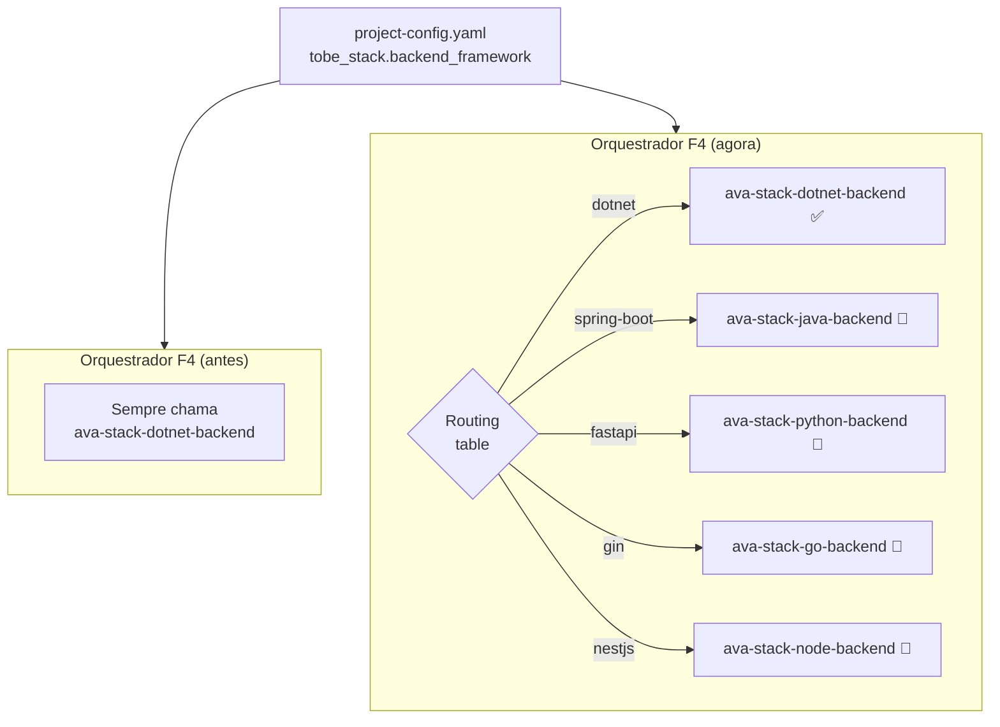
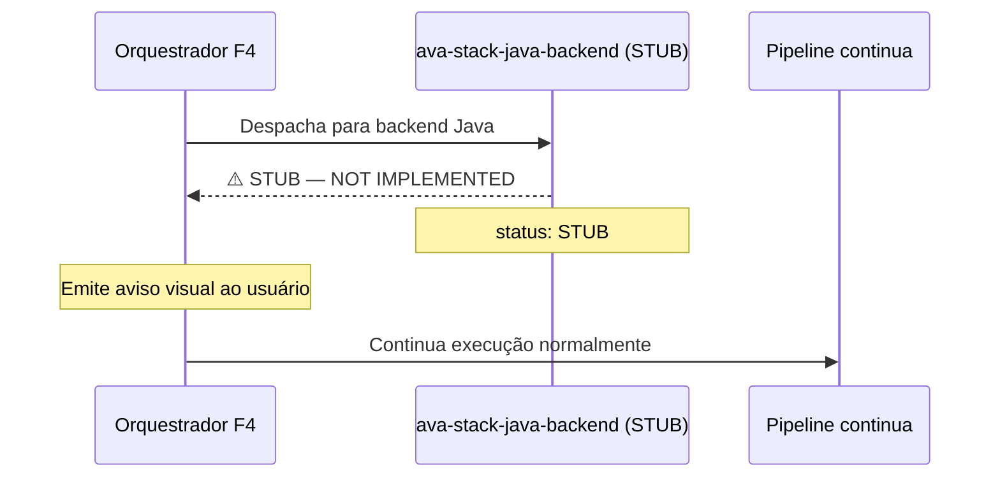
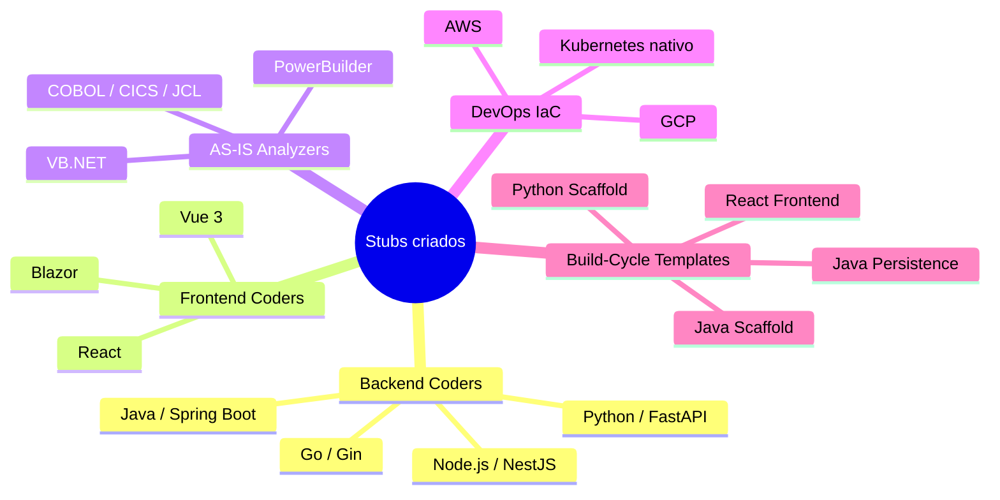
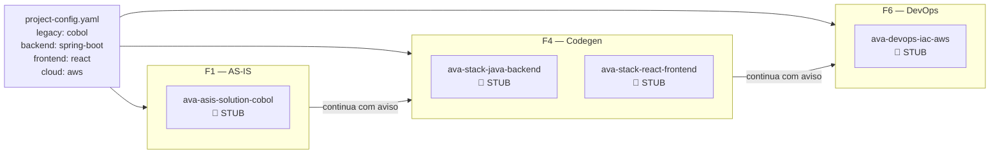

# Stack Split — Impacto no Pipeline AVA Fabric
## Comunicação Técnica para Product Owner

> **Feature:** #2146 — Stack Split  
> **PBI inicial:** #2150 — Wiring inicial (entregue em PR #289)  
> **Data:** 2026-06-16  
> **Autor:** Tech Lead

---

## Resumo Executivo

O pipeline AVA Fabric foi projetado originalmente para migrar sistemas **Delphi → .NET + Angular**. Durante o desenvolvimento, esse par de tecnologias foi usado como exemplo fixo — o que inadvertidamente "engessou" o sistema, impedindo seu uso para outros stacks sem modificações manuais extensas no código dos agentes.

Esta feature remove essa limitação. **O pipeline agora pode migrar qualquer stack de origem para qualquer stack de destino**, com um único arquivo de configuração controlando tudo.

**Nenhum projeto existente é afetado.** Projetos Delphi → .NET + Angular funcionam exatamente como antes.

---

## O que mudou para o usuário final

### Antes: dois arquivos, papéis confusos

Para configurar um projeto, era necessário editar dois arquivos e entender qual campo ia onde:

```
📁 projects/Meu-ERP/context/
    └── project-config.yaml          ← legado + algumas configs gerais

📁 docs/architecture/
    └── ConfigStackDotNet.yaml       ← stack de destino (mas o nome dizia ".NET"...)
```

O PO/Tech Lead que quisesse configurar um projeto Java teria dificuldade em encontrar onde mudar o stack, pois o arquivo se chamava `ConfigStackDotNet.yaml`.

---

### Depois: um arquivo, papel claro

```
📁 projects/Meu-ERP/context/
    └── project-config.yaml          ← TUDO está aqui
```

Não existe mais nenhum arquivo separado de configuração de stack.
O `project-config.yaml` contém explicitamente:

```yaml
# Tecnologia de origem (sistema legado)
legacy_technology: "delphi"       # delphi | cobol | vb6 | vbnet | powerbuilder

# Stack de destino
tobe_stack:
  backend_framework: "dotnet"     # dotnet | spring-boot | fastapi | gin | nestjs
  backend_version: "10.0"
  frontend_framework: "angular"   # angular | react | blazor | vue
  frontend_version: "17"

# Provedor de cloud
cloud_provider: "azure"           # azure | aws | gcp | k8s-native
```

Para mudar de Delphi→.NET para COBOL→Java+AWS, basta alterar três linhas nesse único arquivo.

---

## Impacto no fluxo de execução

### O fluxo de fases NÃO mudou

A sequência da esteira (F1 AS-IS → F2 TO-BE → F3 Prototype → F4 Stack → F5 QA → F6 DevOps → F7 Deliverables) permanece a mesma referência canônica do `guia-execucao-fluxo-agentes.md` — este split de roteamento dinâmico não altera a ordem das fases, apenas o comportamento interno do orquestrador de Stack (F4).

### O que mudou internamente: roteamento dinâmico

Antes, cada orquestrador "sabia" que o agente a chamar era sempre o mesmo (`.NET`, `Angular`, `Delphi`). Agora, cada orquestrador **lê o `project-config.yaml` e decide qual agente chamar** com base nos valores configurados.



O mesmo padrão se aplica a:
- **F1** — qual agente analisa o código legado (Delphi, VB6, COBOL, VB.NET, PowerBuilder)
- **F2** — qual agente gera o código na Fase 4.7
- **F6** — qual agente provisiona a infraestrutura (Azure, AWS, GCP, Kubernetes)

---

## Stubs: pipeline funciona para todos os stacks, mesmo os não implementados

### O conceito de stub

Um **stub** é um agente placeholder — existe no sistema, tem o endereço correto, mas ainda não faz a implementação real. Quando chamado, emite um aviso claro e continua sem bloquear o pipeline.



Isso significa que:
- Um projeto COBOL → Java **pode ser iniciado hoje** — o pipeline roda, os stubs sinalizam o que precisa ser implementado
- Nada explode ou bloqueia silenciosamente
- Cada stub tem um PBI correspondente no backlog (#2152 a #2169)

### Stubs criados (17 no total)



### Status atual por stack

| Stack de Origem | Status |
|---|---|
| Delphi | ✅ Implementado |
| VB6 | ✅ Implementado |
| COBOL | 🚧 Stub (PBI #2155) |
| VB.NET | 🚧 Stub (PBI #2156) |
| PowerBuilder | 🚧 Stub (PBI #2163) |

| Stack de Destino — Backend | Status |
|---|---|
| .NET (dotnet) | ✅ Implementado |
| Java / Spring Boot | 🚧 Stub (PBI #2152) |
| Python / FastAPI | 🚧 Stub (PBI #2153) |
| Go / Gin | 🚧 Stub (PBI #2159) |
| Node.js / NestJS | 🚧 Stub (PBI #2160) |

| Stack de Destino — Frontend | Status |
|---|---|
| Angular | ✅ Implementado |
| React | 🚧 Stub (PBI #2154) |
| Blazor | 🚧 Stub (PBI #2161) |
| Vue 3 | 🚧 Stub (PBI #2162) |

| Cloud Provider | Status |
|---|---|
| Azure | ✅ Implementado |
| AWS | 🚧 Stub (PBI #2157) |
| GCP | 🚧 Stub (PBI #2164) |
| Kubernetes (cloud-agnostico) | 🚧 Stub (PBI #2165) |

---

## Exemplo completo: antes vs. depois

### Cenário A — Projeto Delphi → .NET + Azure (existente)

**Nenhuma mudança.** O `project-config.yaml` já tem os valores corretos por padrão.

```yaml
legacy_technology: "delphi"
tobe_stack:
  backend_framework: "dotnet"
  frontend_framework: "angular"
cloud_provider: "azure"
```

Pipeline roda identicamente. Zero impacto.

---

### Cenário B — Novo projeto COBOL → Java + React + AWS (futuro)

**Antes:** impossível sem modificar o código dos agentes manualmente.

**Agora:** editar três linhas no `project-config.yaml`:

```yaml
legacy_technology: "cobol"
tobe_stack:
  backend_framework: "spring-boot"
  frontend_framework: "react"
cloud_provider: "aws"
```

O pipeline executa. F1 usa o stub COBOL, F4 usa o stub Java + React, F6 usa o stub AWS — todos emitem avisos mas não bloqueiam. Os stubs são preenchidos pelos PBIs do backlog à medida que a equipe os implementa.



---

## Mudança no arquivo de configuração de stack

### Antes: dois arquivos com papéis confusos

- `project-config.yaml` — configurações do legado e algumas configs gerais
- `ConfigStackDotNet.yaml` — stack de destino (nome amarrado ao .NET, difícil de descobrir)
- Era necessário editar os dois para configurar um projeto

### Depois: um único arquivo

| Arquivo | Papel | Quem edita |
|---|---|---|
| `project-config.yaml` | **Tudo** — stack, auth, persistência, observabilidade, quality gates | Tech Lead ao criar projeto |

O conteúdo de `ConfigStackDotNet.yaml` foi incorporado integralmente ao `project-config.yaml`. Nada foi perdido — apenas consolidado.

---

## Backlog dos stubs (PBIs filhos da Feature #2146)

Os stubs são entregáveis concretos, priorizados por demanda de mercado:

| Prioridade | PBI | Stack | Descrição |
|---|---|---|---|
| 🔴 Alta | #2150 | — | **Wiring inicial** (este PR — entregue) |
| 🔴 Alta | #2152 | Java/Spring Boot | Coder backend Java |
| 🔴 Alta | #2153 | Python/FastAPI | Coder backend Python |
| 🔴 Alta | #2154 | React | Coder frontend React |
| 🔴 Alta | #2155 | COBOL | Analisador AS-IS COBOL |
| 🔴 Alta | #2156 | VB.NET | Analisador AS-IS VB.NET |
| 🔴 Alta | #2157 | AWS | IaC AWS |
| 🟡 Média | #2159 | Go/Gin | Coder backend Go |
| 🟡 Média | #2160 | NestJS | Coder backend Node.js |
| 🟡 Média | #2161 | Blazor | Coder frontend Blazor |
| 🟡 Média | #2162 | Vue 3 | Coder frontend Vue |
| 🟡 Média | #2163 | PowerBuilder | Analisador AS-IS PowerBuilder |
| 🟡 Média | #2164 | GCP | IaC GCP |
| 🟡 Média | #2165 | K8s | IaC Kubernetes nativo |
| 🔵 Baixa | #2166–2169 | build-cycle | Templates build-cycle (dependem dos anteriores) |

A equipe pode priorizar os stubs conforme os projetos de clientes que entrarem. Se o próximo cliente tiver um sistema COBOL, priorizamos #2155. Se o cliente quiser AWS, priorizamos #2157. A fábrica responde à demanda sem precisar de refatoração emergencial.

---

## Impacto no guia de execução existente

O [Guia de Execução do Fluxo de Agentes](./guia-execucao-fluxo-agentes.md) continua válido. As únicas seções que precisam ser atualizadas futuramente são:

1. **Seção 2 — Configuração do Projeto** — adicionar os campos `tobe_stack.*` e `cloud_provider` ao exemplo de `project-config.yaml`
2. **Seção 7 — F4 Stack Tecnológica** — mencionar que o stack é configurável, não fixo em .NET + Angular
3. **Referência Rápida (última tabela)** — adicionar os novos agentes stub

Essas atualizações fazem parte do próprio PBI #2150 (aceito como trabalho da feature).

---

## Resumo para o PO

| Pergunta | Resposta |
|---|---|
| O pipeline quebra? | Não. Projetos existentes continuam funcionando. |
| Precisamos reconfigurar projetos existentes? | Não. Apenas novos projetos usam a nova estrutura. |
| O fluxo F1→F8 mudou? | Não. A sequência e os comandos são os mesmos. |
| O que muda na prática? | O `project-config.yaml` agora contém todos os campos de stack, auth, persistência e observabilidade em um único arquivo. |
| Quando o Java funciona? | Quando o PBI #2152 for concluído. Até lá, emite aviso sem bloquear. |
| Qual o risco desta entrega? | Zero para projetos existentes. Novos stacks têm aviso claro de "não implementado". |
| Onde está o controle de progresso? | `src/shared/data/stub-registry.yaml` lista os 17 stubs e seus status. |
