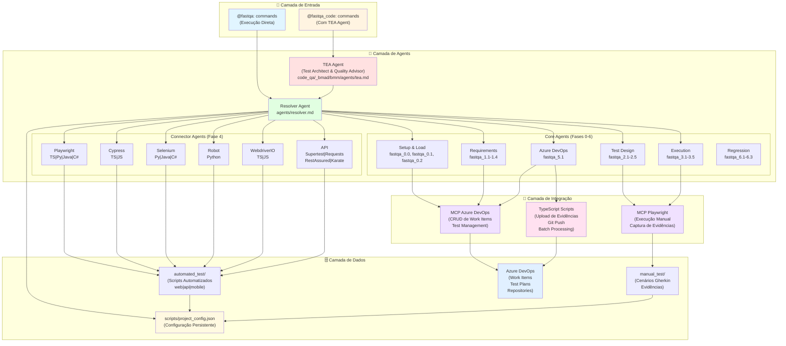

# FastQA - Framework de QA Multi-Framework & Multi-Linguagem

> Sistema completo de Quality Assurance com agents de IA, suporte a múltiplos frameworks e linguagens, integração nativa com Azure DevOps e Avanade CODE.

[](https://github.com)
[](https://nodejs.org)
[](https://www.typescriptlang.org/)

---

## 🎯 O que é o FastQA?

FastQA é um ecossistema completo de QA que combina:

- **🤖 Agents de IA** — Automação inteligente de tarefas de QA via comandos naturais
- **🔀 Dual-Mode** — Executar comandos diretamente (`@fastqa:`) ou com TEA Agent (`@fastqa_code:`)
- **📦 Multi-Framework** — Suporte nativo a 15+ combinações de framework/linguagem
- **🔗 Azure DevOps** — Integração TypeScript nativa + MCP para operações CRUD
- **📊 Avanade CODE** — Integração com Avanade CODE workflows de Test Architecture

---

## 🚀 Início Rápido

```bash
# 1. Configurar o projeto (wizard interativo de 10 perguntas)
@fastqa:setup_project

# 2. Ver menu completo de comandos
@fastqa:help

# 3. [Opcional] Acessar workflows Avanade CODE
@fastqa_code:help_code_avanade

# 4. Executar primeiro comando (exemplo: carregar PBI)
@fastqa:load_pbi
```

---

## 🗺️ Jornadas de Trabalho

Após configurar o projeto, selecione uma jornada de trabalho:

```
@fastqa /journey
```

| # | Jornada | Persona | Duração |
|---|---------|---------|----------|
| J1 | 🚀 Full Automation Cycle | Automation Engineer | 2-4 dias |
| J2 | 🏃 Sprint QA (Manual) | Manual Tester | 4-8 horas |
| J3 | 🔧 Automate Existing TCs | QA com TCs prontos | 1-3 dias |
| J4 | 🐛 False Negative Fix | QA debugando | 30 min - 2h |
| J5 | 🌐 API Quality Assurance | API/Security Tester | 1-2 dias |
| J6 | 📊 Regression Execution | QA Lead | 30 min - 1h |
| J7 | 📋 Test Plan Management | QA organizando | 2-4 horas |
| J8 | ⚡ Quick Exploratory | QA smoke test | 15-30 min |

O Copilot guia você step a step, rastreia progresso e sugere próximos passos automaticamente.

---

## 🏗️ Arquitetura do Sistema



### 🔀 Fluxo de Execução de Comandos

```
┌─────────────────────────────────────────────┐
│ Usuário digita comando no chat             │
│ @fastqa:command ou @fastqa_code:command    │
└────────────────┬────────────────────────────┘
                 │
                 ▼
        ┌────────────────┐
        │ Prefixo?       │
        └────────┬───────┘
                 │
        ┌────────┴────────┐
        │                 │
@fastqa:│                 │@fastqa_code:
        │                 │
        ▼                 ▼
┌───────────────┐  ┌──────────────────┐
│ Execução      │  │ 1. Ativa TEA     │
│ Direta        │  │ 2. Executa       │
└───────┬───────┘  └────────┬─────────┘
        │                   │
        └────────┬──────────┘
                 │
                 ▼
        ┌────────────────┐
        │ Resolver Agent │ ← Lê scripts/project_config.json
        └────────┬───────┘
                 │
        ┌────────┴────────┐
        │                 │
  Fase 0-5              Fase 4
        │                 │
        ▼                 ▼
┌───────────────┐  ┌──────────────────┐
│ Core Agents   │  │ Connector Agents │
│ (Agnósticos)  │  │ (Framework-      │
│               │  │  Specific)       │
└───────┬───────┘  └────────┬─────────┘
        │                   │
        └────────┬──────────┘
                 │
        ┌────────┴────────┐
        │                 │
   MCP Azure         TypeScript
   DevOps              Scripts
        │                 │
        └────────┬────────┘
                 │
                 ▼
        ┌────────────────┐
        │ Azure DevOps / │
        │ Local Storage  │
        └────────────────┘
```

---

## 📂 Estrutura do Projeto

```
fastqa/
├── config/                          # ⚙️ Configuração
│   ├── project_config.json         # (MOVIDO para scripts/project_config.json)
│   └── project_setup.py            # Wizard interativo de setup
│
├── agents/                          # 🤖 Agents (Templates de IA)
│   ├── resolver.md                 # Roteador dinâmico de agents
│   ├── core/                       # Agents agnósticos de framework
│   │   ├── fastqa_0.0_project_setup.md
│   │   ├── fastqa_0.0_azdo_health.md
│   │   ├── fastqa_0.1_pbi_loader.md
│   │   ├── fastqa_0.2_journey_selector.md
│   │   ├── fastqa_1.1_gap_identifier.md
│   │   ├── fastqa_1.1.1_gap_synthesizer.md
│   │   ├── fastqa_1.2_refinement.md
│   │   ├── fastqa_1.3_requirements_analyzer.md
│   │   ├── fastqa_1.4_behavior_specialist.md
│   │   ├── fastqa_2.1_gherkin_writer.md
│   │   ├── fastqa_2.6_step_by_step_writer.md
│   │   ├── fastqa_2.2_validator.md
│   │   ├── fastqa_2.3_exploratory_api_test.md
│   │   ├── fastqa_2.4_destructive_api_test.md
│   │   ├── fastqa_2.5_ac_scope_analyzer.md
│   │   ├── fastqa_3.1_run_manual_test.md
│   │   ├── fastqa_3.2_run_parallel_execution.md
│   │   ├── fastqa_3.3_run_manual_api_test.md
│   │   ├── fastqa_3.4_run_mobile_test.md
│   │   ├── fastqa_3.5_run_mobile_exploratory_test.md
│   │   ├── fastqa_4.3_run_guide.md
│   │   ├── fastqa_4.3_verify_and_fix.md
│   │   ├── fastqa_5.1_azure_devops.md
│   │   ├── fastqa_6.1_regression_analyzer.md
│   │   ├── fastqa_6.2_generate_regression_map.md
│   │   └── fastqa_6.3_execute_regression_plan.md
│   └── connectors/                 # Agents específicos por framework
│       ├── api/                    # API: Cypress, Playwright, Supertest, Requests, RestAssured, Karate, Robot
│       ├── mobile/                 # Mobile: WebdriverIO (TS/JS), Robot
│       └── web/                    # Web: Playwright, Cypress, Selenium, Robot, WebdriverIO
│
├── automated_test/                  # 🤖 Testes Automatizados
│   ├── web/                        # Testes Web (Playwright, Cypress, Selenium, Robot)
│   │   ├── config/                 # playwright.config.ts, cypress.config.ts, etc.
│   │   ├── data/                   # Massa de dados JSON
│   │   ├── pages/                  # Page Object Model
│   │   ├── support/                # Helpers, hooks, custom commands
│   │   ├── tests/                  # Specs de teste
│   │   └── results/                # Reports, screenshots, vídeos
│   ├── api/                        # Testes de API (Supertest, Requests, RestAssured, Karate)
│   │   ├── config/                 # jest.config, conftest.py, karate-config.js
│   │   ├── data/                   # Payloads, mocks, fixtures
│   │   ├── schemas/                # JSON Schema, contratos de API
│   │   ├── support/                # API clients, auth helpers
│   │   ├── tests/                  # Specs de teste
│   │   ├── collections/            # Postman/Insomnia collections
│   │   └── results/                # Reports
│   ├── mobile/                     # Testes Mobile (WebdriverIO, Robot Framework via Appium)
│   │   ├── config/                 # Capabilities, conftest.py
│   │   ├── data/                   # Massa de dados
│   │   ├── screens/                # Screen Object Pattern
│   │   ├── support/                # Gestures, scroll helpers
│   │   ├── tests/                  # Specs
│   │   ├── apps/                   # APK/IPA
│   │   └── results/                # Reports
│   └── shared/                     # Recursos compartilhados
│       ├── constants/              # Constantes globais
│       ├── fixtures/               # Dados comuns entre plataformas
│       ├── helpers/                # Utilitários reutilizáveis
│       └── types/                  # Type definitions (TS)
│
├── manual_test/                     # 📋 Artefatos de Testes Manuais
│   ├── US/                         # User Stories originais
│   ├── gap_analysis/               # Análise de gaps
│   ├── estimate_effort/            # Estimativas de esforço
│   ├── requirements_analysis/      # Requisitos estruturados
│   ├── behavior_analysis/          # Mapeamento de comportamentos
│   ├── test_cases/                 # Cenários Gherkin (.feature)
│   └── evidence/                   # Evidências de execução
│
├── scripts/                         # 📜 Scripts Azure DevOps
│   ├── Complete-TestExecution.ps1
│   ├── Complete-TestExecution-Batch.ps1
│   └── ...
│
├── package.json                     # Dependências Node.js (agnóstico de framework)
├── .gitignore
├── .env.example
└── README.md
```

---

## 🔧 Pipeline Completo de QA (6 Fases)

### 📋 Fase 0: Setup & Carregamento

| Comando | Descrição | Tecnologia |
|---------|-----------|------------|
| `@fastqa:setup_project` | Wizard interativo de 10 perguntas | Python Script |
| `@fastqa:journey` | Selecionar jornada de trabalho guiada (J1–J8) | — |
| `@fastqa:azdo_health` | Diagnóstico da integração com Azure DevOps | MCP Azure DevOps |
| `@fastqa:add_automation_template` | Adicionar template de automação ao projeto | — |
| `@fastqa:help` | Menu completo de comandos por fase | — |
| `@fastqa_code:help_code_avanade` | Menu workflows BMAD (TEA Agent) | TEA Agent |
| `@fastqa:load_pbi` | Carregar PBI do Azure DevOps | MCP Azure DevOps |

### 🔍 Fase 1: Análise de Requisitos

| Comando | Descrição |
|---------|-----------|
| `@fastqa:identify_gaps` | Identificar gaps e ambiguidades nos requisitos |
| `@fastqa:estimate_effort` | Estimativa de esforço e massa de dados (Refinement) |
| `@fastqa:analyze_requirements` | Estruturar requisitos em formato testável |
| `@fastqa:map_behaviors` | Mapear comportamentos (principal, alternativos, exceções) |

### 📝 Fase 2: Geração de Cenários

| Comando | Descrição | Tecnologia |
|---------|-----------|------------|
| `@fastqa:test_case_with_fastqa` | Gerar casos de teste (Gherkin ou Step by Step, apenas agents) | Core Agent |
| `@fastqa:test_case_with_playwright_mcp` | Gerar cenários explorando app com Playwright | Core Agent + MCP Playwright |
| `@fastqa:api_generate_scenarios` | Gerar cenários API (cURL/Swagger) | Core Agent |
| `@fastqa:exploratory_api_test` | Testes exploratórios API (POISED/VADER) | Core Agent + MCP Playwright |
| `@fastqa:destructive_api_test` | Testes destrutivos API (vulnerabilidades) | Core Agent + MCP Playwright |
| `@fastqa:validate_scenarios` | Validar qualidade/cobertura Gherkin (score ≥95/100) | Core Agent |

### 🎬 Fase 3: Execução Manual

| Comando | Descrição | Tecnologia |
|---------|-----------|------------|
| `@fastqa:run_manual_test` | Execução manual Web (com opção de upload automático ao Azure DevOps) | MCP Playwright + MCP Azure DevOps |
| `@fastqa:run_parallel_tests` | Execução paralela de múltiplos cenários | MCP Playwright (múltiplos servidores) |
| `@fastqa:run_manual_api_test_swagger` | Execução manual API via Swagger UI (15 etapas) | MCP Playwright |
| `@fastqa:run_mobile_test` | Execução de cenários Mobile (Android/iOS) | Appium MCP |
| `@fastqa:run_mobile_exploratory_test` | Testes exploratórios Mobile com geração de evidências e cenários | Appium MCP |

### 🤖 Fase 4: Automação

| Comando | Descrição | Tecnologia |
|---------|-----------|------------|
| `@fastqa:install_framework` | Instalar framework de testes | Connector Agent |
| `@fastqa:automate_test` | Gerar scripts automatizados (Web/Mobile) | Connector Agent |
| `@fastqa:create_mobile_automation` | Criar automação Mobile com Appium/WebdriverIO | Connector Agent |
| `@fastqa:verify_and_fix` | Verificar, corrigir e refatorar scripts gerados | Connector Agent |
| `@fastqa:api_create_automated` | Gerar testes automatizados API (Playwright+TS) | Connector Agent |
| `@fastqa:run_guide` | Gerar guia de execução para pipelines CI/CD | Core Agent |

### 🚀 Fase 5: Azure DevOps & CI/CD

#### 5.1 Gestão de Work Items

| Comando | Descrição | Tecnologia |
|---------|-----------|------------|
| `@fastqa:azdo_get_work_item_by_id_or_title` | Obter work item por ID ou título (busca parcial) | **MCP Azure DevOps** |
| `@fastqa:azdo_list_work_items_by_sprint` | Listar work items por sprint/iteração | **MCP Azure DevOps** |
| `@fastqa:azdo_create_work_item` | Criar work item (tipo selecionável) | **MCP Azure DevOps** |
| `@fastqa:azdo_create_bug` | Criar bug + vincular + evidências | **MCP + TypeScript** |
| `@fastqa:azdo_create_test_case` | Criar Test Case com steps (Gherkin → XML) | **MCP Azure DevOps** |
| `@fastqa:azdo_update_work_item` | Atualizar campos de work item | **MCP Azure DevOps** |
| `@fastqa:azdo_link_work_items` | Vincular work items (parent/child/related) | **MCP Azure DevOps** |
| `@fastqa:azdo_add_comment` | Adicionar comentário em work item | **MCP Azure DevOps** |

#### 5.2 Test Management

| Comando | Descrição | Tecnologia |
|---------|-----------|------------|
| `@fastqa:azdo_list_test_plans` | Listar Test Plans/Suites/Cases | **MCP Azure DevOps** |
| `@fastqa:azdo_add_testcase_to_suite` | Adicionar Test Cases à Suite | **MCP Azure DevOps** |
| `@fastqa:azdo_upload_evidence` | Upload de evidência individual | **TypeScript** |
| `@fastqa:azdo_upload_folder_evidence` | Upload de pasta de evidências | **TypeScript** |
| `@fastqa:azdo_upload_test_execution` | Fluxo completo: Run + Upload + Status + Bug | **TypeScript** |
| `@fastqa:azdo_upload_batch_test_execution` | Upload em lote (JSON/CSV/inline) | **TypeScript** |
| `@fastqa:azdo_generate_report` | Relatório consolidado de execução | **MCP Azure DevOps** |

#### 5.3 Repositórios & CI/CD

| Comando | Descrição | Tecnologia |
|---------|-----------|------------|
| `@fastqa:azdo_create_repo` | Criar repositório + push inicial (suporte cross-project) | **TypeScript** |
| `@fastqa:azdo_push_automation` | Push de código de automação para repo | **MCP + TypeScript** |
| `@fastqa:azdo_generate_pipeline` | Gerar pipeline YAML CI/CD + opcional push | **TypeScript** |
| `@fastqa:azdo_sync_pipeline_results` | Sincronizar resultados pipeline → Test Plan | **TypeScript** |
| `@fastqa:azdo_create_test_plan` | Criar Test Plan com suites opcionais | **TypeScript** |
| `@fastqa:azdo_update_test_plan` | Atualizar Test Plan (nome, datas, estado) | **TypeScript** |
| `@fastqa:azdo_create_pipeline` | Criar definição de pipeline no Azure DevOps | **TypeScript** |
| `@fastqa:azdo_run_pipeline` | Executar pipeline com polling opcional | **TypeScript** |
| `@fastqa:azdo_set_pipeline_variable` | Criar/atualizar Variable Group + autorizar pipeline | **TypeScript** |
| `@fastqa:azdo_verify_pipeline_results` | Verificar resultados + diagnóstico para auto-healing | **TypeScript** |

### 🔄 Fase 6: Regressão

| Comando | Descrição | Tecnologia |
|---------|-----------|------------|
| `@fastqa:regression_analyze` | Analisar PR/mudanças e gerar plano de regressão | Core Agent |
| `@fastqa:generate_regression_map` | Gerar mapa de regressão a partir dos testes existentes | Core Agent |
| `@fastqa:execute_regression_plan` | Executar o plano de regressão gerado | Core Agent |

### 🔄 Fluxo Recomendado

```bash
# 1. Setup inicial
@fastqa:setup_project
@fastqa:load_pbi

# 2. Análise completa
@fastqa:identify_gaps
@fastqa:estimate_effort
@fastqa:analyze_requirements
@fastqa:map_behaviors

# 3. Design de testes
@fastqa:test_case_with_playwright_mcp  # Para Web
# ou
@fastqa:api_generate_scenarios          # Para API
@fastqa:validate_scenarios

# 4. Testes exploratórios e destrutivos (⚠️ OPCIONAL - apenas APIs)
@fastqa:exploratory_api_test            # Heurísticas POISED/VADER
@fastqa:destructive_api_test            # ⚠️ Apenas em ambiente de teste

# 5. Execução manual
@fastqa:run_manual_test                 # Para Web
# ou
@fastqa:run_manual_api_test_swagger     # Para API
# → Prompt automático: "Enviar resultado para Azure DevOps?"
# → Se Sim: executa @fastqa:azdo_upload_test_execution automaticamente

# 6. Automação
@fastqa:automate_test                   # Para Web
@fastqa:create_mobile_automation        # Para Mobile
# ou
@fastqa:api_create_automated            # Para API

# 7. CI/CD
@fastqa:azdo_create_repo --automation-dir web  # ou api, mobile
@fastqa:azdo_generate_pipeline --push
# → Pipeline executada no Azure DevOps
@fastqa:azdo_sync_pipeline_results --build-id 150

# 8. Regressão (opcional)
@fastqa:regression_analyze              # Analisar impacto de mudanças
@fastqa:generate_regression_map         # Mapear testes afetados
@fastqa:execute_regression_plan         # Executar plano de regressão

# 9. Relatório final
@fastqa:azdo_generate_report
```

---

## 🔌 Frameworks Suportados (15+ Combinações)

### 🌐 Web (4 frameworks × 8 configurações)

| Framework | Linguagens | Padrão de Design | Uso Principal |
|-----------|-----------|-----------------|---------------|
| **Playwright** | TypeScript, Python, Java, C# | Page Object Model | Testes E2E modernos, multi-browser, API Testing |
| **Cypress** | TypeScript, JavaScript | Custom Commands | Testes E2E front-end, rápido feedback |
| **Selenium** | Python, Java, C# | Page Object Model | Testes cross-browser clássicos |
| **Robot Framework** | Python | Keywords + Resources | Testes keyword-driven, relatórios visuais |

### 📱 Mobile (2 frameworks × 3 configurações)

| Framework | Linguagens | Padrão de Design | Uso Principal |
|-----------|-----------|-----------------|---------------|
| **WebdriverIO** | TypeScript, JavaScript | Screen Object Pattern | Testes Android/iOS nativos e híbridos (via Appium) |
| **Robot Framework** | Python | Keywords + Resources | Testes mobile keyword-driven (via AppiumLibrary) |

### 🔌 API (5 frameworks × 5 configurações)

| Framework | Linguagens | Estilo | Uso Principal |
|-----------|-----------|--------|---------------|
| **Playwright API** | TypeScript | API Client + AAA Pattern | Testes REST modernos com @playwright/test |
| **Supertest** | TypeScript, JavaScript | Jest + API Client | Testes HTTP Express/Node.js |
| **Requests** | Python | pytest + API Client | Testes HTTP Python simples e diretos |
| **RestAssured** | Java | BDD-style assertions | Testes REST com DSL fluente Java |
| **Karate** | Java | Gherkin-like DSL | Testes API com DSL nativo tipo Gherkin |

### 📊 Total: 16+ Combinações Suportadas

- **4 Web** × 8 configs = Playwright (TS/Py/Java/C#) + Cypress (TS/JS) + Selenium (Py/Java/C#) + Robot (Py)
- **2 Mobile** × 3 configs = WebdriverIO (TS/JS) + Robot (Py)
- **5 API** × 5 configs = Playwright API (TS) + Supertest (TS/JS) + Requests (Py) + RestAssured (Java) + Karate (Java)

---

## ⚙️ Configuração do Projeto

### 1. Wizard Interativo (10 Perguntas Sequenciais)

Execute o comando no chat:

```bash
@fastqa:setup_project
```

O wizard coleta:

1. **Identificação** — Nome, cliente, projeto, squad
2. **Integração, Gestão e Testes** — Azure DevOps + Test Plans | Jira + Xray | Jira + Zephyr Scale | Jira + AssertThat | Nenhuma | Outro
3. **Formato de Casos de Teste** — Gherkin (BDD) | Step by Step
4. **Plataforma** — Web | Mobile | API | Desktop
5. **Framework + Linguagem** — Filtrado pela plataforma selecionada
6. **Formatos de massa de dados** — JSON | Excel | CSV | YAML | XML | SQL | Fixtures
7. **Configuração Avanade CODE** — Isolada | Integrada com Time | Não instalar

### 2. Arquivo de Persistência

Todas as escolhas são salvas em: `scripts/project_config.json`

```json
{
  "projectName": "Meu Projeto",
  "platform": "web",
  "framework": "playwright",
  "language": "typescript",
  "usesGherkin": true,
  "managementTool": "azuredevops",
  "inputType": "url",
  "avanadeCode": {
    "enabled": true,
    "mode": "isolated"
  }
}
```

Os agents leem automaticamente este arquivo para adaptar comportamento e geração de código.

### 3. Variáveis de Ambiente Azure DevOps

Criar arquivo `.env` na raiz de `fastqa/`:

```env
# Azure DevOps (usar mesmas credenciais do .vscode/mcp.json)
AZURE_DEVOPS_ORG_URL=https://dev.azure.com/sua-organizacao
AZURE_DEVOPS_PAT=seu-personal-access-token
AZURE_DEVOPS_PROJECT=seu-projeto
AZURE_DEVOPS_API_VERSION=7.1
```

> **⚠️ IMPORTANTE:** Use as **mesmas credenciais** configuradas em `.vscode/mcp.json` (servidor `azureDevOps`)

---

## 📋 Pré-requisitos

### Mínimos (Obrigatórios)

- **Node.js** v22+ — Para framework TypeScript e scripts Azure DevOps
- **NPM** — Gerenciador de pacotes
- **Git** — Controle de versão
- **VS Code** — Editor recomendado

### Por Framework (Opcionais)

| Framework | Requisitos Adicionais |
|-----------|----------------------|
| **Playwright** | `npm install` + `npx playwright install --with-deps` |
| **Cypress** | `npm install cypress --save-dev` |
| **Selenium Python** | `pip install selenium pytest` + WebDrivers |
| **Selenium Java** | Java 17+, Maven, WebDrivers |
| **Selenium C#** | .NET 6+, NuGet packages |
| **Robot Framework** | `pip install robotframework robotframework-browser` |
| **WebdriverIO** | Appium Server 2.x, Android SDK ou Xcode, `npm install` |
| **Supertest** | `npm install supertest @types/supertest --save-dev` |
| **Requests** | `pip install requests pytest` |
| **RestAssured** | Java 17+, Maven |
| **Karate** | Java 17+, Maven |

### MCP Servers (Obrigatórios para Execução Manual)

Configurar em `.vscode/mcp.json`:

```json
{
  "mcpServers": {
    "azureDevOps": {
      "command": "npx",
      "args": ["-y", "@tiberriver256/mcp-server-azure-devops"],
      "env": {
        "AZURE_DEVOPS_ORG_URL": "https://dev.azure.com/sua-org",
        "AZURE_DEVOPS_AUTH_METHOD": "pat",
        "AZURE_DEVOPS_PAT": "seu-token",
        "AZURE_DEVOPS_DEFAULT_PROJECT": "seu-projeto"
      }
    },
    "playwright-web": {
      "command": "npx",
      "args": [
        "@playwright/mcp@latest",
        "--output-dir", "manual_test/evidence/TC-001",
        "--viewport-size=1366,768"
      ]
    }
  }
}
```

---

## 🎯 Diferenças: `@fastqa:` vs `@fastqa_code:`

### `@fastqa:` — Execução Direta

- ✅ Executa o comando diretamente via Core Agents ou Connector Agents
- ✅ Mais rápido para tarefas pontuais
- ✅ Ideal para: setup, comandos Azure DevOps, geração de cenários simples

### `@fastqa_code:` — Com TEA Agent (Test Architect & Quality Advisor)

- ✅ Ativa o **TEA Agent** (`code_qa/_bmad/bmm/agents/tea.md`) **antes** de executar
- ✅ Acessa workflows BMAD Method da Avanade CODE
- ✅ Ideal para: análise profunda de requisitos, refinement, design de arquitetura de testes
- ✅ Menu especial: `@fastqa_code:help_code_avanade`

**Exemplo prático:**

```bash
# Execução direta (rápida)
@fastqa:test_case_with_fastqa

# Com TEA Agent (análise profunda + BMAD workflows)
@fastqa_code:test_case_with_fastqa
```

---

## 🤖 Como Funciona o Resolver

O **Resolver Agent** (`agents/resolver.md`) é o roteador central:

1. **Lê configuração** — `scripts/project_config.json` para descobrir framework/linguagem/plataforma
2. **Roteia comandos:**
   - **Fases 0-3 e 5** → `agents/core/` (agnósticos de framework)
   - **Fase 4 (automação)** → `agents/connectors/{framework}/{language}/`
3. **Injeta variáveis dinâmicas:**
   - `{{FRAMEWORK}}` — Ex: `playwright`
   - `{{LANGUAGE}}` — Ex: `typescript`
   - `{{PLATFORM}}` — Ex: `web`
   - `{{BASE_URL}}` — Ex: `https://app.example.com`
4. **Carrega template correto** — Baseado na combinação framework/linguagem

---

## 🔗 Integração Azure DevOps

### Tecnologias Utilizadas

| Operação | Tecnologia | Motivo |
|----------|------------|--------|
| **CRUD Work Items** | MCP Azure DevOps | API REST direto via MCP (rápido e simples) |
| **Test Management** | MCP Azure DevOps | Listagens, consultas, adição de test cases |
| **Upload de Evidências** | TypeScript Scripts | Base64 encoding + attach API (complexo) |
| **Git Push** | TypeScript Scripts | Multi-file push via REST API Git |
| **CI/CD Sync** | TypeScript Scripts | Mapeamento inteligente build → test cases |

### Configuração MCP Azure DevOps

Arquivo `.vscode/mcp.json`:

```json
{
  "mcpServers": {
    "azureDevOps": {
      "command": "npx",
      "args": ["-y", "@tiberriver256/mcp-server-azure-devops"],
      "env": {
        "AZURE_DEVOPS_ORG_URL": "https://dev.azure.com/sua-org",
        "AZURE_DEVOPS_AUTH_METHOD": "pat",
        "AZURE_DEVOPS_PAT": "seu-token-aqui",
        "AZURE_DEVOPS_DEFAULT_PROJECT": "seu-projeto"
      }
    }
  }
}
```

### Como Criar PAT (Personal Access Token)

1. Acesse: `https://dev.azure.com/{sua-org}/_usersSettings/tokens`
2. Clique em **New Token**
3. Configure escopos:
   - ✅ Work Items (Read & Write)
   - ✅ Test Management (Read & Write)
   - ✅ Code (Read & Write)
   - ✅ Build (Read & Execute)
   - ✅ Project and Team (Read)
4. Copie o token e cole em `.vscode/mcp.json` e `fastqa/.env`

---

## 📊 Exemplos de Uso

### Exemplo 1: Fluxo Completo Web (Playwright + TypeScript)

```bash
# 1. Setup
@fastqa:setup_project
# → Selecionar: Web → Playwright → TypeScript → URL

# 2. Carregar requisitos
@fastqa:load_pbi
# → Informar ID do PBI: 2

# 3. Análise
@fastqa:identify_gaps
@fastqa:analyze_requirements
@fastqa:map_behaviors

# 4. Gerar cenários
@fastqa:test_case_with_playwright_mcp
# → Informar URL: https://app.example.com

# 5. Executar manualmente
@fastqa:run_manual_test
# → Prompt: "Enviar resultado para Azure DevOps?" → Sim
# → Executa @fastqa:azdo_upload_test_execution automaticamente

# 6. Gerar automação
@fastqa:automate_test

# 7. Criar repo + Pipeline
@fastqa:azdo_create_repo --repo "e2e-tests" --automation-dir web
@fastqa:azdo_generate_pipeline --push --repo "e2e-tests"

# 8. Após build executar
@fastqa:azdo_sync_pipeline_results --build-id 150

# 9. Relatório
@fastqa:azdo_generate_report
```

### Exemplo 2: Fluxo API (Playwright API + TypeScript)

```bash
# 1. Setup
@fastqa:setup_project
# → Selecionar: API → Playwright → TypeScript → Swagger

# 2. Gerar cenários a partir do Swagger
@fastqa:api_generate_scenarios
# → Informar URL Swagger: https://api.example.com/swagger

# 3. Executar manualmente via Swagger UI
@fastqa:run_manual_api_test_swagger
# → Informar URL Swagger: https://api.example.com/swagger
# → Selecionar recurso: /api/books
# → Selecionar operações: GET, POST
# → Executa no Swagger e captura evidências

# 4. Gerar automação
@fastqa:api_create_automated
# → Usa cenários .feature gerados no passo 2
# → Cria: client, schema, fixture, test, config, helper

# 5. Criar repo + Pipeline
@fastqa:azdo_create_repo --repo "api-tests" --automation-dir api
@fastqa:azdo_generate_pipeline --push --repo "api-tests"
```

### Exemplo 3: Testes Exploratórios e Destrutivos de API

```bash
# 1. Setup
@fastqa:setup_project
# → Selecionar: API → Playwright → TypeScript → Swagger

# 2. Gerar cenários básicos
@fastqa:api_generate_scenarios
# → Informar URL Swagger: https://api.example.com/swagger

# 3. Executar testes exploratórios (POISED ou VADER)
@fastqa:exploratory_api_test
# → Escolher abordagem: Com Swagger UI
# → Escolher heurística: POISED (abrangente)
# → Informar URL Swagger: https://api.example.com/swagger
# → Selecionar recurso: /api/books
# → Agent executa testes em 6 áreas: Parameters, Output, Interoperability, Security, Error, Data
# → Gera relatório em: manual_test/evidence/api/exploratory-books-{timestamp}/report.md

# 4. Executar testes destrutivos (⚠️ APENAS em ambiente de teste)
@fastqa:destructive_api_test
# → ⚠️ CONFIRMAR: Ambiente de teste? Sim
# → Escolher abordagem: Com Swagger UI
# → Informar URL Swagger: https://api.example.com/swagger
# → Selecionar recurso: /api/books
# → Agent executa 7 categorias de testes:
#    1. Injeção de Código (SQL, XSS, Command, JSON)
#    2. Malformação de Dados (JSON/XML inválido)
#    3. Sobrecarga de Recursos (payloads grandes)
#    4. Manipulação de Headers
#    5. Ataques de Autenticação
#    6. Path Traversal
#    7. Race Conditions
# → Gera relatório de vulnerabilidades: manual_test/evidence/api/destructive-books-{timestamp}/vulnerabilities-report.md

# 5. Executar manualmente via Swagger UI
@fastqa:run_manual_api_test_swagger
# → Executa cenários Gherkin via interface do Swagger

# 6. Gerar automação
@fastqa:api_create_automated
# → Cria testes automatizados com Playwright + TypeScript
```

### Exemplo 4: Upload em Lote (Batch Processing)

```bash
# Preparar arquivo JSON com múltiplas execuções
@fastqa:azdo_upload_batch_test_execution
# → Selecionar formato: JSON
# → Informar caminho: fastqa/scripts/azure-devops/examples/batch-executions-example.json
# → Confirmar dados exibidos
# → Confirmar execução de 4 test cases
# → Aguardar processamento sequencial
# → Ver relatório consolidado
```

---

## 🚨 Troubleshooting

### Erro: MCP Azure DevOps não responde

**Causa:** Servidor MCP não está ativo  
**Solução:** Verificar painel MCP no VS Code (ícone na barra lateral) e reiniciar o servidor `azureDevOps`

### Erro: `401 Unauthorized` ao chamar Azure DevOps API

**Causa:** PAT inválido ou expirado  
**Solução:** Renovar token em `https://dev.azure.com/{org}/_usersSettings/tokens` e atualizar nos dois locais:

- `.vscode/mcp.json` (env.AZURE_DEVOPS_PAT)
- `fastqa/.env` (AZURE_DEVOPS_PAT)

### Erro: `Test Point not found` ao fazer upload

**Causa:** Test Case não está associado à Test Suite  
**Solução:** Executar `@fastqa:azdo_add_testcase_to_suite` antes do upload

### Erro: `Payload Too Large` em upload de evidência

**Causa:** Arquivo > 130 MB  
**Solução:** Comprimir vídeo antes do upload (H.264/WebM, máx 50 MB ideal)

### Erro: `0% test case mapping` no sync de pipeline

**Causa:** Nomes dos testes automatizados não correspondem aos Test Cases  
**Solução:** Incluir ID do TC no nome do teste:

```typescript
// ✅ CORRETO
test('TC-14: Login com credenciais válidas', async () => { ... });

// ❌ INCORRETO
test('Login válido', async () => { ... });
```

### Erro: Playwright MCP não captura evidências

**Causa:** Configuração `--output-dir` incorreta  
**Solução:** Verificar em `.vscode/mcp.json` se o caminho está correto:

```json
"args": [
  "@playwright/mcp@latest",
  "--output-dir", "manual_test/evidence/TC-001",  // ✅ Relativo ao workspace
  "--viewport-size=1366,768"
]
```

### Erro: Testes destrutivos executados em produção

**Causa:** Falha na validação do ambiente de teste  
**Solução:**

- ❌ **NUNCA** executar `@fastqa:destructive_api_test` em produção
- ✅ O comando **sempre** pede confirmação de ambiente de teste
- ✅ Se executado acidentalmente em produção: parar imediatamente e notificar o time

### Erro: Heurísticas POISED/VADER não encontram vulnerabilidades

**Causa:** API bem protegida ou escopo de testes limitado  
**Solução:**

- ✅ Isso é um bom sinal! API está protegida
- ✅ Documentar no relatório os testes executados e resultados negativos
- ✅ Considerar aumentar escopo (mais endpoints, mais payloads)

### Erro: MCP Playwright timeout em testes exploratórios

**Causa:** Swagger UI lento ou muitos recursos para testar  
**Solução:**

- ✅ Testar recursos individualmente em vez de todos de uma vez
- ✅ Aumentar timeout do MCP se necessário
- ✅ Verificar se Swagger UI está respondendo corretamente

---

## 📚 Documentação Adicional

### Arquivos de Instruções (`.github/instructions/`)

| Arquivo | Conteúdo |
|---------|----------|
| `00-fastqa-index.instructions.md` | Índice principal, setup, help |
| `01-fastqa-requirements.instructions.md` | Fase 0-1: Carregamento e análise |
| `02-fastqa-test-design.instructions.md` | Fase 2: Geração de cenários |
| `03-fastqa-execution.instructions.md` | Fase 3: Execução manual |
| `04-fastqa-automation.instructions.md` | Fase 4: Automação |
| `05-fastqa-azure-devops.instructions.md` | Fase 5: Azure DevOps (18 comandos) |

### Links Úteis

- [Azure DevOps REST API v7.1](https://learn.microsoft.com/en-us/rest/api/azure/devops/)
- [Playwright Documentation](https://playwright.dev/)
- [Cypress Documentation](https://www.cypress.io/)
- [Avanade CODE BMAD Method](https://avanade.github.io/code/) (interno)

---

## 🎓 Boas Práticas

### Convenções de Nomenclatura

| Item | Padrão | Exemplo |
|------|--------|---------|
| **Evidência (vídeo)** | `{TC-ID}_video_{timestamp}.webm` | `TC-014_video_20260221-1430.webm` |
| **Evidência (screenshot)** | `{TC-ID}_screenshot_{step}.png` | `TC-014_screenshot_03.png` |
| **Bug (título)** | `[BUG] {Módulo} - {Descrição}` | `[BUG] Login - Erro 500 ao submeter` |
| **Test Case (título)** | `{Módulo} - {Cenário}` | `Login - Autenticação válida` |
| **Arquivo .feature** | `{TIPO}-{ID}.feature` | `PBI-13.feature` |

### Regras Obrigatórias

- ✅ **Gherkin:** Keywords em **INGLÊS** (Given, When, Then, And) + conteúdo em **PORTUGUÊS**
- ✅ **Azure DevOps:** Scripts **TypeScript** (`.ts`) APENAS — **NUNCA** usar PowerShell (`.ps1`)
- ✅ **API Automation:** `require()` para JSON imports — **NUNCA** usar `import` para JSON
- ✅ **Estrutura:** Arquivos API em `automated_test/api/**` — **NUNCA** em `automated_test/**` direto
- ✅ **Credenciais:** Usar `.env` — **NUNCA** hardcodar PAT em código

---

## 📝 Licença

ISC

---

## 👥 Suporte

Para dúvidas ou suporte:

- Consulte os arquivos de instruções em `.github/instructions/`
- Use `@fastqa:help` para menu completo de comandos
- Use `@fastqa_code:help_code_avanade` para workflows BMAD

---

**Versão:** 5.0  
**Última Atualização:** 21 de Fevereiro de 2026  
**Compatibilidade:** Node.js v22+, Python 3.10+
