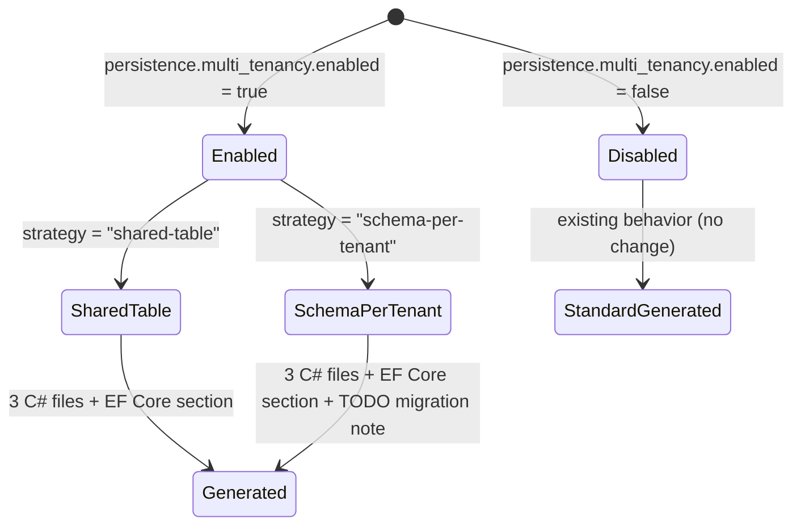

# Data Model: multitenant-db-isolation (PBI 2309)

**Phase 1 Design Artifact**
**Date**: 2026-07-08

---

## 1. Configuration Entities

### 1.1 Trigger Condition (read from `project-config.yaml`)

```yaml
persistence:
  multi_tenancy:
    enabled: boolean          # true → activate multitenant scaffolding
    strategy: string          # "shared-table" | "schema-per-tenant"
```

**Resolution order** (Constitution Article I — override resolution):
1. `project-config.yaml → persistence.multi_tenancy.enabled`
2. `docs/architecture/ConfigStackDotNet.yaml → persistence.multi_tenancy.enabled`
3. Agent default: `false` (no multitenant scaffolding)

---

## 2. Generated C# Types (Templates)

### 2.1 TenantInfo

Implements `ITenantInfo` (Finbuckle contract). Stored in `ITenantStore<TenantInfo>`.

| Field | Type | Source | Description |
|---|---|---|---|
| `Id` | `string` | JWT claim `tid` / `X-Tenant-Id` header | Unique tenant identifier (GUID or slug) |
| `Identifier` | `string` | Same as `Id` | Human-readable identifier |
| `Name` | `string` | Key Vault or tenant store | Display name |
| `ConnectionString` | `string` | Key Vault: `{tenantId}--{bc_name}-sql-connection-string` | Per-tenant DB connection |

### 2.2 AppDbContext (multitenant variant)

Replaces the standard `{BCName}DbContext : DbContext` with a Finbuckle-aware variant.

| Aspect | Standard (non-MT) | Multitenant |
|---|---|---|
| Base class | `DbContext, IUnitOfWork` | `EFCoreDbContext<TenantInfo>, IUnitOfWork` |
| Constructor injection | `ICurrentUserService` | `ICurrentUserService` + `IMultiTenantContextAccessor<TenantInfo>` |
| Global query filter | `IsDeleted == false` (soft-delete only) | `TenantId == currentTenant.Id` + `IsDeleted == false` |
| `OnModelCreating` | `base.OnModelCreating()` at end | `base.OnModelCreating()` FIRST (Finbuckle requirement) |

### 2.3 TenantResolutionMiddleware

Registered in `Program.cs` pipeline via `app.UseMultiTenant<TenantInfo>()`.

| Step | Action | Fallback |
|---|---|---|
| 1 | Read `X-Tenant-Id` HTTP header | → Step 2 |
| 2 | Extract `tid` claim from JWT Bearer token | → 400 Bad Request (no tenant) |
| 3 | Resolve `TenantInfo` from store | → 404 (tenant not found) |
| 4 | Set `IMultiTenantContext<TenantInfo>` in DI scope | — |

### 2.4 KeyVaultTenantConnectionStringResolver

Implements per-tenant connection string resolution from Azure Key Vault.

| Input | Type | Description |
|---|---|---|
| `tenantId` | `string` | Current tenant identifier |
| `bcName` | `string` | Bounded context name (kebab-case) |
| Key Vault client | `SecretClient` | Injected via `IKeyVaultConnectionStringResolver` |

**Key Vault secret naming**:
```
{tenantId}--{bc_name}-sql-connection-string
```
Examples:
- `tenant-acme--financeiro-sql-connection-string`
- `tenant-globex--pedidos-sql-connection-string`

**Returns**: `string` — the raw ADO.NET connection string

**Caching**: Per-tenant connection strings are cached in `IMemoryCache` with a configurable TTL (default: 5 minutes) to avoid repeated Key Vault calls on every request.

---

## 3. State Transitions



---

## 4. Layer Ownership

| Component | Layer | Namespace |
|---|---|---|
| `TenantInfo` (entity) | Infrastructure → Multitenancy | `{Prefix}.{BC}.Infrastructure.Multitenancy` |
| `TenantResolutionMiddleware` | Infrastructure → Multitenancy | `{Prefix}.{BC}.Infrastructure.Multitenancy` |
| `KeyVaultTenantConnectionStringResolver` | Infrastructure → Multitenancy | `{Prefix}.{BC}.Infrastructure.Multitenancy` |
| `AppDbContext` (multitenant) | Infrastructure → Persistence | `{Prefix}.{BC}.Infrastructure.Persistence` |
| Finbuckle DI registration | Infrastructure → DependencyInjection | `{Prefix}.{BC}.Infrastructure` |

> **Constitution Article IX (Clean Architecture)**: All 4 components live in `Infrastructure`. No Finbuckle dependency leaks into `Domain` or `Application`.

---

## 5. NuGet Packages Required

| Package | Resolved by | Used in |
|---|---|---|
| `Finbuckle.MultiTenant.EntityFrameworkCore` | Agent runtime (NuGet API) | Infrastructure.csproj |
| `Azure.Security.KeyVault.Secrets` | Already present (existing agent) | Infrastructure.csproj |
| `Microsoft.Extensions.Caching.Memory` | Already present (built-in) | Infrastructure.csproj |

---

## 6. Agent File Modifications

### 6.1 `build-cycle-efcore-agent.md` (pipeline_mode: build-cycle)

**New reads in Step 1.2**:
```
→ persistence.multi_tenancy.enabled   (default: false)
→ persistence.multi_tenancy.strategy  (default: "shared-table")
```

**New Step 1.2c** (after existing 1.2b): Multi-tenancy pre-flight check  
**New Step 1.5 packages**: `Finbuckle.MultiTenant.EntityFrameworkCore` added to Compatibility Assert list  
**Modified Step 3.1**: When `multi_tenancy.enabled: true`, generate multitenant variant of `{BCName}DbContext`  
**Modified Step 3.6**: When `multi_tenancy.enabled: true`, add Finbuckle DI registration  
**New Step 7**: `## Multi-tenant EF Core Setup` section (documentation + migration isolation)

### 6.2 `coder-dotnet-backend.md` (pipeline_mode: generic)

**New section** after guardrail G9: `## Multi-tenancy Scaffold Gate`  
Conditional block: when `persistence.multi_tenancy.enabled: true` → generate the 3 C# files

---

## 7. Template Files to Create

| File | Path | Generates |
|---|---|---|
| `TenantResolutionMiddleware.cs.tpl` | `tech-stack/templates/multitenant/` | `Infrastructure/Multitenancy/TenantResolutionMiddleware.cs` |
| `AppDbContext.multitenant.cs.tpl` | `tech-stack/templates/multitenant/` | `Infrastructure/Persistence/AppDbContext.cs` (MT variant) |
| `KeyVaultTenantConnectionStringResolver.cs.tpl` | `tech-stack/templates/multitenant/` | `Infrastructure/Multitenancy/KeyVaultTenantConnectionStringResolver.cs` |
