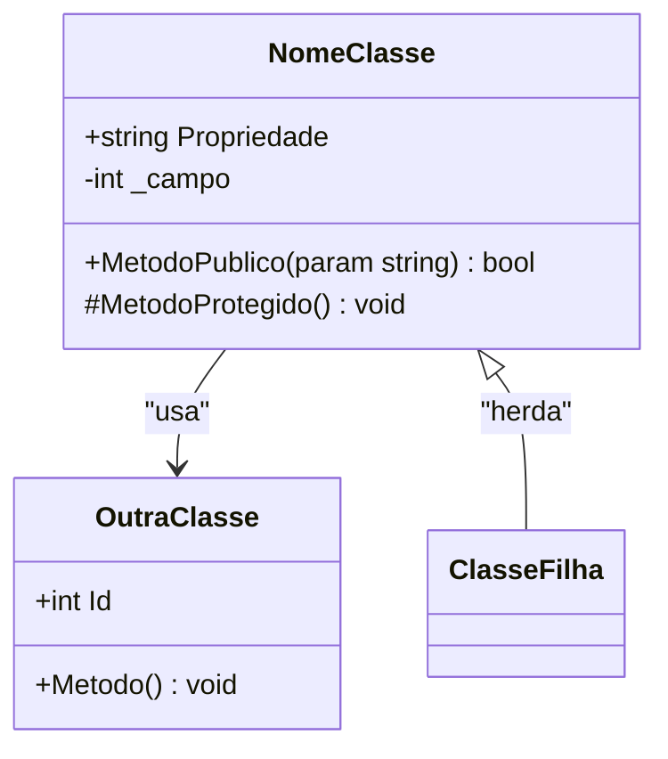
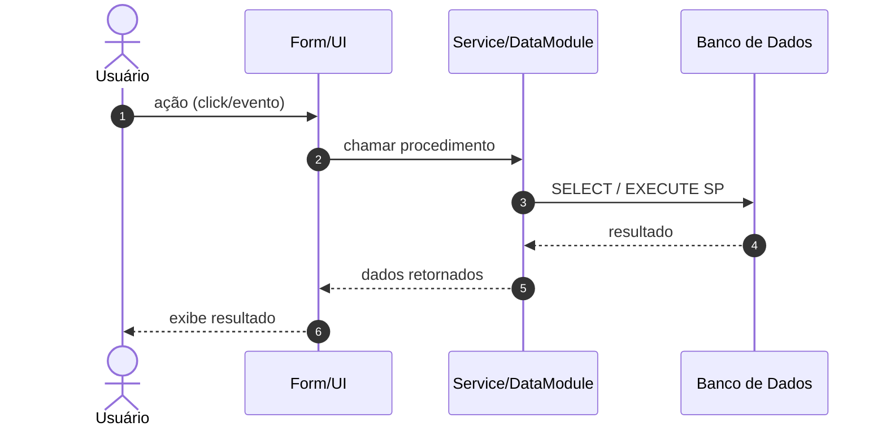
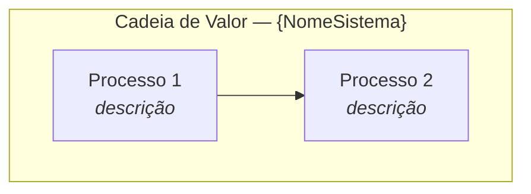

# Delphi Patterns & Mermaid Rules — AVA AS-IS

Referenciado por `solution-delphi.md` e `documentation-asis.md`.
Contém tabelas de mapeamento, regras de diagramas e templates canônicos.

---

## Mapeamento Canônico Delphi → C4

| Elemento Delphi | Tipo C4 | Label canônico |
|---|---|---|
| VCL Forms (TForm, TFrame) | Container — UI Layer | `"VCL Forms Layer\n<i>Delphi VCL</i>"` |
| TDataModule | Container — Business Logic | `"DataModule\n<i>Business / Data Bridge</i>"` |
| FireDAC / ADO / BDE target DB | Database | `"Relational DB\n<i>via FireDAC/ADO</i>"` (especificar engine se identificada) |
| Report Engine (FastReport, QR, ppReport) | Container — Reporting | `"Report Engine\n<i>{nome da suite}</i>"` |
| PDF / Printer output | External System — Output | `"PDF / Printer\n<i>OS Print Subsystem</i>"` |
| ACBr, 3rd-party DLLs | External Component | `"ACBr\n<i>External Library</i>"` |

---

## Pattern Classification — Nomes Canônicos

| Nome Canônico (usar EXATAMENTE) | Quando usar |
|---|---|
| `Smart UI (Form-Centric)` | Forms com lógica de negócio + SQL nos event handlers |
| `DataModule (Repository implícito)` | TDataModule com queries compartilhadas |
| `Two-Tier (SQL inline)` | SQL literal embutido (sem DataModule dedicado) |
| `Business Logic in SP` | Lógica de negócio dentro de Stored Procedures |
| `Rich Domain (units isoladas)` | Units de domínio com comportamento real |

---

## Regras Universais Mermaid (v11.14.0) - TODOS OS DIAGRAMAS DEVEM SER COMPATIVEIS.

> Ver regras completas e autoritativas: [MermaidGuardrails](../../shared/mermaid-guardrails.md)
> Obrigatório para TODOS os diagramas `.mmd` gerados por agentes que referenciam este arquivo.

---

## Diagramas C4

> Usar sintaxe C4 nativa: `C4Context` · `C4Container` · `C4Component` · `C4Dynamic` · `C4Deployment`.
> Ver templates canônicos e regras: [MermaidGuardrails](../../shared/mermaid-guardrails.md) seção "Regras de uso — Diagramas C4 Nativos".
>
> **Guardrail obrigatório C4:** NUNCA usar `\n` literal dentro de strings de parâmetros (`Container()`, `Rel()`, `System_Ext()`, etc.) — causa falha silenciosa no browser. Usar texto em linha única.

---

## Template Class Diagram

---

## Template Sequence Diagram

---

## Template Value Chain (flowchart TD)

---

## Flags de Risco (Migration Readiness)

Flags que DEVEM reduzir o Migration Readiness Score:
`INLINE_SQL` · `HARDCODED_VALUE` · `UI_ONLY_CLASS` · `FILE_IMPORT_*` · `FILE_EXPORT_*` · `FTP_EXPORT` · `COM_ACTIVEX_DEPENDENCY` · `NATIVE_DLL_DEPENDENCY` · `NO_AUTOMATED_TEST_COVERAGE`

`NO_AUTOMATED_TEST_COVERAGE` (fonte: `09_test_coverage.json`, ver `ava-asis-solution-delphi` Step 3) — nenhum teste automatizado DUnit/DUnitX nem indicador auxiliar de teste (scripts manuais, CI, dados de teste) detectado. Ausência de rede de segurança para validar paridade comportamental durante a migração.

Presença combinada favorece estratégias Re-Plate ou Rewrite parcial.

---

## Avaliação de Risco — Exportação

| Tipo | Risk |
|------|------|
| Filesystem local | MEDIUM |
| Exportação via UI | HIGH |
| FTP/SFTP com credenciais hardcoded | HIGH |
| Exportação sem contrato | HIGH |
