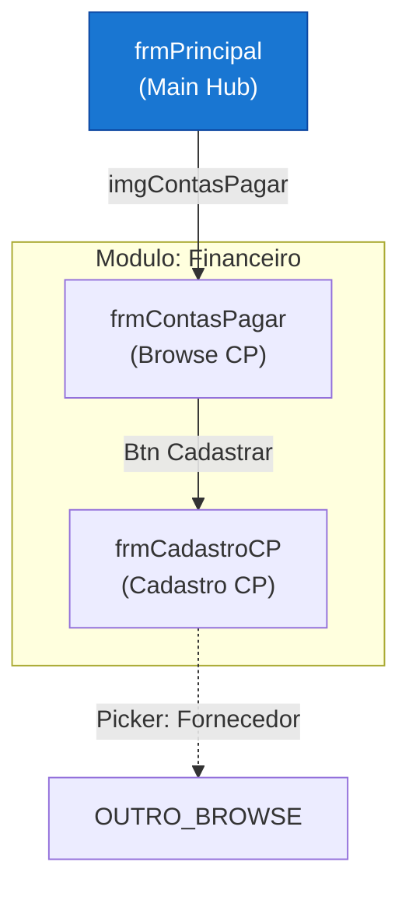

# Parser Contracts — AVA AS-IS Module

Contratos de formato que `build_summary_comprehensive.py` lê com regex fixo.
Qualquer variação de formato quebra o Summary HTML.

---

## Functional Requirements section (within business-rules.md)

> **A partir da spec-026**, o conteúdo de requisitos funcionais reside na seção
> `## Functional Requirements` de `asis/docs/business-rules.md` (artefato unificado).
> O arquivo `functional-requirements.md` foi descontinuado.

> ⚠️ NÃO usar texto narrativo livre — usar EXCLUSIVAMENTE um dos formatos abaixo.

**Formato A — section headers por RF (preferido):**
```markdown
## FR-0001: Título do Requisito
**Module**: NomeDoModulo
**Description**: Descrição completa do requisito funcional extraído do código.
**Priority**: HIGH
```

**Formato B — tabela por módulo:**
```markdown
## Module: Customer & Supplier

| FR-0001 | Register client with CPF/CNPJ | CPF validated, record saved | frmClientesFornecedores |
| FR-0002 | Filter by type C/F/CF | Correct records returned | uClientesFornecedores |
```

**Invariantes:**
- IDs SEMPRE `FR-NNN` (3 dígitos, zero-padded)
- Separador do header SEMPRE `:` (dois pontos)
- Campo `**Module**:` SEMPRE presente no Formato A
- Campo `**Description**:` SEMPRE presente no Formato A
- Campo `**Priority**:` SEMPRE em inglês maiúsculo (`HIGH`, `MEDIUM`, `LOW`)
- NÃO usar texto narrativo como seções `## 2.1 Customer...` com bullet points

---

## business-rules.md

### Formato A — Section headers (canônico)

```markdown
# Business Rules — {NomeProjeto} AS-IS
**trace_id**: {trace_id}  
**Generated**: {YYYY-MM-DD}

---

## BR-0001: Título da Regra
**Rule**: Descrição completa da regra de negócio extraída do código.  
**Impact**: Impacto desta regra no sistema ou na migração.  
**Priority**: MEDIUM
```

### Formato B — Domain table (alternativo)

```markdown
# Business Rules Catalog — {NomeProjeto} AS-IS

## Domain: {NomeDomínio}
| ID | Category | Rule | Confirmed? |
|----|----------|------|------------|
| RN-XX-01 | BRN | Descrição da regra extraída do código. | ✅ Code |
| RN-XX-02 | BRC | Outra regra de negócio. | ✅ Inferred |
```

**Categorias válidas (Formato B):** `BRN` (negócio), `BRC` (cálculo), `BRV` (validação), `BRF` (fluxo)

**Invariantes (ambos os formatos):**
- IDs: `BR-NNN` ou `RN-XX-NN` (domínio + sequencial)
- Campo `Rule` / coluna `Rule` SEMPRE presente (texto exibido no Summary)
- Arquivo SEPARADO de `business-rules.md`
- Formato B: `## Domain:` OBRIGATÓRIO como section header antes de cada tabela

---

## business-rules-catalog.json

> **A partir da spec-028**, a enumeração **100% lossless** de todas as regras de negócio AST
> reside neste artefato determinístico, produzido por
> [`business_rules_catalog_generator.py`](../utils/business_rules_catalog_generator.py) na
> pipeline de pós-extração (Step 0.7 de `run_delphi_ast_analysis.py`). É a **fonte de verdade**
> das regras consumida pelas fases downstream (TO-BE, codegen, test-plan). `business-rules.md`
> passa a ser um resumo curado que aponta para este catálogo. Ver
> [ArtifactSizeGovernance](./artifact-size-governance.md) § "Completude vs. Tamanho".

**Estrutura obrigatória:**
```json
{
  "generated_at": "<ISO-8601 UTC>",
  "project": "<string>",
  "trace_id": "<uuid>",
  "source_artifacts": ["01_business_rules.json", "02_form_business_rules.json"],
  "counts": {
    "total": 5055,
    "from_01": 4254,
    "from_02_validations": 801,
    "by_category": { "calculation": 815, "threshold_condition": 2631, "state_classification": 510, "validation": 298, "form_validation": 801 },
    "domain_relevant": 4912,
    "ui_component": 143
  },
  "rules": [
    {
      "id": "BR-0730",
      "ast_ref": "BR-0730",
      "origin": "01_business_rules.json",
      "category": "calculation",
      "unit": "TSysEstq",
      "method": "TProductCost.GetEstqDspn",
      "target": "Result",
      "expression": "QtdEstq - QtdRsrv + QtdEstqQR + QtdGrnt",
      "source": "TSysEstq.pas:1262",
      "domain_relevant": true,
      "raw": { }
    }
  ]
}
```

**Invariantes (contrato de paridade — o gerador falha com exit 1 se violado):**
- `counts.total` == `count(rules)` == `counts.from_01` + `counts.from_02_validations`
- `counts.from_01` == `payload.counts.total` de `01_business_rules.json` (nenhuma regra perdida)
- `counts.from_02_validations` == nº de campos com `has_validation == true` OU `event_handlers` não-vazio em `02_form_business_rules.json`
- Cada rule tem `id` único, `category`, `unit`, `source`, e `domain_relevant` (bool — `false` marca ruído de componente UI genérico, NUNCA descarta a regra)
- `category` ∈ {`calculation`, `threshold_condition`, `state_classification`, `validation`, `form_validation`}
- Regras de `01` usam o `id` AST (ex: `BR-0730`); regras de validação de tela de `02` usam `FBR-NNNN` sequencial
- Campo `raw` preserva o registro AST original (fidelidade lossless)

### Enumeração Markdown — `business-rules-part{N}.md`

O mesmo gerador emite a enumeração das regras de **domínio** (`domain_relevant == true`)
como Markdown particionado, Formato B agrupado por `unit`:

```markdown
## Domain: TSysEstq

| ID | Category | Rule | Source | Confirmed? |
|----|----------|------|--------|------------|
| BR-0730 | calculation | Result = QtdEstq - QtdRsrv + QtdEstqQR + QtdGrnt | TSysEstq.pas:1262 | ✅ Code |
```

- Particionado em `business-rules-part1.md`, `-part2.md`, … com orçamento < 600 KB/part (ver [ArtifactSizeGovernance](./artifact-size-governance.md) § 5); cada part inicia com o header `> ⚠️ Artefato particionado — este é o {N}º de {total} arquivos.`
- Regras com `domain_relevant == false` (ruído de UI) permanecem **apenas** no catálogo JSON.
- Complementa (não substitui) o resumo curado de `business-rules.md`.

---

## metrics.json

Campos OBRIGATÓRIOS (flat JSON, usar `0` quando não se aplica):

```json
{
  "total_loc": 0,
  "total_files": 0,
  "total_classes": 0,
  "total_methods": 0,
  "total_forms": 0,
  "total_datamodules": 0,
  "total_units": 0,
  "total_packages": 0,
  "layers_count": 0,
  "modules_count": 0,
  "complexity": {
    "average_cc": 0,
    "max_cc": 0,
    "files_above_10": 0,
    "top_complex_files": []
  },
  "coupling": {
    "afferent_avg": 0,
    "efferent_avg": 0,
    "instability_avg": 0
  }
}
```

---

## pattern-classifications.json

Campo `pattern` DEVE usar exatamente um dos 5 nomes canônicos (case-sensitive):

| Nome Canônico | Quando usar |
|---|---|
| `Smart UI (Form-Centric)` | Forms com lógica de negócio + SQL nos event handlers |
| `DataModule (Repository implícito)` | TDataModule com queries compartilhadas |
| `Two-Tier (SQL inline)` | SQL literal embutido (sem DataModule dedicado) |
| `Business Logic in SP` | Lógica de negócio dentro de Stored Procedures |
| `Rich Domain (units isoladas)` | Units de domínio com comportamento real |

---

## bounded-context-map.md

Cada `## BC-NN: Nome` DEVE conter:
```
**Forms**: N
**Units**: u1.pas, u2.pas, ...
**LOC**: NNN
**Risk**: HIGH|MEDIUM|LOW — justificativa
```

`**Forms**` = arquivos com par `.dfm` (TForm, TFrame, TDataModule). Não incluir units sem form.

---

## patterns-applied.json

Arquivo TO-BE produzido por `ava-tobe-architecture-technical` (trigger `PA`).
Contraparte TO-BE de `asis/pattern-classifications.json`.

**Estrutura obrigatória:**
```json
{
  "generated_at": "<ISO-8601>",
  "project_name": "<string>",
  "trace_id": "<uuid>",
  "patterns": [ { ... } ]
}
```

**Campos obrigatórios de cada objeto em `patterns[]`:**

| Campo | Tipo | Descrição |
|---|---|---|
| `pattern_name` | string | Nome canônico (case-sensitive) |
| `layer` | string | Camada da solução onde o padrão é aplicado |
| `justification` | string | Por que o padrão foi escolhido |
| `reference_artifact` | string | Artefato concreto que materializa o padrão |
| `trade_offs` | string[] | Trade-offs aceitos (DEVE ser array, nunca string simples) |
| `adr_reference` | string | Arquivo ADR vinculante (ex: `ADR-004-backend.md`) |

**Nomes canônicos obrigatórios (7 patterns — case-sensitive):**

| `pattern_name` canônico | Camada esperada |
|---|---|
| `Clean Architecture` | `All layers` |
| `CQRS` | `Application` |
| `Repository` | `Infrastructure` |
| `Unit of Work` | `Infrastructure` |
| `Domain Events` | `Domain` |
| `Specification` | `Domain` |
| `Guard Clauses` | `Domain` |

**Invariantes (parser `build_summary_complete.py`):**
- `patterns` DEVE ser array JSON (não dict)
- `pattern_name` DEVE ser exatamente um dos 7 nomes acima (variações de case geram contagem 0 na tabela HTML)
- `trade_offs` DEVE ser array de strings
- JSON válido — sem trailing commas, sem comentários

---

## screen-navigation-map.md

> 📐 Template completo de formato: ver [Screen Navigation Flow Template](../../../../shared/templates/diagrams/screen-navigation-flow.md)

**Seções OBRIGATÓRIAS (nesta ordem):**

### 1. Navigation Flow (bloco mermaid com navegabilidade)
```markdown
## Navigation Flow


```

**Regras do diagrama Mermaid (OBRIGATÓRIO):**
- **Nó = form/screen real** — ID curto + label com `formName<br/>(descricao)`
- **Aresta = trigger/ação** — `-->|"Btn Cadastrar"|` ou `-->|"Menu: Item"|`
- **Subgraph = módulo** — agrupar forms por bounded context/módulo funcional
- **Lookup/Picker = dashed** — `-.->|"Picker: Entidade"|` para modais de seleção
- **Hub principal = style destacado** — `style MAIN fill:#1976d2,color:#fff`
- Sem trigger nos edges = diagrama INVÁLIDO (não mostra navegabilidade)

### 2. Screen Inventory
```markdown
## Screen Inventory

| Screen | Form | Trigger | Type |
|--------|------|---------|------|
| Main Dashboard | frmPrincipal | Application start | Parent shell |
```

**Para projetos API-first (sem VCL forms):** usar endpoints como linhas.
**Invariantes:** cabeçalho SEMPRE `| Screen | Form | Trigger | Type |`, mínimo 1 linha de dados.
