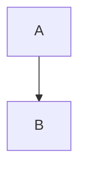

# Summary compatibility contract

Architecture Blueprints are validated by the exact Mermaid bundle embedded in
the Summary template. `C4Container` is not assumed to be supported: runtime
version extraction and an actual `mermaid.render()` C4 capability test are
required. Silent conversion from C4 to `flowchart` is prohibited. Unsupported
or malformed C4, configuration failures, version mismatch, source-integrity
mismatch, and missing evidence block publication.

# Mermaid Guardrails — v11.14.0

> ⚠️ **Compatibilidade: Mermaid v11.14.0** — pinned. Qualquer sintaxe incompatível causa
> falha silenciosa: o diagrama exibe código bruto em vez de renderizar no Summary HTML.
>
> **OBRIGATÓRIO em todos os agentes que geram arquivos `.mmd` ou blocos mermaid.**
> _Document version: **v1.7.0**_

---

## Tipos PERMITIDOS

Tipos estáveis em v11.14.0:

`flowchart` · `sequenceDiagram` · `classDiagram` · `erDiagram` · `gantt` · `pie` · `gitGraph` · `stateDiagram-v2` · `mindmap` · `timeline` · `journey` · `quadrantChart` · `C4Context` · `C4Container` · `C4Component` · `C4Dynamic` · `C4Deployment`

---

## Tipos PROIBIDOS

| Tipo proibido | Motivo                   | Substituto  |
| ------------- | ------------------------ | ----------- |
| `graph`       | Legado — removido em v11 | `flowchart` |

| `stateDiagram` | v1 legado | `stateDiagram-v2` |
| `xychart-beta` | Beta — instável em v11 | — |
| `block-beta` | Beta — instável em v11 | — |
| `architecture-beta` | Beta — instável em v11 | — |
| `sankey-beta` | Beta — instável em v11 | — |
| `packet-beta` | Beta — instável em v11 | — |
| `zenuml` | Instável em v11 | — |

---

## Guardrails de Sintaxe

- NUNCA usar `graph TB` — usar `flowchart TB`
- NUNCA prefixar labels com `? — incerteza DEVE ser documentada via `%% [INFERRED]` em comentário separado, nunca no label do nó
- Stadium shape: fechar com `"])` — NUNCA `"])]`
- Um nó por linha — nunca dois nós na mesma linha sem separador
- `\n` proibido em títulos de `subgraph` — usar `-` inline (ver tabela de Caracteres PROIBIDOS: `—` U+2014 é PROIBIDO). `\n` válido APENAS dentro de labels de nós entre aspas duplas `["linha1<br/>linha2"]`
- Nós referenciados em arestas DEVEM estar declarados antes da aresta
- IDs de nós: somente `[A-Za-z0-9_]` — sem espaços, hífens, acentos ou caracteres especiais
- Labels com espaço: `["Texto com espaço"]` ou `["Linha 1<br/>Linha 2"]` — máx 35 chars/linha
- `subgraph`: sempre fechar com `end` explícito
- **Subgraph ID com espaços**: PROIBIDO `subgraph "Nome com Espaços"` — usar SEMPRE `subgraph ALIAS["Nome com Espaços"]` onde ALIAS é um identificador `[A-Za-z0-9_]` sem espaços. A forma sem alias provoca parse error em v11.14.0 quando o nome contém espaços ou caracteres especiais.
- Aninhamento: máximo 2 níveis de subgraph — renderização quebra em 3+
- **Auto-arestas (self-loop)**: PROIBIDO `A --> A` ou `A -->|"label"| A` — um nó apontando para si mesmo pode causar loop infinito no motor de layout. Se uma ação retorna ao mesmo form, OMITIR a aresta.
- Conexões com labels: `-->|"label texto"|` com aspas duplas obrigatórias
- Caracteres proibidos em labels **sem** aspas: `{`, `}`, `(`, `)` causam erro de parse

---

## Caracteres PROIBIDOS

Em qualquer diagrama Mermaid, NUNCA usar os seguintes caracteres fora do contexto indicado:

| Caractere                           | Unicode                        | Contexto                                                                                                | Substituto                                                                    |
| ----------------------------------- | ------------------------------ | ------------------------------------------------------------------------------------------------------- | ----------------------------------------------------------------------------- |
| `~` tilde                           | U+007E                         | PROIBIDO fora de `classDiagram`                                                                         | espaço                                                                        |
| `"` aspas curvas esquerda           | U+201C                         | PROIBIDO em qualquer contexto                                                                           | `"` (U+0022)                                                                  |
| `"` aspas curvas direita            | U+201D                         | PROIBIDO em qualquer contexto                                                                           | `"` (U+0022)                                                                  |
| `'` aspas simples curvas            | U+2018/U+2019                  | PROIBIDO em qualquer contexto                                                                           | `'` (U+0027)                                                                  |
| `"` aspas retas                     | U+0022                         | PROIBIDO fora de `["label"]`                                                                            | espaço (dentro de labels é obrigatório)                                       |
| `→` seta unicode                    | U+2192                         | PROIBIDO como operador                                                                                  | `-->` ou `to`                                                                 |
| `↔` seta bidirecional               | U+2194                         | PROIBIDO em qualquer contexto                                                                           | `<-->` ou texto descritivo                                                    |
| `←` seta esquerda                   | U+2190                         | PROIBIDO como operador                                                                                  | `<--`                                                                         |
| `⇒` seta dupla                      | U+21D2                         | PROIBIDO como operador                                                                                  | `-->`                                                                         |
| `—` em-dash                         | U+2014                         | PROIBIDO em qualquer contexto (labels, titles, subgraph headers, gantt sections)                        | `-`                                                                           |
| `–` en-dash                         | U+2013                         | PROIBIDO em qualquer contexto                                                                           | `-`                                                                           |
| `─` box-drawing horizontal          | U+2500                         | PROIBIDO em qualquer contexto                                                                           | `-` (U+002D) ou remover                                                       |
| `│` box-drawing vertical            | U+2502                         | PROIBIDO em qualquer contexto                                                                           | `\|` ou remover                                                               |
| `┌` `┐` `└` `┘` box-drawing corners | U+250C/U+2510/U+2514/U+2518    | PROIBIDO em qualquer contexto                                                                           | remover                                                                       |
| `•` bullet                          | U+2022                         | PROIBIDO em labels (causa parse error em flowchart)                                                     | `*` ou remover                                                                |
| `·` middle dot                      | U+00B7                         | PROIBIDO em labels sem aspas                                                                            | usar dentro de `["..."]` ou remover                                           |
| NBSP espaço não-quebrável           | U+00A0                         | PROIBIDO em qualquer contexto                                                                           | espaço simples U+0020                                                         |
| Zero-width space                    | U+200B                         | PROIBIDO em qualquer contexto                                                                           | remover                                                                       |
| Zero-width non-joiner               | U+200C                         | PROIBIDO em qualquer contexto                                                                           | remover                                                                       |
| Zero-width joiner                   | U+200D                         | PROIBIDO em qualquer contexto                                                                           | remover                                                                       |
| BOM (Byte Order Mark)               | U+FEFF                         | PROIBIDO no início de arquivo ou em qualquer contexto                                                   | remover                                                                       |
| `` ` `` backtick                    | U+0060                         | PROIBIDO em labels                                                                                      | `'` apóstrofo simples                                                         |
| `;` ponto-e-vírgula                 | U+003B                         | PROIBIDO em labels ou IDs                                                                               | espaço                                                                        |
| `#` hash                            | U+0023                         | PROIBIDO em labels sem aspas (conflita com hex colors)                                                  | remover ou usar dentro de `["..."]`                                           |
| `&` ampersand                       | U+0026                         | PROIBIDO em labels sem aspas (conflita com HTML entities)                                               | `and` ou usar dentro de `["..."]`                                             |
| Emojis                              | U+1F000–U+1FAFF, U+2600–U+27BF | PROIBIDO em qualquer contexto (node IDs, labels, subgraph headers, edge labels, gantt sections, titles) | remover completamente — NUNCA substituir por texto alternativo no mesmo token |

> ⚠️ **Regra de ouro:** Qualquer caractere fora do range ASCII printável (U+0020–U+007E) que não seja acentuação portuguesa válida (á, é, í, ó, ú, ã, õ, â, ê, ô, ç) DEVE ser removido ou substituído pelo equivalente ASCII.

---

## Labels Multi-linha — Protocolo Obrigatório

> ⚠️ **Causa raiz de CYLINDEREND parse error** — o mecanismo mais frequente de quebra de diagrama v11.

**PROIBIDO — raw newline em label não-quoted:**

```
%% ❌ NUNCA FAZER — raw \n dentro de [...] sem aspas
User([Usuario do ERP
Departamento Financeiro])

MeuERP[Meu-ERP
Delphi 7 VCL Desktop App
Gestao financeira]
```

**Mecanismo da falha:** raw `\n` dentro de `[...]` sem aspas duplas reseta o contexto do lexer v11 para "início de linha". O token seguinte ao reset é reavaliado — se o label termina com `)`, `}`, `>` ou `]` após a quebra, esses são tokenizados como `CYLINDEREND`, `RHOMB_END`, `DIAMOND_END` ou `SQE` inesperados, causando `Parse error on line N`.

**OBRIGATÓRIO — sempre usar `<br/>` dentro de aspas duplas:**

```
%% ✅ SEMPRE FAZER
User(["Usuario do ERP<br/>Departamento Financeiro"])

MeuERP["Meu-ERP<br/>Delphi 7 VCL Desktop App<br/>Gestao financeira"]

MySQL[("MySQL Database<br/>Dados financeiros<br/>cadastros")]
```

**Regra:** Todo label que ocupa mais de uma linha lógica DEVE usar `["linha1<br/>linha2"]` com aspas duplas obrigatórias. Máx. 35 chars por segmento de linha.

---

## Compound-Close Tokens — PROIBIDOS em labels não-quoted

Se o label contém qualquer par de fechamento de shape — envolver em `["label"]` obrigatório.

| Sequência no label | Token errado gerado | Shape que conflita | Fix                |
| ------------------ | ------------------- | ------------------ | ------------------ |
| `...texto)]`       | `CYLINDEREND`       | `[("cilindro")]`   | `["texto com )"]`  |
| `...texto))`       | `ROUND_END`         | `(("round"))`      | `["texto com ))"]` |
| `...texto}}`       | `RHOMB_END`         | `{{"rhombus"}}`    | `["texto com }}"]` |
| `...texto>>`       | `DIAMOND_END`       | `>>"diamond">>`    | `["texto com >>"]` |

---

## Checklist de Validação Pré-Geração (Self-Verification Obrigatória)

Verificar CADA arquivo `.mmd` antes de finalizar:

- [ ] Tipo de diagrama está na lista PERMITIDOS — nunca na lista PROIBIDOS
- [ ] Nenhum node ID contém espaço, hífen ou acento — somente `[A-Za-z0-9_]`
- [ ] Todo label com espaço ou caractere especial está entre aspas duplas `["..."]`
- [ ] Nenhum label multi-linha usa raw `\n` — somente `<br/>` dentro de `["..."]`
- [ ] Nenhum label não-quoted termina com `)`, `}`, `>` antes de `]`
- [ ] Todo `subgraph` possui `end` explícito
- [ ] Todo `subgraph` com nome legível usa formato `subgraph ALIAS["Nome Legível"]` — NUNCA `subgraph "Nome com Espaços"` sem alias
- [ ] Nenhuma auto-aresta (self-loop): `A --> A` ou `A -->|"label"| A` — verificar que source ≠ target em TODAS as arestas
- [ ] Aninhamento de subgraph não ultrapassa 2 níveis
- [ ] Labels de arestas usam `-->|"texto"|` com aspas
- [ ] Nenhum caractere unicode proibido presente: `~` `"` `"` `→` `—` NBSP ZWS `` ` `` `;`
- [ ] Nenhum emoji em node IDs nem em labels, subgraph headers ou edge labels
- [ ] Se dados insuficientes → placeholder: `flowchart TB\n  PH["%% [INCOMPLETE - needs review]"]`
- [ ] Arquivo `.mmd` **NÃO inicia com ` ```mermaid ` ou ` ``` `** — conteúdo raw Mermaid apenas, sem delimitadores markdown
- [ ] Diagrama C4: nenhum `\n` literal dentro de strings de `Container()`, `Component()`, `Rel()`, `System_Ext()`, `Deployment_Node()`
- [ ] Diagrama C4: `System_Ext` / `Person_Ext` declarados FORA do `Container_Boundary`
- [ ] Diagrama C4: `Rel()` externos (componente → sistema externo) declarados FORA do `Container_Boundary`
- [ ] Diagrama C4Deployment: `<br/>` em labels de `Deployment_Node` é permitido (único tipo que aceita)

---

## Regras de uso — Diagramas C4 Nativos

> ✅ `C4Context` · `C4Container` · `C4Component` · `C4Dynamic` · `C4Deployment` são **PERMITIDOS e estáveis** em Mermaid v11.14.0.
>
> A única restrição é `\n` literal dentro de strings de parâmetros — causa falha silenciosa no browser com `htmlLabels:true`.

### Regras obrigatórias

- NUNCA usar `\n` literal dentro de strings de parâmetros — tudo em linha única
- `System_Ext` / `Person_Ext` / `ContainerDb_Ext` declarados FORA do `Container_Boundary`
- `Rel()` internos (entre componentes dentro do mesmo módulo) → DENTRO do `Container_Boundary`
- `Rel()` externos (componente → sistema externo) → FORA do `Container_Boundary`
- `UpdateRelStyle()` para ajuste visual de offsets em pixels ($offsetX / $offsetY)
- `Rel_U()` / `Rel_R()` / `Rel_L()` / `Rel_D()` → controle de direção de seta em C4Deployment
- CLI aprovado ≠ Browser aprovado — validar SEMPRE no Summary HTML gerado
- IDs de nós e nós de infraestrutura: somente `[A-Za-z0-9_]` — sem espaços, hífens ou acentos

### Template canônico — C4Context

```
C4Context
  title [título descritivo]
  Enterprise_Boundary(b0, "Nome da Empresa") {
    Person(userId, "Nome Pessoa", "Descricao em linha unica")
    System(sysId, "Nome Sistema", "Descricao em linha unica")
    Enterprise_Boundary(b1, "Sub-Boundary") {
      SystemDb_Ext(extId, "Sistema Externo", "Descricao em linha unica")
    }
  }
  BiRel(userId, sysId, "Usa")
  Rel(sysId, extId, "Envia dados", "HTTPS")
  UpdateRelStyle(userId, sysId, $textColor="blue", $lineColor="blue", $offsetX="5")
  UpdateLayoutConfig($c4ShapeInRow="3", $c4BoundaryInRow="1")
```

### Template canônico — C4Container

```
C4Container
  title [título descritivo]
  Person(userId, "Nome Pessoa", "Descricao em linha unica")
  System_Ext(extId, "Sistema Externo", "Descricao em linha unica")
  Container_Boundary(c1, "Nome da Aplicacao") {
    Container(appId, "Nome Container", "Tecnologia", "Descricao em linha unica")
    ContainerDb(dbId, "Database", "SQL Database", "Descricao em linha unica")
    ContainerDb_Ext(apiId, "API Ext", "Docker", "Descricao em linha unica")
  }
  Rel(userId, appId, "Usa", "HTTPS")
  Rel(appId, dbId, "Le e escreve", "JDBC")
  Rel(appId, extId, "Usa", "XML/HTTPS")
  UpdateRelStyle(userId, appId, $offsetY="60", $offsetX="90")
```

### Template canônico — C4Component

> ⚠️ **`Component_Boundary` NÃO EXISTE no Mermaid v11.** É uma keyword do C4PlantUML (ferramenta diferente).
> Usar **`Container_Boundary`** para agrupar componentes dentro de módulos — funciona igual visualmente e é o único keyword aceito pelo lexer Mermaid v11 C4Component.
>
> ❌ PROIBIDO: `Component_Boundary(mod, "Module") { ... }`
> ✅ CORRETO: `Container_Boundary(mod, "Module") { ... }`

```
C4Component
  title [título descritivo]
  System_Ext(extId, "Sistema Externo", "Descricao em linha unica")
  ContainerDb(dbId, "Database", "Relational DB", "Descricao em linha unica")
  Container_Boundary(api, "Nome da Aplicacao") {
    Container_Boundary(modA, "Modulo A") {
      Component(compA, "Controller A", "MVC Rest", "Descricao em linha unica")
      Component(compB, "Service B", "Spring Bean", "Descricao em linha unica")
    }
    Rel(compA, compB, "Usa")
    Rel(compB, dbId, "Le e escreve", "JDBC")
    Rel(compB, extId, "Usa", "XML/HTTPS")
  }
  Rel_Back(extId, compA, "Usa", "JSON/HTTPS")
  UpdateRelStyle(compA, compB, $offsetX="-160", $offsetY="10")
```

### Template canônico — C4Dynamic

> Mostra **fluxo de execução numerado** em runtime (passos numerados automaticamente pelo Mermaid).
> Usar para: login flow, checkout, processos step-by-step. NÃO para estrutura estática.

```
C4Dynamic
  title [título descritivo — fluxo dinâmico numerado]
  ContainerDb(dbId, "Database", "Relational DB", "Descricao em linha unica")
  Container(spa, "Single-Page App", "JavaScript", "Descricao em linha unica")
  Container_Boundary(b, "API Application") {
    Component(ctrl, "Controller", "Spring MVC", "Descricao em linha unica")
    Component(svc, "Service", "Spring Bean", "Descricao em linha unica")
  }
  Rel(spa, ctrl, "Envia credenciais", "JSON/HTTPS")
  Rel(ctrl, svc, "Chama metodo()")
  Rel(svc, dbId, "SELECT * FROM tabela WHERE campo = ?", "JDBC")
  UpdateRelStyle(spa, ctrl, $textColor="red", $offsetY="-40")
  UpdateRelStyle(ctrl, svc, $textColor="red", $offsetX="-40", $offsetY="60")
  UpdateRelStyle(svc, dbId, $textColor="red", $offsetY="-40", $offsetX="10")
```

### Template canônico — C4Deployment

> `<br/>` é **permitido** em labels de `Deployment_Node` (único tipo C4 que aceita).
> Usar `Rel_U/R/L/D()` para controlar direção e evitar sobreposição em infra densa.
> `Deployment_Node` pode ter N níveis de aninhamento — cada nível = camada de infra.

```
C4Deployment
  title [título descritivo — ambiente: dev/staging/prod]

  Deployment_Node(clientDevice, "Dispositivo do Cliente", "iOS ou Android") {
    Container(mobileApp, "Mobile App", "Xamarin", "Descricao em linha unica")
  }

  Deployment_Node(serverInfra, "Datacenter", "Nome do DC") {
    Deployment_Node(webServer, "Servidor Web x4", "Ubuntu 22.04 LTS") {
      Deployment_Node(tomcat, "Apache Tomcat", "Tomcat 10.x") {
        Container(webApp, "Web Application", "Java Spring MVC", "Descricao em linha unica")
      }
    }
    Deployment_Node(appServer, "Servidor API x8", "Ubuntu 22.04 LTS") {
      Deployment_Node(tomcatApi, "Apache Tomcat", "Tomcat 10.x") {
        Container(apiApp, "API Application", "Java Spring MVC", "Descricao em linha unica")
      }
    }
    Deployment_Node(dbPrimary, "DB Primario", "Ubuntu 22.04 LTS") {
      Deployment_Node(dbEngine, "Engine Primary", "SQL Server 2022") {
        ContainerDb(db, "Database", "Relational Schema", "Descricao em linha unica")
      }
    }
    Deployment_Node(dbReplica, "DB Replica", "Ubuntu 22.04 LTS") {
      Deployment_Node(dbEngine2, "Engine Secondary", "SQL Server 2022") {
        ContainerDb(db2, "Database Replica", "Relational Schema", "Descricao em linha unica")
      }
    }
  }

  Rel(mobileApp, apiApp, "Chama API", "JSON/HTTPS")
  Rel(apiApp, db, "Le e escreve", "JDBC")
  Rel(apiApp, db2, "Le e escreve", "JDBC")
  Rel_R(db, db2, "Replica dados")

  UpdateRelStyle(mobileApp, apiApp, $offsetY="-40")
  UpdateRelStyle(apiApp, db, $offsetY="-20", $offsetX="5")
  UpdateRelStyle(db, db2, $offsetY="-10")
```

---

## Regras de uso — erDiagram (Mapeamento de Tipos para Mermaid v11.14.0)

> ⚠️ **Problema recorrente**: Agentes que geram `erDiagram` para engines SQL Server / PostgreSQL
> tendem a usar tipos DDL nativos (ex: `uniqueidentifier`, `NVARCHAR(MAX)`, `ROWVERSION`) que,
> embora tecnicamente aceitos pelo lexer de erDiagram, são verbosos e podem causar falha silenciosa
> em alguns builds do Mermaid v11.14.0 quando combinados com outros atributos.
>
> **Regra obrigatória:** Em arquivos `.mmd` com `erDiagram`, usar SEMPRE os aliases abaixo.
> Os tipos DDL completos pertencem ao DDL SQL (`.sql`, `.md` de report), NUNCA ao `.mmd`.

### Tabela de Mapeamento — DDL SQL Server → erDiagram Mermaid

| Tipo DDL (não usar no .mmd)                  | Alias Mermaid erDiagram (usar)   |
| -------------------------------------------- | -------------------------------- |
| `UNIQUEIDENTIFIER` / `uniqueidentifier`      | `uuid`                           |
| `NVARCHAR(n)` / `NVARCHAR(MAX)` / `nvarchar` | `varchar`                        |
| `DATETIME2(7)` / `datetime2`                 | `datetime`                       |
| `ROWVERSION` / `rowversion`                  | `bytes`                          |
| `BIGINT` / `bigint`                          | `bigint` _(OK — comum e aceito)_ |
| `NUMERIC(18,2)` / `numeric`                  | `decimal`                        |
| `BIT` / `bit`                                | `boolean`                        |
| `INT IDENTITY(1,1)` / `int`                  | `int` _(OK — usar sem IDENTITY)_ |
| `DATE` / `date`                              | `date` _(OK)_                    |
| `TEXT` / `NVARCHAR(MAX)` como texto longo    | `string`                         |

### Tabela de Mapeamento — DDL PostgreSQL → erDiagram Mermaid

| Tipo DDL (não usar no .mmd)                | Alias Mermaid erDiagram (usar) |
| ------------------------------------------ | ------------------------------ |
| `BIGSERIAL`                                | `int`                          |
| `TIMESTAMPTZ` / `TIMESTAMP WITH TIME ZONE` | `datetime`                     |
| `BOOLEAN`                                  | `boolean` _(OK)_               |
| `TEXT`                                     | `string`                       |
| `NUMERIC(18,2)`                            | `decimal`                      |
| `UUID`                                     | `uuid` _(OK)_                  |

### Template correto — erDiagram com aliases Mermaid

```
erDiagram
    NOME_ENTIDADE {
        uuid   id_nome_entidade  PK
        uuid   id_tabela_fk      FK
        varchar  nome_campo
        decimal  valor_campo
        date     data_campo
        datetime created_at
        datetime updated_at
        datetime deleted_at
        varchar  created_by
        varchar  updated_by
        int      versao_linha
    }
```

---

## Regras de uso — Gantt (Mermaid v11.14.0)

> ⚠️ **Em-dash em `section` names é a causa #1 de gantt não renderizar.**
> O parser de gantt v11 interpreta `—` (U+2014) como token de separação inválido.

### Regras obrigatórias

- `dateFormat YYYY-MM-DD` — DEVE ser a primeira directiva após `title`
- `section` names: SOMENTE texto ASCII + espaço + hífen simples `-` (U+002D)
  - ❌ `section Wave 0 — Foundation` (em-dash U+2014)
  - ✅ `section Wave 0 - Foundation` (hífen simples U+002D)
- Task IDs: `[a-zA-Z0-9_]` — sem espaços, sem hífens
  - ❌ `w0-a` (hífen no ID)
  - ✅ `w0a` (sem hífen)
- Task labels: texto livre MAS sem `:`, `{`, `}` fora do contexto de status
  - ❌ `Análise & Design: fase 1 :done, w1a, 2026-07-01, 10d` (`:` duplicado no label)
  - ✅ `Analise e Design fase 1 :done, w1a, 2026-07-01, 10d`
- Status válidos: `done`, `active`, `crit`, ou omitido — NUNCA free text
- Relative dates: `after <task_id>` — o task_id DEVE existir no mesmo diagrama
- `excludes weekends` — opcional, mas se presente DEVE ser a 2ª ou 3ª directiva
- Acentos em task labels: PERMITIDOS mas recomenda-se ASCII para máxima compatibilidade
- **PROIBIDO emojis** em titles, section names, e task labels
- **PROIBIDO** caracteres unicode decorativos: `─`, `│`, `•`, `→`, `←`, `↔`

### Template correto — Gantt

```
gantt
    title Migration Plan - 52 Weeks
    dateFormat YYYY-MM-DD
    axisFormat %b-%Y

    section Wave 0 - Foundation
    Solution Scaffolding    :w0a, 2026-07-01, 1w
    CI/CD Pipeline          :w0b, after w0a, 1w

    section Wave 1 - CustomerSupplier
    Domain + App Layer      :w1a, after w0b, 2w
    Infrastructure + API    :w1b, after w1a, 2w
    Tests + UAT             :w1c, after w1b, 3w
```

---

## Regras de uso — sequenceDiagram

> SequenceDiagram tem regras próprias de label que diferem de flowchart.

### Regras obrigatórias

- `participant` aliases: `[A-Za-z0-9_]` — sem espaços, sem hífens
- `participant` labels com `as`: `participant MW as Middleware` — texto livre após `as` **sem colchetes ou parênteses**
  - ⚠️ **PROIBIDO**: `participant X as LABEL [Smart UI]` — `[Smart UI]` após o label é tokenizado pelo lexer v11 como bracket token, não como parte do label, causando parse error
  - ✅ **CORRETO**: `participant X as LABEL` ou `participant X as "Smart UI"`
- **`<br/>` é PERMITIDO** em labels de `participant ... as ...` para multi-linha
  - ✅ `participant MW as Middleware<br/>(JWT + Correlation + Logging)`
- Mensagens entre participantes: texto livre entre aspas ou sem aspas
  - ✅ `UI->>+MW: POST /api/endpoint`
  - ✅ `MW-->>-UI: 200 OK`
- `Note over` / `Note right of` / `Note left of`: texto multi-linha com `end`
  - ✅ `Note right of DOM: Guard clausula<br/>Status check`
- **PROIBIDO** `\n` literal em qualquer string — usar `<br/>`
- **PROIBIDO** emojis em participant names, aliases, ou mensagens
- **PROIBIDO** em-dash `—` e en-dash `–` — usar `-`

## PROIBIDO — Markdown Code Fences em arquivos `.mmd`

> ⚠️ **INVARIANTE ABSOLUTO:** Arquivos `.mmd` NUNCA devem ser gerados com delimitadores markdown.

Um arquivo `.mmd` contém **APENAS** conteúdo Mermaid puro. É proibido envolver em ` ```mermaid ` ou ` ``` `.

**❌ PROIBIDO — conteúdo com code fence:**

````


**✅ CORRETO — conteúdo `.mmd` raw (sem nenhum delimitador):**
```

flowchart TB
A --> B

````

**Mecanismo da falha:** O builder lê o arquivo `.mmd` e injeta seu conteúdo diretamente no bloco mermaid do HTML. Se o conteúdo começa com ` ```mermaid `, o renderer recebe ` ```mermaid ` como primeira linha — parse error imediato e exibição de código bruto.

**Detecção automática:** O gate `validate_diagram.py` e o check suite `mermaid_files.py` detectam e reportam code fences em arquivos `.mmd` (rule: `code_fence_in_mmd`). O sanitizador `sanitize_diagrams.py` remove automaticamente code fences detectados (`CODE_FENCE_STRIPPED`).

> ⚠️ **TODOS os agentes que geram `.mmd` DEVEM executar este protocolo ANTES de gravar o arquivo.**
> Este protocolo é a ÚLTIMA barreira antes da escrita — se um caractere proibido escapar das
> regras anteriores, este protocolo o captura.

### Passo 1 — Remoção de caracteres invisíveis

Remover TODOS os seguintes caracteres do conteúdo gerado:
- BOM (U+FEFF)
- Zero-width space (U+200B)
- Zero-width non-joiner (U+200C)
- Zero-width joiner (U+200D)
- NBSP (U+00A0) → substituir por espaço simples (U+0020)

### Passo 2 — Substituição de caracteres proibidos

Aplicar as seguintes substituições em TODO o conteúdo:

| De | Para | Regex |
|---|---|---|
| `—` (U+2014) | ` - ` | `\u2014` → ` - ` |
| `–` (U+2013) | ` - ` | `\u2013` → ` - ` |
| `"` `"` (U+201C/U+201D) | `"` (U+0022) | `[\u201C\u201D]` → `"` |
| `'` `'` (U+2018/U+2019) | `'` (U+0027) | `[\u2018\u2019]` → `'` |
| `→` (U+2192) | ` to ` | `\u2192` → ` to ` |
| `←` (U+2190) | ` from ` | `\u2190` → ` from ` |
| `↔` (U+2194) | ` <--> ` | `\u2194` → ` <--> ` |
| `⇒` (U+21D2) | ` --> ` | `\u21D2` → ` --> ` |
| `─` (U+2500) | `-` | `\u2500` → `-` |
| `│` (U+2502) | `\|` | `\u2502` → `\|` |
| `•` (U+2022) | `*` | `\u2022` → `*` |
| Box-drawing (U+2500–U+257F) | remover | `[\u2500-\u257F]` → `` |

### Passo 3 — Remoção de emojis

Remover TODOS os codepoints nos seguintes ranges:
- U+1F000–U+1FAFF (Emoticons, Transport, Map, Objects, etc.)
- U+1F600–U+1F64F (Emoticons)
- U+1F300–U+1F5FF (Misc Symbols)
- U+1F680–U+1F6FF (Transport)
- U+1F900–U+1F9FF (Supplemental Symbols)
- U+2600–U+27BF (Misc Symbols, Dingbats)
- U+FE00–U+FE0F (Variation Selectors)
- U+200D (ZWJ — usado em sequências de emoji compostos)
- U+E0020–U+E007F (Tags)

> ⚠️ Após remoção de emoji, verificar se não restaram espaços duplicados (` ` → ` `).

### Passo 4 — Validação de `\n` (raw newline em labels)

Para diagramas `flowchart`, `C4*`, `gantt`, `stateDiagram-v2`:
- Scan: se algum label contém `\n` literal (não `<br/>`) dentro de `[...]`, `(...)`, `{...}` → SUBSTITUIR por `<br/>`
- Garantir que o label está envolvido em `["..."]` quando contém `<br/>`

Para diagramas C4 (`C4Context`, `C4Container`, `C4Component`, `C4Dynamic`, `C4Deployment`):
- Scan: se alguma string de parâmetro contém `\n` → REMOVER e concatenar numa linha única
  - ❌ `System(meuERP, "Meu-ERP", "Descricao\nsegunda linha")`
  - ✅ `System(meuERP, "Meu-ERP", "Descricao - segunda linha")`

Para diagramas `classDiagram`:
- `\n` NÃO APLICÁVEL — cada membro de classe é uma linha separada

Para diagramas `sequenceDiagram`:
- `<br/>` é PERMITIDO em `participant ... as ...` labels
- `\n` literal é PROIBIDO — usar `<br/>`

### Passo 5 — Validação de IDs e subgraph

- Scan: todos os node IDs (tokens antes de `[`, `(`, `{`, `>`, `"`) devem ser `[A-Za-z0-9_]+`
- ⚠️ **PROIBIDO — IDs curtos letra+dígito** (ex: `R1`, `A2`, `B3`): o tokenizer do Mermaid v11
  pode separar a letra e o dígito em dois tokens, causando `Parse error: got '1'`.
  Usar nomes descritivos: `Repo1`, `AppServer`, `DB_Main` em vez de `R1`, `DB`, `A1`.
- ⚠️ **PROIBIDO — IDs com dígito após trecho alfanumérico curto** (ex: `CC_L1`, `CP_L2`):
  o lexer do v11 pode tokenizar `CC_L` e `1` separadamente quando o ID aparece como destino
  de uma aresta com pipe label (`-->|label|CC_L1`). Usar `CCLookup`, `CPLookup1` etc.
- Scan: todos os `subgraph` devem ter formato `subgraph ALIAS["Label"]` quando o label contém espaços
- Scan: nenhum `subgraph` sem `end` correspondente
- Scan: máximo 2 níveis de aninhamento de subgraph

### Passo 6 — Validação de self-loops

- Scan: para cada aresta `A --> B` ou `A -->|"label"| B`, verificar que `A ≠ B`
- Se `A == B` → REMOVER a aresta inteiramente (não substituir)

### Passo 7 — Validação final

- Contar nós declarados vs nós referenciados em arestas → warning se divergência > 5%
- Verificar que todos os `subgraph` estão fechados com `end`
- Verificar que o tipo de diagrama está na lista PERMITIDOS

> Se QUALQUER passo falhar ou encontrar problemas, o agente DEVE corrigir antes de gravar o arquivo.
> NUNCA gravar um `.mmd` com problemas conhecidos e documentá-los como "TODO" ou "FIXME".

---

## Pre-Write Validation Gate (OBRIGATÓRIO)

> ⚠️ **INVARIANTE ABSOLUTO:** Nenhum arquivo `.mmd` pode ser escrito diretamente em disco pelo agente.
> TODO `.mmd` DEVE passar pelo gate `validate_diagram.py` que valida, sanitiza e escreve atomicamente.
> Este é o ÚNICO ponto de escrita autorizado para arquivos `.mmd`.

### Como usar (em blocos Bash do agente)

```bash
# Gerar o conteúdo mermaid e pipar para o gate — o gate escreve em disco se PASS
cat <<'MERMAID_EOF' | python src/shared/utils/validate_diagram.py --output projects/{project_name}/outputs/{phase}/diagrams/{filename}.mmd
flowchart TB
    A["Node A<br/>Description"] --> B["Node B"]
    subgraph GROUP["Group Label"]
        C["Node C"]
    end
MERMAID_EOF
````

### Exit codes do gate

| Código | Status                                                                           | Ação do agente                                                    |
| ------ | -------------------------------------------------------------------------------- | ----------------------------------------------------------------- |
| `0`    | **PASS** — conteúdo limpo, escrito em disco                                      | Prosseguir normalmente                                            |
| `1`    | **FAIL** — erros irrecuperáveis (tipo proibido, XML inválido, self-loops)        | **REGENERAR** o conteúdo corrigindo os erros reportados no stderr |
| `2`    | **FIXED** — conteúdo tinha problemas que foram auto-corrigidos, escrito em disco | Prosseguir (o gate já corrigiu) — verificar stderr para detalhes  |

### Fluxo obrigatório do agente

```
1. Gerar conteúdo mermaid na memória
2. Pipar via: cat <<'EOF' | python src/shared/utils/validate_diagram.py --output {path}
3. Se exit code == 0 → OK, próximo artefato
4. Se exit code == 2 → OK (auto-corrigido), próximo artefato
5. Se exit code == 1 → LER erros do stderr, CORRIGIR o conteúdo, REPETIR passo 2
6. Máximo 3 tentativas — se falhar 3× → abortar com [DIAGRAM-GATE-FAIL] e reportar
```

### O que o gate valida

- Todos os 7 passos do "Protocolo de Sanitização Obrigatório" (seção anterior)
- Tipo de diagrama na lista PERMITIDOS
- Node IDs `[A-Za-z0-9_]` only
- Subgraph format e closure
- Self-loops (A → A)
- Caracteres proibidos (emojis, em-dash, box-drawing, etc.)
- Raw `\n` em labels (auto-fix para `<br/>`)
- `\n` em parâmetros C4 (auto-fix para inline)

---

## Changelog

### v1.6.0 — 2026-06-03

- Adicionado: **PROIBIDO — Markdown Code Fences em arquivos `.mmd`** — invariante absoluto: arquivos `.mmd` contêm apenas Mermaid raw. Code fence ` ```mermaid ` é detectado por `mermaid_files.py` (rule `code_fence_in_mmd`) e removido por `sanitize_diagrams.py` (`CODE_FENCE_STRIPPED`).
- Adicionado: Regra `participant X as LABEL [text]` em **Regras de uso — sequenceDiagram** — `[text]` após label é tokenizado como bracket token, não como parte do label (parse error); `sanitize_diagrams.py` remove automaticamente (`SEQUENCE_PARTICIPANT_LABEL`).
- Adicionado: Checklist item — `[ ] Arquivo .mmd NÃO inicia com \`\`\`mermaid ou \`\`\``.
- Corrigido: Templates de `shared/templates/architecture/` e contexto de `architecture-design-tobe.md` — `\n` → `<br/>` em todos os labels Mermaid scaffold.
- Corrigido: `solution-delphi.md` — tipo `graph` removido da lista de tipos válidos (`flowchart` é o correto); em-dash em placeholder removido.

### v1.5.0 — 2026-06-02

- Adicionado: Seção "Pre-Write Validation Gate" — invariante absoluto que TODO `.mmd` DEVE passar pelo `validate_diagram.py` antes de tocar o disco. Fluxo obrigatório com retry, exit codes documentados.
- Adicionado: Referência ao utilitário `src/shared/utils/validate_diagram.py` como ÚNICO ponto de escrita autorizado.

### v1.4.0 — 2026-06-02

- Adicionado: Seção "Protocolo de Sanitização Obrigatório (Pre-Generation)" com 7 passos de higienização — barreira final antes da escrita de `.mmd`.
- Adicionado: Seção "Regras de uso — Gantt" — em-dash em section names é causa #1 de gantt não renderizar; regras de task ID, section name, status.
- Adicionado: Seção "Regras de uso — sequenceDiagram" — participant aliases, `<br/>` em labels, proibição de `\n`.
- Expandido: Tabela "Caracteres PROIBIDOS" — adicionados 15+ novos caracteres: `↔` (U+2194), `←` (U+2190), `⇒` (U+21D2), `─` box-drawing (U+2500), `│` (U+2502), `•` bullet (U+2022), `·` middle dot (U+00B7), `'`/`'` curly single quotes (U+2018/U+2019), `#` hash, `&` ampersand, BOM (U+FEFF), ZWJ (U+200D), ZWNJ (U+200C), box-drawing corners.
- Adicionado: Regra de ouro ASCII — qualquer caractere fora do range ASCII printável (exceto acentuação portuguesa) DEVE ser removido.

### v1.3.0 — 2026-06-02

- Adicionado: regra "Auto-arestas (self-loop) PROIBIDAS" em Guardrails de Sintaxe — previne `A --> A` em screen-flow e similares.
- Adicionado: regra obrigatória de formato de subgraph com alias — `subgraph ALIAS["Label"]` vs `subgraph "Label"` proibido.
- Adicionado: seção "Regras de uso — erDiagram" com tabelas de mapeamento DDL → alias Mermaid para SQL Server e PostgreSQL.
- Atualizado Checklist: inclui verificação de auto-arestas e formato de subgraph com alias.

### v1.2.0 — 2026-05-08

- C3: Tipos C4 nativos movidos de PROIBIDOS para PERMITIDOS — `C4Context` · `C4Container` · `C4Component` · `C4Dynamic` · `C4Deployment` são estáveis em v11.14.0.
- C3: Adicionada seção "Regras de uso — Diagramas C4 Nativos" com 5 templates canônicos.
- C3: Checklist atualizado com itens de validação específicos para diagramas C4.
- C3: Removida regra incorreta "NUNCA usar sintaxe C4 nativa" da seção Guardrails.

### v1.1.0 — 2026-05-08

- P-R1: Criado como arquivo canônico compartilhado — consolidação de guardrails duplicados em
  `delphi-patterns.md`, `solution-vb.md`, `architecture-design-tobe.md`, `migration-plan-tobe.md`.
- Adicionado: seção "Labels Multi-linha — Protocolo Obrigatório" (causa raiz CYLINDEREND).
- Adicionado: tabela "Compound-Close Tokens PROIBIDOS" (mecanismo de token collision).
- Adicionado: Checklist de Validação Pré-Geração.
- Adicionado: tabela de caracteres proibidos com Unicode codepoints.

### v1.0.0 — 2026-05-08

- Extraído de: `asis-diagnostic/shared/delphi-patterns.md` seção "Regras Universais Mermaid (v11.14.0)"
- Extraído de: `asis-diagnostic/agents/solution-vb.md` seção "Regras Universais Mermaid"
- Extraído de: `tobe-architecture/agents/architecture-design-tobe.md` seção "Regras Universais Mermaid"
- Extraído de: `tobe-architecture/agents/migration-plan-tobe.md` seção "Regras Universais Mermaid"

## erDiagram — Regras Adicionais (v1.7.0+)

### GR-013 — Separação de Blocos de Entidade por Linha em Branco

**OBRIGATÓRIO**: Todo diagrama `erDiagram` DEVE ter uma linha em branco entre o fechamento `}` de uma entidade e a declaração da próxima entidade:

```
%% ✅ CORRETO
PESSOA {
    int id PK
}

PESSOA_FISICA {
    int id PK
    varchar rg
}
```

```
%% ❌ INCORRETO — causa parse error "Expecting 'ATTRIBUTE_WORD', got 'BLOCK_STOP'"
PESSOA {
    int id PK
}
PESSOA_FISICA {
    int id PK
    varchar rg
}
```

**Motivo**: O lexer v11 delimita tokens por linha. Quando `}PESSOA_FISICA {` aparece sem linha em branco, o token `}` é reclassificado como `BLOCK_STOP` da entidade anterior, e o parser não espera um novo nome de entidade.

### GR-014 — Modificador de Chave Composta

**OBRIGATÓRIO**: O modificador `PK_FK` (chave composta primária + estrangeira) NÃO é reconhecido pelo lexer Mermaid v11 erDiagram. Use APENAS `PK`:

```
%% ✅ CORRETO
PESSOA_FISICA {
    int id PK
    varchar rg
}

FORNECEDOR {
    int id PK
}
```

```
%% ❌ INCORRETO — causa cascade parse error
PESSOA_FISICA {
    int id PK_FK
    varchar rg
}
```

**Motivo**: O lexer erDiagram v11 aceita apenas `PK` ou `FK` como tokens independentes. `PK_FK` é rejeitado, fazendo o parser continuar buscando `ATTRIBUTE_WORD` e falhando ao encontrar `}`.

**Regra de correção automática**: O gate Playwright (GR-014) substitui `PK_FK` → `PK` em diagramas erDiagram.
