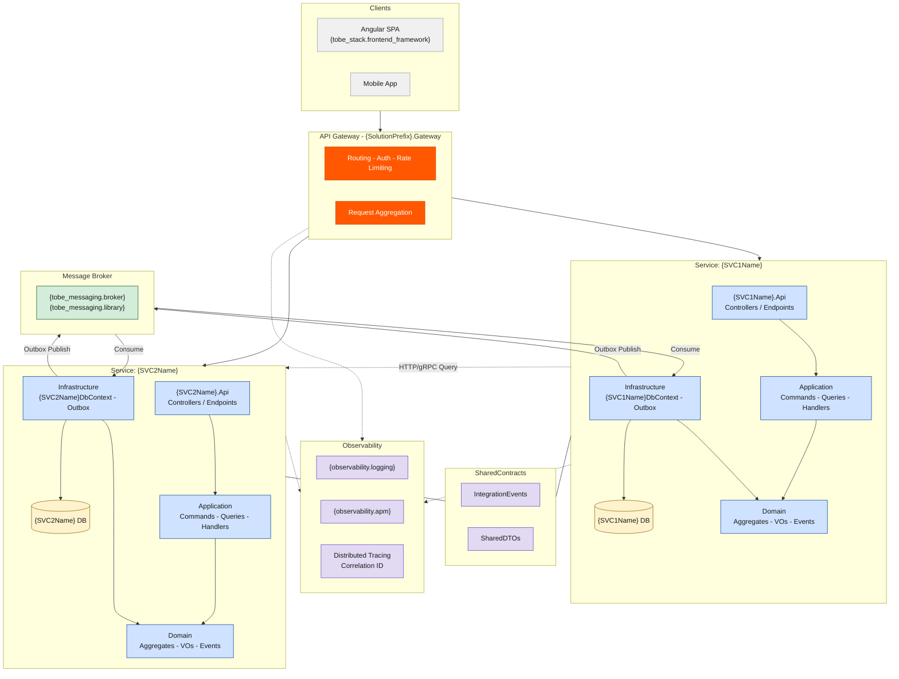

# Architecture Style — Microservices

> **style_id**: `microservices`
> **Version**: 1.0.0
> **Consumed by**: `ava-tobe-architecture-design` via `architecture_style_file` in `project-config.yaml`

> ⚠️ **INVARIANT**: Every instruction in this file is a binding constraint. Agents MUST follow all rules exactly as stated. There are no optional items. Deviations require an ADR justifying the exception.

---

## 1. Architecture Definition

Microservices is a distributed architecture where each **Bounded Context** is deployed as an **independent service** with its own runtime, database, CI/CD pipeline, and versioned API. Services communicate via **asynchronous messaging** (events over a message broker) for commands/side-effects and **synchronous HTTP/gRPC** only for queries that require real-time responses. Each service follows Clean Architecture internally. An **API Gateway** provides a unified entry point for clients.

---

## 2. Pattern Flags

```yaml
cqrs: true
ddd: true
mediator: true
bounded_context_separation: true
inter_service_communication: async-messaging
schema_separation: true
database_per_service: true
event_sourcing: false
repository_pattern: true
service_layer: false
fluent_validation: true
result_pattern: true
api_gateway: true
service_discovery: true
distributed_tracing: true
circuit_breaker: true
outbox_pattern: true
saga_orchestration: false
saga_choreography: true
evolution_path: "Microservices (fully distributed, independently deployable)"
```

---

## 3. Layers (Per Service)

Each service contains exactly **4 internal layers** following Clean Architecture. Dependency direction: `Presentation → Application → Domain ← Infrastructure`.

| # | Layer | Project Suffix | Responsibility | MUST NOT contain |
|---|-------|---------------|----------------|------------------|
| 1 | **Domain** | `.Domain` | Aggregates, Entities, Value Objects, Domain Events, Repository interfaces, Domain Services | Dependencies on any other layer; EF Core; HTTP; messaging SDK |
| 2 | **Application** | `.Application` | CQRS Commands/Queries, MediatR Handlers, FluentValidation, DTOs, Integration Event contracts | EF Core; HTTP; direct broker calls |
| 3 | **Infrastructure** | `.Infrastructure` | Service-scoped `DbContext`, Repositories, Message broker consumers/producers, external service clients, Polly policies, Outbox | Business logic; domain rules |
| 4 | **Presentation** | `.Api` | Controllers/Endpoints, OpenAPI/Swagger, gRPC service definitions, request/response mapping | Business logic; direct DbContext access |

**API Gateway** (`{SolutionPrefix}.Gateway`): Routes external client requests to the appropriate service. Handles cross-cutting concerns: authentication, rate limiting, request aggregation, SSL termination.

**SharedContracts** (`{SolutionPrefix}.SharedContracts`): Integration event contracts (`IIntegrationEvent` implementations), shared DTOs for inter-service communication. MUST NOT contain business logic or domain entities. Published as a NuGet package consumed by services.

---

## 4. Solution Structure

Agents MUST generate exactly this folder structure. Each service is a **separate solution** (or a top-level folder in a monorepo with independent build pipelines). `{ServiceName}` is resolved from the Bounded Context name.

```
src/
  {SolutionPrefix}.Gateway/
    Program.cs
    appsettings.json
    Configuration/
      RouteConfig.cs
      RateLimitConfig.cs
    HealthChecks/
      AggregatedHealthCheck.cs

  Services/
    {ServiceName}/
      {ServiceName}.Domain/
        Aggregates/
          {AggregateRoot}.cs
          {AggregateRoot}Id.cs
        Entities/
          {Entity}.cs
        ValueObjects/
          {ValueObject}.cs
        DomainEvents/
          {Entity}{Action}DomainEvent.cs
        Repositories/
          I{AggregateRoot}Repository.cs
        Services/
          I{Domain}Service.cs

      {ServiceName}.Application/
        Commands/
          {Action}{Entity}/
            {Action}{Entity}Command.cs
            {Action}{Entity}CommandHandler.cs
            {Action}{Entity}CommandValidator.cs
        Queries/
          Get{Entity}/
            Get{Entity}Query.cs
            Get{Entity}QueryHandler.cs
            Get{Entity}Response.cs
        IntegrationEvents/
          Inbound/
            {Event}IntegrationEventHandler.cs
          Outbound/
            {Event}IntegrationEvent.cs
        Behaviors/
          ValidationBehavior.cs
          LoggingBehavior.cs
        DependencyInjection.cs

      {ServiceName}.Infrastructure/
        Persistence/
          {ServiceName}DbContext.cs
          Repositories/
            {AggregateRoot}Repository.cs
          Configurations/
            {Entity}Configuration.cs
          Outbox/
            OutboxMessage.cs
            OutboxProcessor.cs
          Migrations/
        Messaging/
          Consumers/
            {Event}Consumer.cs
          Producers/
            IntegrationEventPublisher.cs
        ExternalServices/
          {ExternalService}Client.cs
        Resilience/
          {ExternalService}ResiliencePolicy.cs
        DependencyInjection.cs

      {ServiceName}.Api/
        Program.cs
        appsettings.json
        Controllers/
          {Entity}Controller.cs
        Endpoints/
        Dockerfile
        DependencyInjection.cs

  SharedContracts/
    {SolutionPrefix}.SharedContracts/
      IntegrationEvents/
        {Entity}{Action}IntegrationEvent.cs
      DTOs/
        {Entity}SharedDto.cs
      Abstractions/
        IIntegrationEvent.cs
        IIntegrationEventHandler.cs

tests/
  Services/
    {ServiceName}/
      {ServiceName}.Domain.Tests/
      {ServiceName}.Application.Tests/
      {ServiceName}.Infrastructure.Tests/
      {ServiceName}.Api.Tests/
  {SolutionPrefix}.Integration.Tests/
  {SolutionPrefix}.Contract.Tests/
```

---

## 5. Naming Conventions

| Artifact | Convention | Example |
|----------|-----------|---------|
| Service folder | PascalCase BC name | `Customers`, `Billing` |
| Aggregate Root | PascalCase, singular | `Customer` |
| Strongly-typed ID | `{AggregateRoot}Id` (record struct) | `CustomerId` |
| Value Object | PascalCase `record` | `Address`, `Money` |
| Domain Event | `{Entity}{Action}DomainEvent` | `OrderCreatedDomainEvent` |
| Integration Event | `{Entity}{Action}IntegrationEvent` : `IIntegrationEvent` | `OrderCreatedIntegrationEvent` |
| Command | `{Action}{Entity}Command` : `IRequest<Result<T>>` | `CreateOrderCommand` |
| Query | `Get{Entity}Query` : `IRequest<Result<T>>` | `GetOrderQuery` |
| Handler | `{Action}{Entity}CommandHandler` | `CreateOrderCommandHandler` |
| Validator | `{Action}{Entity}CommandValidator` | `CreateOrderCommandValidator` |
| Repository interface | `I{AggregateRoot}Repository` (in Domain) | `IOrderRepository` |
| Repository impl | `{AggregateRoot}Repository` (in Infrastructure) | `OrderRepository` |
| DbContext | `{ServiceName}DbContext` (per service) | `CustomersDbContext` |
| Message Consumer | `{Event}Consumer` | `OrderCreatedConsumer` |
| Integration Event Publisher | `IntegrationEventPublisher` (per service) | `IntegrationEventPublisher` |
| External Service Client | `{ExternalService}Client` | `PaymentGatewayClient` |
| Resilience Policy | `{ExternalService}ResiliencePolicy` | `PaymentGatewayResiliencePolicy` |
| Controller | `{Entity}Controller` (plural route) | `OrdersController` |
| Dockerfile | `Dockerfile` (per service, in `.Api` project) | `Dockerfile` |

---

## 6. Patterns — REQUIRED

| Pattern | Implementation |
|---------|---------------|
| Database per Service | Each service has its own database instance or schema — NEVER shared |
| API Gateway | Unified entry point for external clients. Routes, authenticates, rate-limits |
| Clean Architecture (per service) | Domain → Application → Infrastructure + Presentation per service |
| CQRS | Commands (write) and Queries (read) via MediatR within each service |
| DDD Aggregates | Each BC has ≥1 Aggregate Root with strongly-typed ID (`record struct`) |
| Value Objects | Immutable `record` types for domain concepts without identity |
| Domain Events | Aggregates raise events; dispatched via MediatR after `SaveChangesAsync()` |
| Integration Events | Cross-service communication via message broker (Azure Service Bus / RabbitMQ / Kafka) |
| Outbox Pattern | Integration events persisted in `OutboxMessage` table within the same transaction as domain changes. Background processor publishes to broker. Guarantees at-least-once delivery |
| Choreography Saga | Cross-service workflows via event chain. Each service reacts to events and publishes compensating events on failure |
| Repository Pattern | `I{AggregateRoot}Repository` in Domain; implementation in Infrastructure |
| Circuit Breaker | Polly circuit breaker on all synchronous inter-service calls and external service clients |
| Retry + Exponential Backoff | Polly retry policy on transient failures for HTTP/gRPC calls |
| Distributed Tracing | Correlation ID propagated across all service boundaries via headers (`X-Correlation-Id`) |
| Health Checks | Each service exposes `/health` (liveness) and `/ready` (readiness) endpoints |
| Containerization | Each service has a `Dockerfile` in its `.Api` project. MUST support independent deployment |
| Contract Testing | `{SolutionPrefix}.Contract.Tests` validates that integration event schemas are backward compatible |
| MediatR Pipeline Behaviors | `ValidationBehavior`, `LoggingBehavior` registered per service |
| FluentValidation | `AbstractValidator<TCommand>` per command |
| Result Pattern | `Result<T>` return from all handlers — NEVER throw exceptions for business errors |
| Constructor Injection | All dependencies injected via constructor — NEVER use `new` for services |
| Soft Delete | `IsDeleted` + `DeletedAt` — ONLY when `persistence.soft_delete: true` |
| Audit Fields | `CreatedAt`, `CreatedBy`, `UpdatedAt`, `UpdatedBy` — ONLY when `persistence.audit_fields: true` |

---

## 7. Patterns — PROHIBITED

Agents MUST NOT generate code using any of the following:

| Prohibited Pattern | Reason |
|--------------------|--------|
| Shared database across services | Each service owns its data — NEVER share a database or DbContext |
| Direct DB query to another service's database | Use API call or integration event instead |
| Synchronous calls for side-effects | Write operations across services MUST use async messaging — NEVER synchronous HTTP POST/PUT/DELETE to another service for mutations |
| Direct service-to-service entity reference | Services communicate via SharedContracts DTOs and integration events only |
| Distributed transactions (2PC) | NEVER use two-phase commit — use Saga pattern instead |
| Shared domain model across services | Each service owns its domain model — duplicate and translate via ACL |
| Circular service dependencies | Resolve via event inversion |
| Business logic in Infrastructure or Presentation | Business rules live in Domain and Application only |
| Service Layer (`I{Entity}Service`) | Use CQRS Command/Query handlers instead |
| Exception-driven flow | NEVER throw for business validation — use Result pattern |
| Hard-coded service URLs | Use service discovery or configuration — NEVER hard-code endpoints |
| Monolithic deployment | Each service MUST be independently deployable |

---

## 8. Inter-Service Communication Rules

```
RULE 1 — NEVER import an entity, value object, or aggregate from another service's namespace
RULE 2 — Commands and Queries are service-internal — NEVER send another service's Command
RULE 3 — Cross-service side-effects: publish IntegrationEvent to message broker → subscribing services consume via Consumer
RULE 4 — Cross-service data reads: synchronous HTTP/gRPC call to the owning service's API (query only) — with circuit breaker
RULE 5 — All async communication MUST use Outbox pattern — event and state change in the same transaction
RULE 6 — Integration events MUST be backward compatible — use schema versioning in SharedContracts
RULE 7 — Every synchronous inter-service call MUST have: circuit breaker, retry, timeout, and fallback
RULE 8 — Correlation ID MUST be propagated across all service boundaries
RULE 9 — Services MUST be resilient to downstream failures — design for partial failure
RULE 10 — Compensating events MUST be defined for every integration event that triggers a saga step
```

---

## 9. Invariants

These rules are inviolable. Any generated code that violates them is incorrect.

1. `#nullable enable` in all `.cs` files
2. `async/await` everywhere — NEVER `.Result` or `.Wait()`
3. NEVER `async void`
4. Constructor injection only — NEVER `new` for service/repository instantiation
5. Domain layer MUST have zero external dependencies (no EF Core, no MediatR, no HTTP, no messaging SDK)
6. Aggregates MUST use strongly-typed IDs (`record struct {AggregateRoot}Id(Guid Value)`)
7. Entities MUST NOT be returned from Application layer — always map to DTOs/Responses
8. Each service's `DbContext` targets a dedicated database or schema — NEVER shared
9. `Guid` for PKs and FKs — NEVER `int`, `long`, or `uint`
10. Connection strings via Azure Key Vault — NEVER in `appsettings.json`
11. Service project references: `Api → Application → Domain ← Infrastructure` — no other direction permitted
12. SharedContracts MUST NOT contain business logic — only event contracts and shared DTOs
13. Every service MUST have a `Dockerfile` and be independently deployable
14. Integration events MUST be published via Outbox — NEVER directly to broker from handler

---

## 10. Blueprint Section Overrides

When generating `architecture-blueprint.md`, the agent MUST use the following content:

### Section 2 — Solution Structure
> "Each Bounded Context is deployed as an **independent microservice** under `src/Services/{ServiceName}/` with its own runtime, database, CI/CD pipeline, and versioned API. An API Gateway (`{SolutionPrefix}.Gateway`) provides a unified entry point. Services communicate asynchronously via integration events published to a message broker using the Outbox pattern. `SharedContracts` defines the inter-service event contracts. Folder layout follows the canonical structure defined in the architecture style template `microservices.md`."

### Section 3 — Layers
> "This project uses a **Microservices** architecture with **{SERVICE_COUNT} services** (one per Bounded Context). Each service contains 4 Clean Architecture layers internally and is independently deployable. The API Gateway routes external traffic. Inter-service communication uses async messaging (Outbox + broker) for side-effects and synchronous HTTP/gRPC for queries only. This architecture style was explicitly selected via `architecture_style_file` in `project-config.yaml`."

### Section 4 — Patterns
Use the tables from Sections 6 (Required) and 7 (Prohibited) above verbatim.

---

## 11. Mermaid Scaffold

Agents MUST use this scaffold for `architecture-blueprint.mmd`. Replace `{tokens}` with values from `project-config.yaml`. Add one `SVC` subgraph per service/Bounded Context.


