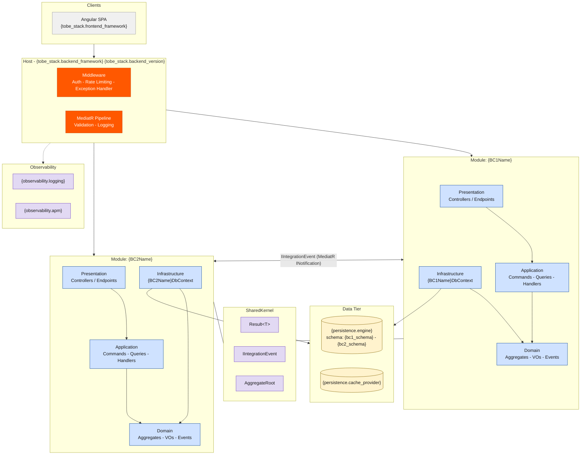

# Architecture Style — Modular Monolith

> **style_id**: `modular-monolith`
> **Version**: 1.0.0
> **Consumed by**: `ava-tobe-architecture-design` via `architecture_style_file` in `project-config.yaml`
> **Reference**: Implements PAT-002 from `src/shared/data/reference-architecture.yaml`

> ⚠️ **INVARIANT**: Every instruction in this file is a binding constraint. Agents MUST follow all rules exactly as stated. There are no optional items. Deviations require an ADR justifying the exception.

---

## 1. Architecture Definition

A Modular Monolith is a single deployable unit composed of independent modules, each aligned to a **Bounded Context**. Each module has its own internal Clean Architecture layers (Domain, Application, Infrastructure, Presentation), its own `DbContext`, and explicit boundaries. Modules communicate exclusively via in-process events (`MediatR INotification`) or well-defined interfaces in `SharedKernel`.

---

## 2. Pattern Flags

```yaml
cqrs: true
ddd: true
mediator: true
bounded_context_separation: true
inter_module_communication: in-process-events
schema_separation: true
event_sourcing: false
repository_pattern: true
service_layer: false
fluent_validation: true
result_pattern: true
evolution_path: "Modular Monolith → Microservices (extract module when scale justifies)"
```

---

## 3. Layers

Each module contains exactly **4 internal layers** following Clean Architecture. Dependency direction: `Presentation → Application → Domain ← Infrastructure`.

| # | Layer | Project Suffix | Responsibility | MUST NOT contain |
|---|-------|---------------|----------------|------------------|
| 1 | **Domain** | `.Domain` | Aggregates, Entities, Value Objects, Domain Events, Repository interfaces, Domain Services | Dependencies on any other layer; EF Core references; HTTP concerns |
| 2 | **Application** | `.Application` | CQRS Commands/Queries, MediatR Handlers, FluentValidation Validators, DTOs, Pipeline Behaviors | EF Core references; HTTP concerns; direct entity persistence |
| 3 | **Infrastructure** | `.Infrastructure` | Module-scoped `DbContext`, Repository implementations, external service clients, Polly policies | Business logic; domain rules |
| 4 | **Presentation** | `.Presentation` | Controllers, Carter modules, OpenAPI configuration, request/response mapping | Business logic; direct DbContext access |

**Host project** (`{SolutionPrefix}.Host`): Bootstraps all modules, registers DI, configures middleware. The ONLY project that references all modules' Presentation layers.

**SharedKernel** (`{SolutionPrefix}.SharedKernel`): Cross-cutting primitives shared across modules. Contains: `Result<T>`, base `Entity<TId>`, `AggregateRoot`, `IDomainEvent`, `IIntegrationEvent`, guard clauses. MUST NOT contain business logic.

---

## 4. Solution Structure

Agents MUST generate exactly this folder structure. `{SolutionPrefix}` is resolved from `project_name` in `project-config.yaml` (PascalCase, no spaces/hyphens). `{BCName}` is resolved from each Bounded Context name.

```
src/
  Modules/
    {BCName}/
      {BCName}.Domain/
        Aggregates/
          {AggregateRoot}.cs
          {AggregateRoot}Id.cs
        Entities/
          {Entity}.cs
        ValueObjects/
          {ValueObject}.cs
        DomainEvents/
          {Entity}{Action}DomainEvent.cs
        Repositories/
          I{AggregateRoot}Repository.cs
        Services/
          I{Domain}Service.cs

      {BCName}.Application/
        Commands/
          {Action}{Entity}/
            {Action}{Entity}Command.cs
            {Action}{Entity}CommandHandler.cs
            {Action}{Entity}CommandValidator.cs
        Queries/
          Get{Entity}/
            Get{Entity}Query.cs
            Get{Entity}QueryHandler.cs
            Get{Entity}Response.cs
        Behaviors/
          ValidationBehavior.cs
          LoggingBehavior.cs
        DependencyInjection.cs

      {BCName}.Infrastructure/
        Persistence/
          {BCName}DbContext.cs
          Repositories/
            {AggregateRoot}Repository.cs
          Configurations/
            {Entity}Configuration.cs
          Migrations/
        ExternalServices/
        DependencyInjection.cs

      {BCName}.Presentation/
        Controllers/
          {Entity}Controller.cs
        Endpoints/
        DependencyInjection.cs

  SharedKernel/
    {SolutionPrefix}.SharedKernel/
      Abstractions/
        Entity.cs
        AggregateRoot.cs
        IDomainEvent.cs
        IIntegrationEvent.cs
      Primitives/
        Result.cs
        Error.cs
      Guards/
        Guard.cs

  {SolutionPrefix}.Host/
    Program.cs
    appsettings.json
    DependencyInjection/
      ModuleRegistrations.cs

tests/
  Modules/
    {BCName}/
      {BCName}.Domain.Tests/
      {BCName}.Application.Tests/
      {BCName}.Infrastructure.Tests/
  {SolutionPrefix}.Integration.Tests/
```

---

## 5. Naming Conventions

| Artifact | Convention | Example |
|----------|-----------|---------|
| Module folder | PascalCase BC name | `Customers`, `AccountsPayable` |
| Aggregate Root | PascalCase, singular | `Customer` |
| Strongly-typed ID | `{AggregateRoot}Id` (record struct) | `CustomerId` |
| Value Object | PascalCase `record` | `Address`, `Money` |
| Domain Event | `{Entity}{Action}DomainEvent` | `OrderCreatedDomainEvent` |
| Command | `{Action}{Entity}Command` : `IRequest<Result<T>>` | `CreateOrderCommand` |
| Query | `Get{Entity}Query` : `IRequest<Result<T>>` | `GetOrderQuery` |
| Handler | `{Action}{Entity}CommandHandler` | `CreateOrderCommandHandler` |
| Validator | `{Action}{Entity}CommandValidator` | `CreateOrderCommandValidator` |
| Repository interface | `I{AggregateRoot}Repository` (in Domain) | `IOrderRepository` |
| Repository impl | `{AggregateRoot}Repository` (in Infrastructure) | `OrderRepository` |
| DbContext | `{BCName}DbContext` (per module) | `CustomersDbContext` |
| Integration Event | `{Entity}{Action}IntegrationEvent` : `IIntegrationEvent` | `OrderCreatedIntegrationEvent` |
| Controller | `{Entity}Controller` (plural route) | `OrdersController` |

---

## 6. Patterns — REQUIRED

| Pattern | Implementation |
|---------|---------------|
| Modular Monolith | One module per Bounded Context under `src/Modules/{BCName}/` |
| Clean Architecture (within module) | Domain → Application → Infrastructure + Presentation per module |
| CQRS | Commands (write) and Queries (read) via MediatR within each module |
| DDD Aggregates | Each BC has ≥1 Aggregate Root with strongly-typed ID (`record struct`) |
| Value Objects | Immutable `record` types for domain concepts without identity |
| Domain Events | Aggregates raise events; dispatched via MediatR after `SaveChangesAsync()` |
| Repository Pattern | `I{AggregateRoot}Repository` in Domain; implementation in Infrastructure |
| Unit of Work | EF Core transaction wraps command handler; Domain Events dispatched post-commit |
| MediatR Pipeline Behaviors | `ValidationBehavior`, `LoggingBehavior` registered globally in Host |
| FluentValidation | `AbstractValidator<TCommand>` per command |
| Result Pattern | `Result<T>` return from all handlers — NEVER throw exceptions for business errors |
| Anti-Corruption Layer (ACL) | At module boundaries; downstream module translates upstream contracts |
| Inter-module Events | `IIntegrationEvent` published via MediatR `INotification` |
| Schema Separation | Each module's `DbContext` targets a schema prefix: `{bc_schema}.{TableName}` |
| Per-module DbContext | Each module has its own `DbContext` — NEVER shared across modules |
| SharedKernel | Only cross-cutting primitives: `Result`, `Entity`, `AggregateRoot`, `IDomainEvent`, guards |
| Constructor Injection | All dependencies injected via constructor — NEVER use `new` for services |
| Soft Delete | `IsDeleted` + `DeletedAt` columns — ONLY when `persistence.soft_delete: true` |
| Audit Fields | `CreatedAt`, `CreatedBy`, `UpdatedAt`, `UpdatedBy` — ONLY when `persistence.audit_fields: true` |

---

## 7. Patterns — PROHIBITED

Agents MUST NOT generate code using any of the following:

| Prohibited Pattern | Reason |
|--------------------|--------|
| Direct cross-module entity reference | Modules communicate via events or explicit contracts — NEVER import entities from another module |
| Shared DbContext across modules | Each module owns its schema and DbContext |
| Module A calling Module B's Application service directly | Use `IIntegrationEvent` |
| Module A sending Module B's Command via MediatR | Commands are module-internal only |
| Business logic in Infrastructure or Presentation | Business rules live in Domain and Application only |
| Circular module dependencies | Resolve via event inversion |
| Exception-driven flow | NEVER throw for business validation — use Result pattern |
| Service Layer (`I{Entity}Service`) | Use CQRS Command/Query handlers instead |

---

## 8. Inter-Module Communication Rules

```
RULE 1 — NEVER import an entity, value object, or aggregate from another module's namespace
RULE 2 — Commands and Queries are module-internal — NEVER send another module's Command via MediatR
RULE 3 — Cross-module side effects: raise IIntegrationEvent in Domain → publish via MediatR → subscribing modules handle via INotificationHandler
RULE 4 — Cross-module data reads: expose a read-only Query service interface in SharedKernel → implement in the owning module → inject where needed
RULE 5 — Circular dependencies between modules are forbidden — resolve via event inversion
RULE 6 — Module boundaries MUST be enforced at compile time (no project reference from Module A.Domain to Module B.Domain)
```

---

## 9. Invariants

These rules are inviolable. Any generated code that violates them is incorrect.

1. `#nullable enable` in all `.cs` files
2. `async/await` everywhere — NEVER `.Result` or `.Wait()`
3. NEVER `async void`
4. Constructor injection only — NEVER `new` for service/repository instantiation
5. Domain layer MUST have zero external dependencies (no EF Core, no MediatR, no HTTP)
6. Aggregates MUST use strongly-typed IDs (`record struct {AggregateRoot}Id(Guid Value)`)
7. Entities MUST NOT be returned from Application layer — always map to DTOs/Responses
8. Each module's `DbContext` targets a dedicated schema — NEVER the default `dbo` schema
9. `Guid` for PKs and FKs — NEVER `int`, `long`, or `uint`
10. Connection strings via Azure Key Vault — NEVER in `appsettings.json`
11. Module project references: `Presentation → Application → Domain ← Infrastructure` — no other direction permitted
12. SharedKernel MUST NOT contain business logic — only primitives and abstractions

---

## 10. Blueprint Section Overrides

When generating `architecture-blueprint.md`, the agent MUST use the following content:

### Section 2 — Solution Structure
> "Each Bounded Context is a self-contained module under `src/Modules/{BCName}/` with its own Domain, Application, Infrastructure, and Presentation layers. Modules communicate exclusively via in-process `IIntegrationEvent` published through MediatR. No module references another module's entities or DbContext directly. Folder layout follows the canonical structure defined in the architecture style template `modular-monolith.md`."

### Section 3 — Layers
> "This project uses a **Modular Monolith** with **{BC_COUNT} modules** (one per Bounded Context). Each module contains 4 Clean Architecture layers internally. The Host project bootstraps all modules. SharedKernel provides cross-cutting primitives only. This architecture style was explicitly selected via `architecture_style_file` in `project-config.yaml`."

### Section 4 — Patterns
Use the tables from Sections 6 (Required) and 7 (Prohibited) above verbatim.

---

## 11. Mermaid Scaffold

Agents MUST use this scaffold for `architecture-blueprint.mmd`. Replace `{tokens}` with values from `project-config.yaml`. Add one `MOD` subgraph per Bounded Context.


