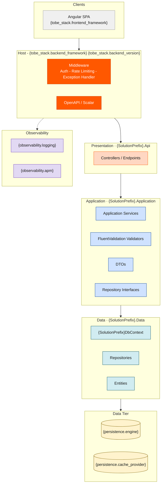

# Architecture Style — Simple Monolith

> **style_id**: `simple-monolith`
> **Version**: 1.0.0
> **Consumed by**: `ava-tobe-architecture-design` via `architecture_style_file` in `project-config.yaml`

> ⚠️ **INVARIANT**: Every instruction in this file is a binding constraint. Agents MUST follow all rules exactly as stated. There are no optional items. Deviations require an ADR justifying the exception.

---

## 1. Architecture Definition

A Simple Monolith is a single deployable unit with a flat, **3-layer** structure. All domain logic is co-located. There is **no** module separation, **no** DDD tactical patterns, and **no** CQRS. Persistence is handled by a single shared `DbContext`.

---

## 2. Pattern Flags

These flags are consumed by agents to determine which patterns to apply or exclude during code generation.

```yaml
cqrs: false
ddd: false
mediator: false
bounded_context_separation: false
inter_module_communication: none
schema_separation: false
event_sourcing: false
repository_pattern: true
service_layer: true
fluent_validation: true
result_pattern: true
```

---

## 3. Layers

This style uses exactly **3 layers**. Dependency direction: `Presentation → Application → Data`. No other dependency direction is permitted.

| # | Layer | Project Suffix | Responsibility | MUST NOT contain |
|---|-------|---------------|----------------|------------------|
| 1 | **Presentation** | `.Api` | HTTP endpoints (Controllers or Minimal APIs), request/response DTOs, input validation, OpenAPI | Business logic; direct DbContext access |
| 2 | **Application** | `.Application` | Application services, use-case orchestration, DTO mapping, FluentValidation validators | HTTP concerns; EF Core entity references in public API |
| 3 | **Data** | `.Data` | EF Core `DbContext`, entity configurations, repositories, migrations | Business logic; entities exposed to callers outside this layer |

**There is no Domain layer.** Business rules MUST reside in Application services.

---

## 4. Solution Structure

Agents MUST generate exactly this folder structure. `{SolutionPrefix}` is resolved from `project_name` in `project-config.yaml` (PascalCase, no spaces/hyphens).

```
src/
  {SolutionPrefix}.Api/
    Controllers/
    Endpoints/
    Middleware/
    Program.cs
    appsettings.json
  {SolutionPrefix}.Application/
    Services/
      {Entity}Service.cs
    DTOs/
      {Entity}Dto.cs
    Validators/
      {Entity}Validator.cs
    Interfaces/
      I{Entity}Service.cs
      I{Entity}Repository.cs
  {SolutionPrefix}.Data/
    {SolutionPrefix}DbContext.cs
    Entities/
      {Entity}.cs
    Repositories/
      {Entity}Repository.cs
    Configurations/
      {Entity}Configuration.cs
    Migrations/
tests/
  {SolutionPrefix}.Api.Tests/
  {SolutionPrefix}.Application.Tests/
  {SolutionPrefix}.Data.Tests/
```

---

## 5. Naming Conventions

| Artifact | Convention | Example |
|----------|-----------|---------|
| Entity class | PascalCase, singular | `Customer`, `Order` |
| DbContext | `{SolutionPrefix}DbContext` | `MeuErpDbContext` |
| Service | `{Entity}Service` : `I{Entity}Service` | `CustomerService` : `ICustomerService` |
| Repository | `{Entity}Repository` : `I{Entity}Repository` | `CustomerRepository` : `ICustomerRepository` |
| DTO | `{Entity}Dto` | `CustomerDto` |
| Validator | `{Entity}Validator` | `CustomerValidator` |
| Controller | `{Entity}Controller` | `CustomersController` (plural) |
| Configuration | `{Entity}Configuration` : `IEntityTypeConfiguration<{Entity}>` | `CustomerConfiguration` |

---

## 6. Patterns — REQUIRED

These patterns MUST be applied in every generated artifact:

| Pattern | Implementation |
|---------|---------------|
| Service Layer | `I{Entity}Service` interface in Application; implementation in Application/Services |
| Repository Pattern | `I{Entity}Repository` in Application/Interfaces; implementation in Data/Repositories |
| FluentValidation | `AbstractValidator<{Command/Dto}>` in Application/Validators |
| Result Pattern | `Result<T>` return type from services — NEVER throw exceptions for business errors |
| Unit of Work | Implicit via `DbContext.SaveChangesAsync()` |
| Constructor Injection | All dependencies injected via constructor — NEVER use `new` for services |
| Soft Delete | `IsDeleted` + `DeletedAt` columns — ONLY when `persistence.soft_delete: true` in config |
| Audit Fields | `CreatedAt`, `CreatedBy`, `UpdatedAt`, `UpdatedBy` — ONLY when `persistence.audit_fields: true` in config |

---

## 7. Patterns — PROHIBITED

Agents MUST NOT generate code using any of the following patterns:

| Prohibited Pattern | Reason |
|--------------------|--------|
| CQRS (Command/Query separation) | Not used in this style — single model for reads and writes |
| MediatR / Mediator | Not used — use direct service injection |
| DDD Aggregates / Aggregate Roots | Not used — entities are EF Core POCO classes |
| Value Objects | Not used — use primitive types or simple DTOs |
| Domain Events | Not used — if side effects are needed, call services directly |
| Anti-Corruption Layer | Not applicable — single bounded context |
| Horizontal slicing per Bounded Context | Not used — all code in single project set |
| Exception-driven flow | NEVER throw for business validation — use Result pattern |

---

## 8. Invariants

These rules are inviolable. Any generated code that violates them is incorrect.

1. `#nullable enable` in all `.cs` files
2. `async/await` everywhere — NEVER `.Result` or `.Wait()`
3. NEVER `async void`
4. Constructor injection only — NEVER `new` for service/repository instantiation
5. Entities MUST NOT be returned from Application layer to Presentation — always map to DTOs
6. Controllers/Endpoints MUST NOT contain business logic — delegate to services
7. `DbContext` MUST NOT be accessed directly from Presentation layer
8. EF Core tracked entities MUST NOT be returned from repositories — project to DTOs or detach
9. `Guid` for PKs and FKs — NEVER `int`, `long`, or `uint`
10. Connection strings via Azure Key Vault — NEVER in `appsettings.json`

---

## 9. Blueprint Section Overrides

When generating `architecture-blueprint.md`, the agent MUST use the following content for these sections:

### Section 2 — Solution Structure
> "Single deployable unit with 3-layer structure. No module separation. All use cases co-located in `{SolutionPrefix}.Application`. Folder layout follows the canonical structure defined in the architecture style template `simple-monolith.md`."

### Section 3 — Layers
> "This project uses a **3-layer Simple Monolith**. There is no Domain layer. Business logic resides in Application services. Dependency direction: Presentation → Application → Data. This architecture style was explicitly selected via `architecture_style_file` in `project-config.yaml`."

### Section 4 — Patterns
Use the tables from Sections 6 (Required) and 7 (Prohibited) above verbatim.

---

## 10. Mermaid Scaffold

Agents MUST use this scaffold for `architecture-blueprint.mmd`. Replace `{tokens}` with values from `project-config.yaml`.


