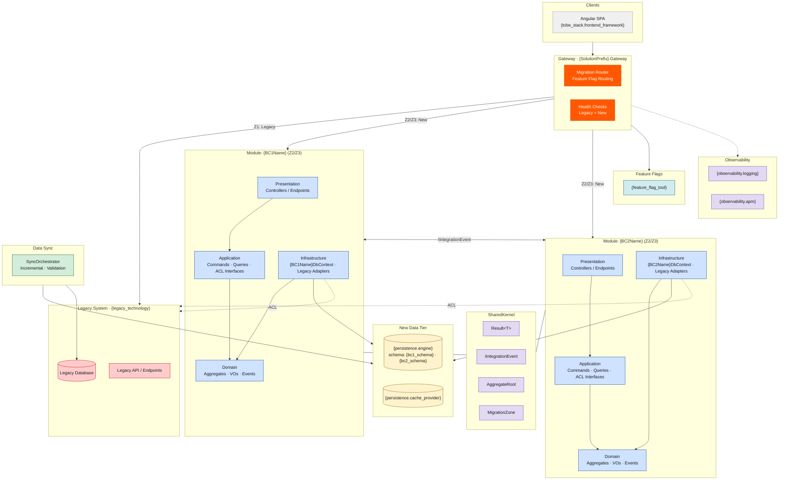

# Architecture Style — Strangler Fig

> **style_id**: `strangler-fig`
> **Version**: 1.0.0
> **Consumed by**: `ava-tobe-architecture-design` via `architecture_style_file` in `project-config.yaml`

> ⚠️ **INVARIANT**: Every instruction in this file is a binding constraint. Agents MUST follow all rules exactly as stated. There are no optional items. Deviations require an ADR justifying the exception.

---

## 1. Architecture Definition

Strangler Fig is a **migration strategy** — not a target architecture. A new application (the "fig") is built incrementally around a legacy system (the "host"). Traffic is routed via an **API Gateway / Façade** that progressively shifts endpoints from legacy to the new implementation. The legacy system is never modified; it is gradually replaced and eventually decommissioned. The TO-BE modules behind the façade follow **Clean Architecture** (or the style declared in `target_style` below).

The agent MUST design **both sides**: the façade/routing layer and the new modules that replace legacy capabilities, plus the coexistence contracts that keep the systems in sync during the migration window.

---

## 2. Pattern Flags

```yaml
cqrs: true
ddd: true
mediator: true
bounded_context_separation: true
inter_module_communication: in-process-events
schema_separation: true
event_sourcing: false
repository_pattern: true
service_layer: false
fluent_validation: true
result_pattern: true
strangler_facade: true
legacy_coexistence: true
feature_flags: true
data_sync: true
target_style: "clean-architecture"
evolution_path: "Strangler Fig → full TO-BE (decommission legacy when 100% migrated)"
```

---

## 3. Migration Zones

The Strangler Fig pattern divides the system into exactly **3 zones**. Every endpoint, module, or capability MUST be classified into one zone at any given time.

| Zone | Name | Description | Routing |
|------|------|-------------|---------|
| **Z1** | **Legacy (Host)** | Endpoints still served by the legacy system. No changes to legacy code. | Façade routes to legacy |
| **Z2** | **Migrated (Fig)** | Endpoints fully re-implemented in the new stack. Legacy endpoint is disabled. | Façade routes to new service |
| **Z3** | **Coexistence** | Endpoints being migrated — both legacy and new implementations exist. Feature flag controls routing. Data sync is active. | Façade routes based on feature flag |

---

## 4. Layers (TO-BE Side)

New modules behind the façade MUST follow Clean Architecture with 4 internal layers. Dependency direction: `Presentation → Application → Domain ← Infrastructure`.

| # | Layer | Project Suffix | Responsibility | MUST NOT contain |
|---|-------|---------------|----------------|------------------|
| 1 | **Domain** | `.Domain` | Aggregates, Entities, Value Objects, Domain Events, Repository interfaces | Dependencies on legacy; EF Core references; HTTP concerns |
| 2 | **Application** | `.Application` | CQRS Commands/Queries, MediatR Handlers, FluentValidation, DTOs, ACL interfaces | Direct legacy DB access; HTTP concerns |
| 3 | **Infrastructure** | `.Infrastructure` | Module DbContext, Repositories, Legacy Adapters (ACL impl), external clients | Business logic; domain rules |
| 4 | **Presentation** | `.Presentation` | Controllers, Endpoints, OpenAPI config, request/response mapping | Business logic; direct DbContext access |

**Façade** (`{SolutionPrefix}.Gateway`): API Gateway or reverse proxy that routes requests to legacy or new implementation based on feature flags and migration zone classification.

**Anti-Corruption Layer** (`{BCName}.Infrastructure/LegacyAdapters/`): Translates legacy contracts (DB schemas, APIs, file formats) into TO-BE domain model. MUST be scoped per module.

**SharedKernel** (`{SolutionPrefix}.SharedKernel`): Same as Clean Architecture: `Result<T>`, `Entity<TId>`, `AggregateRoot`, `IDomainEvent`, `IIntegrationEvent`, guards. MUST NOT contain business logic.

---

## 5. Solution Structure

Agents MUST generate exactly this folder structure. `{SolutionPrefix}` from `project_name` in `project-config.yaml` (PascalCase). `{BCName}` from each Bounded Context name.

```
src/
  {SolutionPrefix}.Gateway/
    Program.cs
    appsettings.json
    Routing/
      MigrationRouter.cs
      FeatureFlagRouteResolver.cs
    Configuration/
      RouteMap.cs
      MigrationZoneConfig.cs
    HealthChecks/
      LegacyHealthCheck.cs
      NewServiceHealthCheck.cs

  Modules/
    {BCName}/
      {BCName}.Domain/
        Aggregates/
          {AggregateRoot}.cs
          {AggregateRoot}Id.cs
        Entities/
          {Entity}.cs
        ValueObjects/
          {ValueObject}.cs
        DomainEvents/
          {Entity}{Action}DomainEvent.cs
        Repositories/
          I{AggregateRoot}Repository.cs

      {BCName}.Application/
        Commands/
          {Action}{Entity}/
            {Action}{Entity}Command.cs
            {Action}{Entity}CommandHandler.cs
            {Action}{Entity}CommandValidator.cs
        Queries/
          Get{Entity}/
            Get{Entity}Query.cs
            Get{Entity}QueryHandler.cs
            Get{Entity}Response.cs
        Behaviors/
          ValidationBehavior.cs
          LoggingBehavior.cs
        ACL/
          I{LegacySystem}Adapter.cs
        DependencyInjection.cs

      {BCName}.Infrastructure/
        Persistence/
          {BCName}DbContext.cs
          Repositories/
            {AggregateRoot}Repository.cs
          Configurations/
            {Entity}Configuration.cs
          Migrations/
        LegacyAdapters/
          {LegacySystem}Adapter.cs
          {LegacySystem}DataMapper.cs
        DataSync/
          {BCName}SyncService.cs
          {BCName}SyncMapper.cs
        ExternalServices/
        DependencyInjection.cs

      {BCName}.Presentation/
        Controllers/
          {Entity}Controller.cs
        Endpoints/
        DependencyInjection.cs

  SharedKernel/
    {SolutionPrefix}.SharedKernel/
      Abstractions/
        Entity.cs
        AggregateRoot.cs
        IDomainEvent.cs
        IIntegrationEvent.cs
      Primitives/
        Result.cs
        Error.cs
      Guards/
        Guard.cs
      Migration/
        IMigrationZone.cs
        MigrationZone.cs

  {SolutionPrefix}.DataSync/
    SyncOrchestrator.cs
    Strategies/
      IncrementalSyncStrategy.cs
      FullSyncStrategy.cs
    Validation/
      DataComparisonValidator.cs

tests/
  Modules/
    {BCName}/
      {BCName}.Domain.Tests/
      {BCName}.Application.Tests/
      {BCName}.Infrastructure.Tests/
      {BCName}.LegacyAdapter.Tests/
  {SolutionPrefix}.Gateway.Tests/
  {SolutionPrefix}.DataSync.Tests/
  {SolutionPrefix}.Integration.Tests/
```

---

## 6. Naming Conventions

| Artifact | Convention | Example |
|----------|-----------|---------|
| Module folder | PascalCase BC name | `Customers`, `AccountsPayable` |
| Aggregate Root | PascalCase, singular | `Customer` |
| Strongly-typed ID | `{AggregateRoot}Id` (record struct) | `CustomerId` |
| Value Object | PascalCase `record` | `Address`, `Money` |
| Domain Event | `{Entity}{Action}DomainEvent` | `OrderCreatedDomainEvent` |
| Command | `{Action}{Entity}Command` : `IRequest<Result<T>>` | `CreateOrderCommand` |
| Query | `Get{Entity}Query` : `IRequest<Result<T>>` | `GetOrderQuery` |
| Handler | `{Action}{Entity}CommandHandler` | `CreateOrderCommandHandler` |
| Validator | `{Action}{Entity}CommandValidator` | `CreateOrderCommandValidator` |
| Repository interface | `I{AggregateRoot}Repository` (in Domain) | `IOrderRepository` |
| Repository impl | `{AggregateRoot}Repository` (in Infrastructure) | `OrderRepository` |
| DbContext | `{BCName}DbContext` (per module) | `CustomersDbContext` |
| Legacy Adapter interface | `I{LegacySystem}Adapter` (in Application/ACL) | `IDelphiErpAdapter` |
| Legacy Adapter impl | `{LegacySystem}Adapter` (in Infrastructure/LegacyAdapters) | `DelphiErpAdapter` |
| Data Sync Service | `{BCName}SyncService` | `CustomersSyncService` |
| Migration Router | `MigrationRouter` (in Gateway) | `MigrationRouter` |
| Feature Flag Key | `migration.{bc_name}.{endpoint}.enabled` | `migration.customers.get-by-id.enabled` |
| Controller | `{Entity}Controller` (plural route) | `OrdersController` |

---

## 7. Patterns — REQUIRED

| Pattern | Implementation |
|---------|---------------|
| Strangler Fig Façade | API Gateway routes traffic to legacy or new implementation per endpoint |
| Feature Flags | Every migrated endpoint MUST be gated by a feature flag (`Azure App Configuration` or tool from `project-config.yaml`) |
| Anti-Corruption Layer (ACL) | `I{LegacySystem}Adapter` in Application/ACL; implementation in Infrastructure/LegacyAdapters. Translates legacy contracts to domain model |
| Clean Architecture (per module) | Domain → Application → Infrastructure + Presentation per migrated module |
| CQRS | Commands (write) and Queries (read) via MediatR within each module |
| DDD Aggregates | Each BC has ≥1 Aggregate Root with strongly-typed ID (`record struct`) |
| Value Objects | Immutable `record` types for domain concepts without identity |
| Domain Events | Aggregates raise events; dispatched via MediatR after `SaveChangesAsync()` |
| Repository Pattern | `I{AggregateRoot}Repository` in Domain; implementation in Infrastructure |
| Data Sync | Bi-directional or uni-directional sync between legacy DB and new DB during Z3 coexistence |
| Data Comparison Validation | Automated comparison of legacy vs new outputs for endpoints in Z3 |
| Blue/Green or Canary Cutover | Production cutover per endpoint — NEVER big-bang for the entire system |
| Rollback Capability | Every migrated endpoint MUST support instant rollback to legacy via feature flag toggle |
| Health Checks | Gateway MUST expose health checks for both legacy and new systems |
| MediatR Pipeline Behaviors | `ValidationBehavior`, `LoggingBehavior` registered globally |
| FluentValidation | `AbstractValidator<TCommand>` per command |
| Result Pattern | `Result<T>` return from all handlers — NEVER throw exceptions for business errors |
| Per-module DbContext | Each module has its own `DbContext` — NEVER shared across modules |
| Schema Separation | Each module's `DbContext` targets a schema prefix: `{bc_schema}.{TableName}` |
| Constructor Injection | All dependencies injected via constructor — NEVER use `new` for services |
| Soft Delete | `IsDeleted` + `DeletedAt` — ONLY when `persistence.soft_delete: true` |
| Audit Fields | `CreatedAt`, `CreatedBy`, `UpdatedAt`, `UpdatedBy` — ONLY when `persistence.audit_fields: true` |

---

## 8. Patterns — PROHIBITED

Agents MUST NOT generate code using any of the following:

| Prohibited Pattern | Reason |
|--------------------|--------|
| Modifying legacy source code | Legacy is treated as a black box — wrap, don't modify |
| Direct cross-module entity reference | Modules communicate via events or explicit contracts |
| Shared DbContext across modules | Each module owns its schema and DbContext |
| Big-bang migration | Endpoints MUST be migrated incrementally, one at a time or in small batches |
| Accessing legacy DB from Domain layer | Legacy DB access MUST go through ACL in Infrastructure only |
| Hard-coded routing decisions | All routing MUST be driven by feature flags and `MigrationZoneConfig` |
| Permanent dual-write | Dual-write is temporary (Z3 only). Z2 endpoints MUST NOT write to legacy |
| Circular module dependencies | Resolve via event inversion |
| Exception-driven flow | NEVER throw for business validation — use Result pattern |
| Service Layer (`I{Entity}Service`) | Use CQRS Command/Query handlers instead |

---

## 9. Migration Lifecycle Rules

```
RULE 1 — Every endpoint starts in Z1 (Legacy). Migration moves it to Z3 (Coexistence), then Z2 (Migrated).
RULE 2 — Z3 duration MUST be time-boxed per endpoint. Maximum coexistence window: defined in project-config.yaml or ADR.
RULE 3 — Feature flag naming: "migration.{bc_name}.{endpoint_name}.enabled" — consistent across all endpoints.
RULE 4 — Data sync in Z3 MUST be validated: automated comparison of legacy vs new outputs for every sync cycle.
RULE 5 — Rollback from Z2 back to Z3 MUST be possible via feature flag toggle — no code deployment required.
RULE 6 — Legacy decommission (Z1 → removed) ONLY after all endpoints in that BC reach Z2 AND validation period passes.
RULE 7 — The Gateway MUST log every routing decision: timestamp, endpoint, zone, feature_flag_value, target (legacy|new).
RULE 8 — ACL adapters MUST NOT leak legacy data structures into Domain — all legacy concepts are translated at the adapter boundary.
```

---

## 10. Invariants

These rules are inviolable. Any generated code that violates them is incorrect.

1. `#nullable enable` in all `.cs` files
2. `async/await` everywhere — NEVER `.Result` or `.Wait()`
3. NEVER `async void`
4. Constructor injection only — NEVER `new` for service/repository instantiation
5. Domain layer MUST have zero external dependencies (no EF Core, no MediatR, no HTTP, no legacy references)
6. Aggregates MUST use strongly-typed IDs (`record struct {AggregateRoot}Id(Guid Value)`)
7. Entities MUST NOT be returned from Application layer — always map to DTOs/Responses
8. Each module's `DbContext` targets a dedicated schema — NEVER the default `dbo` schema
9. `Guid` for PKs and FKs — NEVER `int`, `long`, or `uint`
10. Connection strings via Azure Key Vault — NEVER in `appsettings.json`
11. Module project references: `Presentation → Application → Domain ← Infrastructure` — no other direction permitted
12. SharedKernel MUST NOT contain business logic — only primitives and abstractions
13. Legacy system is read-only from the new system's perspective — NEVER modify legacy code or schema
14. Every migrated endpoint MUST have a corresponding feature flag — no uncontrolled routing

---

## 11. Blueprint Section Overrides

When generating `architecture-blueprint.md`, the agent MUST use the following content:

### Section 2 — Solution Structure
> "This project uses a **Strangler Fig** migration strategy. An API Gateway (`{SolutionPrefix}.Gateway`) routes traffic to legacy or new implementations based on feature flags and migration zone classification (Z1=Legacy, Z2=Migrated, Z3=Coexistence). New modules are built under `src/Modules/{BCName}/` following Clean Architecture with Anti-Corruption Layer adapters that translate legacy contracts. Data synchronization services ensure consistency during the coexistence window. Folder layout follows the canonical structure defined in the architecture style template `strangler-fig.md`."

### Section 3 — Layers
> "This project uses a **Strangler Fig** architecture with **{BC_COUNT} modules** being incrementally migrated from {legacy_technology}. Each new module contains 4 Clean Architecture layers internally, plus an ACL adapter layer for legacy integration. The Gateway routes traffic based on feature flags. Migration progresses per-endpoint: Z1 (Legacy) → Z3 (Coexistence) → Z2 (Migrated). This architecture style was explicitly selected via `architecture_style_file` in `project-config.yaml`."

### Section 4 — Patterns
Use the tables from Sections 7 (Required) and 8 (Prohibited) above verbatim.

---

## 12. Mermaid Scaffold

Agents MUST use this scaffold for `architecture-blueprint.mmd`. Replace `{tokens}` with values from `project-config.yaml`. Add one `MOD` subgraph per migrated Bounded Context.


