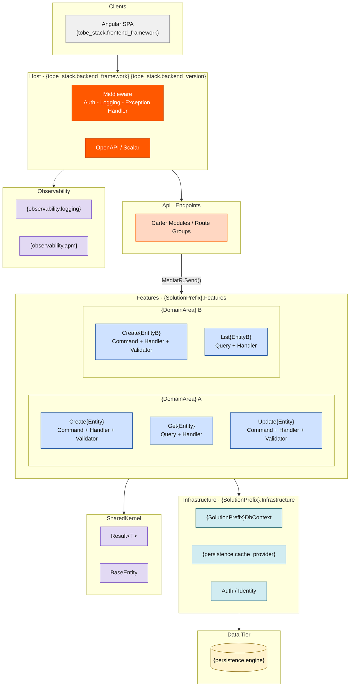

# Architecture Style — Vertical Slice

> **style_id**: `vertical-slice`
> **Version**: 1.0.0
> **Consumed by**: `ava-tobe-architecture-design` via `architecture_style_file` in `project-config.yaml`

> ⚠️ **INVARIANT**: Every instruction in this file is a binding constraint. Agents MUST follow all rules exactly as stated. There are no optional items. Deviations require an ADR justifying the exception.

---

## 1. Architecture Definition

Vertical Slice Architecture organizes code by **feature** (use case), not by technical layer. Each feature is a self-contained vertical cut through the stack: it owns its own request type, handler, validator, and data access logic. MediatR dispatches requests to the correct handler. Shared infrastructure (DbContext, auth, logging) lives in an `Infrastructure` project.

---

## 2. Pattern Flags

```yaml
cqrs: true
ddd: false
mediator: true
bounded_context_separation: false
inter_module_communication: mediator-in-process
schema_separation: false
event_sourcing: false
repository_pattern: false
service_layer: false
fluent_validation: true
result_pattern: true
```

---

## 3. Layers

Vertical Slice has **no horizontal layers**. Features are grouped by domain area in folders.

| Project | Role | Contains |
|---------|------|----------|
| `{SolutionPrefix}.Api` | Host + endpoints | Program.cs, Carter modules or Minimal API route groups, OpenAPI |
| `{SolutionPrefix}.Features` | All feature slices | One subfolder per use case (Command or Query) |
| `{SolutionPrefix}.Infrastructure` | Shared infrastructure | DbContext, migrations, external service clients, auth, cache |
| `{SolutionPrefix}.SharedKernel` | Shared primitives | `Result<T>`, `BaseEntity`, extension methods, `IIntegrationEvent` |

---

## 4. Solution Structure

Agents MUST generate exactly this folder structure. `{SolutionPrefix}` is resolved from `project_name` in `project-config.yaml` (PascalCase, no spaces/hyphens).

```
src/
  {SolutionPrefix}.Api/
    Program.cs
    appsettings.json
    Endpoints/
      {DomainArea}Endpoints.cs

  {SolutionPrefix}.Features/
    {DomainArea}/
      Create{Entity}/
        Create{Entity}Command.cs
        Create{Entity}Handler.cs
        Create{Entity}Validator.cs
        Create{Entity}Response.cs
      Update{Entity}/
        Update{Entity}Command.cs
        Update{Entity}Handler.cs
        Update{Entity}Validator.cs
      Get{Entity}/
        Get{Entity}Query.cs
        Get{Entity}Handler.cs
        Get{Entity}Response.cs
      List{Entity}/
        List{Entity}Query.cs
        List{Entity}Handler.cs
        List{Entity}Response.cs
      Delete{Entity}/
        Delete{Entity}Command.cs
        Delete{Entity}Handler.cs

  {SolutionPrefix}.Infrastructure/
    Persistence/
      {SolutionPrefix}DbContext.cs
      Entities/
        {Entity}.cs
      Configurations/
        {Entity}Configuration.cs
      Migrations/
    Auth/
    Caching/
    ExternalServices/
    DependencyInjection.cs

  {SolutionPrefix}.SharedKernel/
    Result.cs
    BaseEntity.cs
    Extensions/
    Abstractions/

tests/
  {SolutionPrefix}.Features.Tests/
  {SolutionPrefix}.Api.Tests/
```

---

## 5. Naming Conventions

| Artifact | Convention | Example |
|----------|-----------|---------|
| Command | `{Action}{Entity}Command` : `IRequest<Result<{Response}>>` | `CreateOrderCommand` |
| Query | `{Action}{Entity}Query` : `IRequest<Result<{Response}>>` | `GetOrderQuery` |
| Handler | `{Action}{Entity}Handler` : `IRequestHandler<TRequest, TResponse>` | `CreateOrderHandler` |
| Validator | `{Action}{Entity}Validator` : `AbstractValidator<TCommand>` | `CreateOrderValidator` |
| Response | `{Action}{Entity}Response` | `CreateOrderResponse` |
| Entity | PascalCase, singular | `Order` |
| DbContext | `{SolutionPrefix}DbContext` | `MeuErpDbContext` |
| Endpoint class | `{DomainArea}Endpoints` | `OrdersEndpoints` |
| Feature folder | `{Action}{Entity}/` | `CreateOrder/` |
| Domain area folder | PascalCase, plural | `Orders/` |

---

## 6. Patterns — REQUIRED

| Pattern | Implementation |
|---------|---------------|
| Feature Slice | Each use case = one folder containing Command/Query + Handler + Validator + Response |
| MediatR dispatch | `IRequest<T>` + `IRequestHandler<TRequest, TResponse>` — every feature uses MediatR |
| CQRS | Commands (write/mutate) and Queries (read) are separate types dispatched via MediatR |
| FluentValidation | `AbstractValidator<TCommand>` per command — registered in MediatR pipeline |
| Result Pattern | `Result<T>` return from all handlers — NEVER throw exceptions for business errors |
| SharedKernel | Base types (`Result<T>`, `BaseEntity`, guards) shared across features |
| Constructor Injection | All dependencies injected via constructor — NEVER use `new` for services |
| Pipeline Behaviors | `ValidationBehavior<TRequest, TResponse>` registered globally in Host |
| Unit of Work | Implicit via `DbContext.SaveChangesAsync()` within handler |
| Soft Delete | `IsDeleted` + `DeletedAt` columns — ONLY when `persistence.soft_delete: true` |
| Audit Fields | `CreatedAt`, `CreatedBy`, `UpdatedAt`, `UpdatedBy` — ONLY when `persistence.audit_fields: true` |

---

## 7. Patterns — PROHIBITED

Agents MUST NOT generate code using any of the following:

| Prohibited Pattern | Reason |
|--------------------|--------|
| Repository Pattern | Handlers access `DbContext` directly — no repository abstraction |
| Service Layer | No `I{Entity}Service` — each handler IS the use case |
| DDD Aggregates / Aggregate Roots | Entities are EF Core POCOs |
| Value Objects | Use primitives or records |
| Horizontal layers (Application/Domain/Infrastructure per feature) | Features are self-contained — no layering within a slice |
| Cross-feature direct method calls | Features communicate ONLY via MediatR `INotification` |
| Handler calling another handler directly | NEVER `_mediator.Send()` inside a handler to invoke another feature |
| Shared business logic across features | If logic is truly generic → extract to SharedKernel. Otherwise, duplicate. |
| Exception-driven flow | NEVER throw for business validation — use Result pattern |

---

## 8. Cross-Feature Communication Rules

```
RULE 1 — Features MUST NOT call other features' handlers directly
RULE 2 — Cross-feature side effects: publish INotification → other features subscribe via INotificationHandler
RULE 3 — Cross-feature data reads: handler queries DbContext directly (read-only) — no dedicated service
RULE 4 — Circular feature dependencies are forbidden
```

---

## 9. Invariants

These rules are inviolable. Any generated code that violates them is incorrect.

1. `#nullable enable` in all `.cs` files
2. `async/await` everywhere — NEVER `.Result` or `.Wait()`
3. NEVER `async void`
4. Constructor injection only — NEVER `new` for service instantiation
5. One handler per file — one use case per folder
6. Handlers MUST NOT return EF Core tracked entities — always project to response DTOs
7. Endpoints/Controllers MUST NOT contain business logic — delegate to MediatR
8. `Guid` for PKs and FKs — NEVER `int`, `long`, or `uint`
9. Connection strings via Azure Key Vault — NEVER in `appsettings.json`
10. Each feature folder MUST be self-contained — no imports from other feature folders

---

## 10. Blueprint Section Overrides

When generating `architecture-blueprint.md`, the agent MUST use the following content:

### Section 2 — Solution Structure
> "Features are the primary unit of organization. Each use case is a self-contained vertical slice under `{SolutionPrefix}.Features/{DomainArea}/{UseCaseName}/`. No horizontal layers exist. Shared infrastructure is isolated in `{SolutionPrefix}.Infrastructure`. Folder layout follows the canonical structure defined in the architecture style template `vertical-slice.md`."

### Section 3 — Layers
> "This project uses **Vertical Slice Architecture**. There are no horizontal layers. Each feature owns its Command/Query, Handler, Validator, and Response types. Shared infrastructure (DbContext, auth, cache) is isolated in `{SolutionPrefix}.Infrastructure`. Cross-feature shared primitives live in `{SolutionPrefix}.SharedKernel`. This architecture style was explicitly selected via `architecture_style_file` in `project-config.yaml`."

### Section 4 — Patterns
Use the tables from Sections 6 (Required) and 7 (Prohibited) above verbatim.

---

## 11. Mermaid Scaffold

Agents MUST use this scaffold for `architecture-blueprint.mmd`. Replace `{tokens}` with values from `project-config.yaml`.


