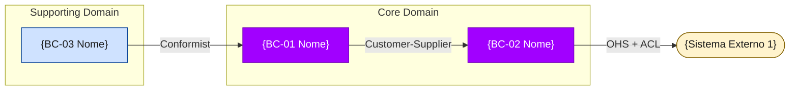

<!-- i18n: apply [@governance-apps](../../../shared/governance-apps.md) § bounded-context-map-template — if language="en", replace all PT headings and field labels per the i18n table in that section -->

# Bounded Context Map TO-BE — {PROJECT_NAME}

**TraceID**: `{TRACE_ID}`
**Data**: {GENERATED_AT}
**Arquiteto DDD**: {DDD_ARCHITECT_NAME}
**Total de BCs TO-BE**: {BC_COUNT}

---

## Decisão de Consolidação AS-IS → TO-BE

> Cada BC do estado atual foi avaliado quanto a coesão de domínio, acoplamento e tamanho de responsabilidade.
> As decisões abaixo são derivadas exclusivamente da análise de `outputs/asis/bounded-context-map.md`.

| BC AS-IS | Decisão | BC TO-BE | Rationale |
|---|---|---|---|
| {BC_ASIS_NAME} | **Preserve** \| **Merge into {X}** \| **Split into {X}, {Y}** \| **Eliminate** | {BC_TOBE_NAME} | {Justificativa baseada em coesão/acoplamento/domínio} |

---

## Bounded Contexts TO-BE

<!--
  Para cada BC, copiar o bloco abaixo e preencher.
  O parser do summary-agent.md detecta seções pelo padrão "## BC-{N}".
  Campos obrigatórios: Responsabilidade, Linguagem Ubíqua (≥5 termos), Squad Owner,
  tabela Relacionamentos com padrão DDD classificado, Critérios de Aceite com [x].
-->

### BC-{N} — {Nome} ({NomeMódulo .NET})

**Responsabilidade**
> O que este contexto É responsável por: {descrição do domínio e operações core — 1 a 2 frases}
> O que este contexto NÃO É responsável por: {exclusões explícitas de escopo}

**Linguagem Ubíqua**
| Termo | Definição | Notas |
|---|---|---|
| {Termo 1} | {Definição precisa dentro deste contexto} | {Variações no AS-IS, se houver} |
| {Termo 2} | {Definição precisa dentro deste contexto} | {Variações no AS-IS, se houver} |
| {Termo 3} | {Definição precisa dentro deste contexto} | {Variações no AS-IS, se houver} |
| {Termo 4} | {Definição precisa dentro deste contexto} | {Variações no AS-IS, se houver} |
| {Termo 5} | {Definição precisa dentro deste contexto} | {Variações no AS-IS, se houver} |

**Squad Owner**: {Role — ex: "Finance Squad", "Back-Office Squad", "Sales Squad"}

**Aggregate Roots**: {Entidade 1}, {Entidade 2}
**Value Objects**: {VO 1}, {VO 2}
**Domain Events** (publica): {Event 1}, {Event 2}
**Domain Events** (consome): {Event 1}, {Event 2}
**Repositórios**: {Repositório 1}, {Repositório 2}
**Commands**: {Command 1}, {Command 2}
**Queries**: {Query 1}, {Query 2}

**Relacionamentos** (Context Map)
| Parceiro | Tipo de Relação | Padrão DDD | Descrição |
|---|---|---|---|
| {BC parceiro} | Upstream (U) / Downstream (D) | ACL / Conformist / OHS / Shared Kernel / Customer-Supplier / Published Language | {Descrição do contrato} |

**ACL / Adapters**: {Descrição dos adaptadores de anti-corrupção, se aplicável}
**Endpoints públicos (API)**: {Lista de endpoints REST/gRPC expostos por este BC}
**Mudanças críticas AS-IS → TO-BE**: {Principais diferenças em relação ao BC original no AS-IS}

**Critérios de Aceite**
- [ ] Linguagem ubíqua documentada com ≥5 termos
- [ ] Squad Owner definido
- [ ] Fronteiras explícitas definidas (inclui e exclui)
- [ ] Todos os relacionamentos com padrão DDD classificado
- [ ] Sem acoplamento bidirecional não justificado
- [ ] Context Map diagram inclui este BC

---

## Context Map — Visão Geral

> O diagrama Mermaid abaixo é gerado automaticamente pelo agente em `diagrams/context-map.mmd`.
> Não editar manualmente — regenerar via trigger `BC`.

---

## DDD Architect Approval

| Campo | Valor |
|---|---|
| Revisor | {Arquiteto DDD — preencher} |
| Data | {YYYY-MM-DD} |
| Trace ID | {TRACE_ID} |

### Critérios de Aceite Globais
- [ ] Cada BC tem linguagem ubíqua documentada (≥5 termos)
- [ ] Cada BC tem Squad Owner definido
- [ ] Cada BC tem fronteiras explícitas (o que é e o que NÃO é responsabilidade)
- [ ] Todos os relacionamentos têm padrão DDD classificado
- [ ] Decisão de consolidação documentada para cada BC AS-IS
- [ ] Context Map diagram gerado e revisado
- [ ] Nenhum BC com acoplamento bidirecional não justificado

**Status**: ⏳ Aguardando aprovação do arquiteto DDD
