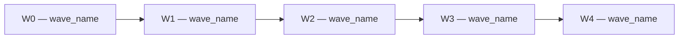

# Wave Plan Executivo — Template de Especificação Completa

## Gate de Pré-requisitos — Bloco [GATE FAILED]

Exibir exatamente o bloco abaixo quando qualquer arquivo estiver ausente, substituindo os placeholders:

```
⛔ [GATE FAILED] Wave Plan Executivo — Pré-requisitos ausentes

  Arquivos não encontrados em projects/{project_name}/outputs/tobe/docs/:
    - {listar cada arquivo ausente, um por linha}

  ⛔ O pipeline está pausado. Execute os PBIs indicados antes de continuar.

  ─────────────────────────────────────────────────────────────
  Ação necessária por arquivo ausente:
    • backlog-tobe.md  → Execute: @ava-tobe-orchestrator (Fase 2.5) ou @ava-tobe-migration-plan (trigger: backlog-tobe)
                         Aguarde a conclusão e confirme que o arquivo existe em disco.
    • sizing-report.md → Execute: @ava-tobe-measure-size (ou agente equivalente de sizing)
                         Aguarde a conclusão e confirme que o arquivo existe em disco.
  ─────────────────────────────────────────────────────────────

  → Após ambos os arquivos estarem disponíveis, re-execute este protocolo.
    Nenhuma confirmação adicional será solicitada.
```

> ⛔ **INVARIANTE ABSOLUTA**: quando os pré-requisitos forem atendidos, re-verificar o gate automaticamente (sem novo prompt ao usuário). SE ambos os arquivos estiverem presentes → prosseguir para Step WP2 sem interrupção.

---

## Estrutura de Waves Pré-Definida

A estrutura de waves é **fixa em 5 waves (W0–W4)** com tipos pré-definidos conforme o `wave-model.json` (Single Source of Truth). Os **nomes** e a **composição de BCs** são **dinâmicos** — derivados do `inventory-report.md` e das regras de priorização (Step 4 do Execution Protocol).

| Wave | Tipo (fixo) | Composição |
|---|---|---|
| W0 | `foundation` | Componentes de infraestrutura identificados no `inventory-report.md` |
| W1 | `domain_read` | BCs com operação predominante de Leitura — alocados pelo algoritmo de priorização |
| W2 | `domain_write` | BCs com operação predominante de Escrita — alocados pelo algoritmo de priorização |
| W3 | `domain_core` | BCs com operação predominante Core — alocados pelo algoritmo de priorização |
| W4 | `cutover` | Atividades operacionais finais (pentest, sign-offs, decommission, migração final) |

Os tipos de wave (`foundation` → `domain_read` → `domain_write` → `domain_core` → `cutover`) são **invioláveis** e definem a progressão incremental obrigatória. O algoritmo determinístico do Step 4 (Execution Protocol) é usado para alocar BCs às waves de domínio (W1–W3), calcular T-shirts, scores e horas.

**INVARIANTE G-8 aplicada**: W0 (`foundation`) e W4 (`cutover`) DEVEM ter T-shirt ≤ M, conforme derivado do `sizing-report.md`. Se a composição resultar em T-shirt > M → alertar com justificativa e aguardar confirmação do PM antes de prosseguir.

---

## Step WP1 — Verificar Gate de Pré-requisitos

Verificar existência de **ambos** os arquivos:

| Artefato | Path esperado |
|---|---|
| Backlog TO-BE | `projects/{project_name}/outputs/tobe/docs/backlog-tobe.md` |
| Sizing Report | `projects/{project_name}/outputs/tobe/docs/sizing-report.md` |

- Ambos presentes → prosseguir para WP2
- Qualquer ausente → exibir bloco `[GATE FAILED]` (seção acima) e **parar**

---

## Step WP2 — Ler e Consolidar Inputs

1. Ler todas as 7 fontes na ordem declarada no agente
2. Para cada fonte ausente (exceto 3 e 4), registrar lacuna com `[FONTE AUSENTE]` e continuar
3. Construir mapa de alocação: `Wave-ID → [BC-IDs] → [US-IDs do backlog] → T-shirt (sizing-report) → horas IA/manual`
4. Registrar composição de BCs conforme alocada no `wave-model.json` (derivada do `inventory-report.md` e regras de priorização)
5. Derivar T-shirt de cada wave: `T-shirt_wave = max(T-shirt dos BCs da wave no sizing-report)` — **proibido estimar manualmente** (G-19)

---

## Step WP3 — Compor e Validar Waves

A composição de waves segue a estrutura de 5 waves (W0–W4) com tipos fixos e composição dinâmica conforme o `wave-model.json`:
1. Usar composição de BCs conforme alocada no `wave-model.json` (derivada do `inventory-report.md`)
2. Para cada wave: derivar T-shirt exclusivamente do `sizing-report.md`
3. Validar restrições:
   - W0 (`foundation`) T-shirt ≤ M: se violado → alertar `⚠️ W0 excede restrição T-shirt ≤ M (derivado: {T-shirt})` e aguardar confirmação do PM
   - W4 (`cutover`) T-shirt ≤ M: mesma regra
4. Total de waves = 5 (W0–W4) — tipos fixos, nomes e BCs dinâmicos

---

## Step WP4 — Gerar Conteúdo por Wave

Para cada wave, gerar obrigatoriamente as **10 seções**:

| # | Seção | Fonte de dados | Requisito |
|---|---|---|---|
| 1 | **Visão Geral** | `shared-context.md` + domínio dos BCs da wave | Objetivo da wave e valor entregue ao negócio (1–2 parágrafos) |
| 2 | **Escopo (User Stories)** | `backlog-tobe.md` | Tabela com `US-ID`, título e MoSCoW de todas as US dos BCs da wave; derivar por BC |
| 3 | **T-Shirt Sizing** | `sizing-report.md` | T-shirt da wave + dimensão determinante declarada nominalmente; **proibido estimar manualmente** (G-19) |
| 4 | **Estimativas de Esforço** | `sizing-report.md` + AI Execution Time Benchmarks | Horas IA, horas manuais, total — derivados da tabela de benchmarks pelo T-shirt; citar tabela de origem (G-4) |
| 5 | **Squad Necessário** | `project-config.yaml` + complexidade da wave | Composição e papéis: Dev, QA, PO, Tech Lead, DBA (se wave com BCs de persistência complexa) |
| 6 | **Dependências** | `integration-matrix.md` + waves anteriores | Waves anteriores obrigatórias, sistemas externos, integrações, sign-offs humanos pendentes |
| 7 | **Critérios de Aceite Quantitativos** | `project-config.yaml` (`wave_approval.thresholds`) + `wave-gonogo-checklist.md` | Métricas mensuráveis e verificáveis (ex.: "cobertura de linha ≥ 80%", "zero CVE crítico", "paridade funcional ≥ 99.5%"); usar defaults do checklist se thresholds ausentes no config |
| 8 | **Go/No-Go Checklist** | `wave-gonogo-checklist.md` (Seções A–G) | Mínimo **5 critérios binários** (✅/❌) por wave, com `Responsável` associado a cada critério |
| 9 | **Responsável pelo Aceite** | `project-config.yaml` (PM, sponsor, tech lead) | Papel + nome completo do responsável pela aprovação de passagem de wave |
| 10 | **Rollback Strategy** | tipo de operação da wave + `gaps-risks-report.md` | Mecanismo de reversão específico e testável (feature flag, blue-green, snapshot BD, restore point) |

### Regras para a Seção 8 — Go/No-Go Checklist

- Mínimo **5 critérios binários** por wave (formato ✅ Pass / ❌ Fail)
- Cada critério DEVE ter um `Responsável` (valores aceitos: PM · Tech Lead · QA · BA · DevOps · Security · Cliente/Sponsor)
- Ler `src/shared/checklists/wave-gonogo-checklist.md` e derivar critérios filtrando por tipo de wave:

| Tipo de wave | Seções prioritárias do checklist |
|---|---|
| **W0 — `foundation`** | Seção F (Operacional) + Seção D (Segurança) + ≥ 1 critério de Seção C |
| **Waves `domain_read`** (W1) | Seção A (Paridade Funcional) + Seção C (Cobertura) + Seção B (Performance) |
| **Waves `domain_write` / `domain_core`** (W2, W3) | Seção A + Seção C + Seção D + Seção E (Completude Funcional) |
| **W4 — `cutover`** | Seção G (Sign-offs PM + Cliente) + Seção A + Seção C + Seção F — **todas obrigatórias** |

- Substituir `{{THRESHOLD_*}}` pelos valores de `project-config.yaml` → `wave_approval.thresholds`; se ausentes, usar os defaults declarados no `wave-gonogo-checklist.md`

---

## Step WP5 — Gerar Seções Transversais

### Resumo Executivo

Tabela consolidada com todas as waves (posição: início do arquivo, antes das seções de wave individuais):

```markdown
| Wave | Nome | BCs Incluídos | T-Shirt | Horas IA | Horas Manual | Total | Responsável Aceite |
|---|---|---|---|---|---|---|---|
| W0 | {wave_name} | {BCs ou infra} | {T-shirt} | {h} | {h} | {h} | {nome/papel} |
| W1 | {wave_name} | {BCs} | {T-shirt} | {h} | {h} | {h} | {nome/papel} |
| W2 | {wave_name} | {BCs} | {T-shirt} | {h} | {h} | {h} | {nome/papel} |
| W3 | {wave_name} | {BCs} | {T-shirt} | {h} | {h} | {h} | {nome/papel} |
| W4 | {wave_name} | {atividades operacionais} | {T-shirt} | {h} | {h} | {h} | {nome/papel} |
| **TOTAL** | — | {N BCs} | — | **{h}** | **{h}** | **{h}** | — |
```

> Derivar todas as células numéricas do `sizing-report.md` via AI Execution Time Benchmarks; linha TOTAL = soma de todas as waves (G-4).

### Mapa de Dependências entre Waves

Diagrama `flowchart LR`:
- Um nó por wave com label `W{N} — {Nome}`
- Aresta `-->` representando dependência sequencial obrigatória
- Nós externos (sistemas, sign-offs bloqueantes) com forma diferenciada (ex.: `[( )]` para sistemas externos)
- Aplicar regras de sintaxe Mermaid de `src/modules/ava-fabric-agents/shared/mermaid-guardrails.md`

Exemplo mínimo:


### Cronograma Estimado

Diagrama `gantt`:
- Derivar duração relativa de cada wave a partir de `total_hours ÷ capacidade_equipe` (lida de `project-config.yaml`; default: 40 h/semana/dev × squad_size; default squad_size: 3 devs → capacidade = 120 h/semana)
- Usar durações relativas (ex.: `2w`, `3w`) — **G-13: proibido datas de calendário absolutas**
- Cada wave decomposta em 4 fases: análise/design (15%), desenvolvimento (50%), testes/homologação (25%), deploy/validação (10%) — conforme Step 6.5.3 do Execution Protocol
- Milestones Go/No-Go após waves de domínio (W1–W3) e milestone final após W4
- Dependências inter-wave: primeira fase de W(N+1) começa `after` deploy de W(N)
- Aplicar template canônico de `src/modules/ava-fabric-agents/tobe-architecture/templates/migration-gantt-mermaid.md`
- Incluir no arquivo como bloco fenced ` ```mermaid ... ``` `

> ⛔ **PROIBIDO**: usar diagramas ASCII art, blocos de texto formatado ou qualquer representação visual que não seja Mermaid gantt. O cronograma DEVE ser um bloco fenced ` ```mermaid gantt ... ``` ` embutido diretamente no `wave-plan.md`.
> **Coordenação com `migration-gantt.mmd`**: O Gantt embutido no `wave-plan.md` DEVE ser **idêntico** ao conteúdo de `migration-gantt.mmd` (gerado no Step 6.5 do Execution Protocol). Se o `migration-gantt.mmd` já existir, copiar o conteúdo diretamente. Se ainda não existir, gerar conforme Step 6.5 e depois persistir como `migration-gantt.mmd`.
> **Cadeia de derivação (Step 6.5.2)**: `total_hours_wave` (sizing-report) ÷ `capacidade_semanal` (squad_size × hours_per_week) = semanas → `ceil()` → duração relativa. Fixed Parameters: squad=3 devs, hours_per_week=40 (measure-size-tobe.md).

---

## Step WP6 — Escrever wave-plan.md

### Estrutura obrigatória do arquivo (nesta ordem exata)

```markdown
# Wave Plan — {project_name} TO-BE

> Gerado por: ava-tobe-migration-plan v{version} | trace_id: {trace_id} | {ISO-8601}
> PM responsável: {pm_name} | Revisão e aprovação final: pendente

## Resumo Executivo
[tabela consolidada de todas as waves — Step WP5]

---

## W0 — {wave_name}
### 1. Visão Geral
### 2. Escopo (User Stories)
### 3. T-Shirt Sizing
### 4. Estimativas de Esforço
### 5. Squad Necessário
### 6. Dependências
### 7. Critérios de Aceite Quantitativos
### 8. Go/No-Go Checklist
### 9. Responsável pelo Aceite
### 10. Rollback Strategy

---

## W1 — {wave_name}
[repetir 10 seções acima]

---

## W2 — {wave_name}
[repetir 10 seções acima]

---

## W3 — {wave_name}
[repetir 10 seções acima]

---

## W4 — {wave_name}
[repetir 10 seções acima]

---

## Mapa de Dependências entre Waves
[diagrama Mermaid flowchart LR — Step WP5]

---

## Cronograma Estimado
[diagrama Mermaid gantt — Step WP5]
```

**Salvar em:** `projects/{project_name}/outputs/tobe/docs/wave-plan.md`

---

## Definition of Done — Wave Plan Executivo

Verificar todos os itens antes de declarar o artefato completo:

- [ ] `projects/{project_name}/outputs/tobe/docs/wave-plan.md` criado com tamanho > 0
- [ ] Exatamente 5 waves documentadas (W0 `foundation`, W1 `domain_read`, W2 `domain_write`, W3 `domain_core`, W4 `cutover`) com nomes e composição de BCs derivados do `wave-model.json`
- [ ] Cada wave contém Go/No-Go checklist com **≥ 5 critérios binários** e responsável associado
- [ ] T-shirt de cada wave derivado do `sizing-report.md` — nenhum valor estimado manualmente (G-19)
- [ ] Dependências entre waves explicitamente mapeadas (Seção 6 de cada wave + diagrama Mermaid)
- [ ] W0 (primeira wave) e última wave com T-shirt ≤ M — ou justificativa documentada com confirmação do PM
- [ ] Diagrama Mermaid `flowchart LR` de dependências entre waves presente
- [ ] Diagrama Mermaid `gantt` com cronograma estimado presente
- [ ] Seção 9 (Responsável pelo Aceite) preenchida em todas as waves
- [ ] Resumo Executivo com tabela consolidada e linha TOTAL presente
- [ ] Sanity check externo executado: `python src/shared/utils/verify_wave_plan.py --project {project_name}` retornou exit code 0
