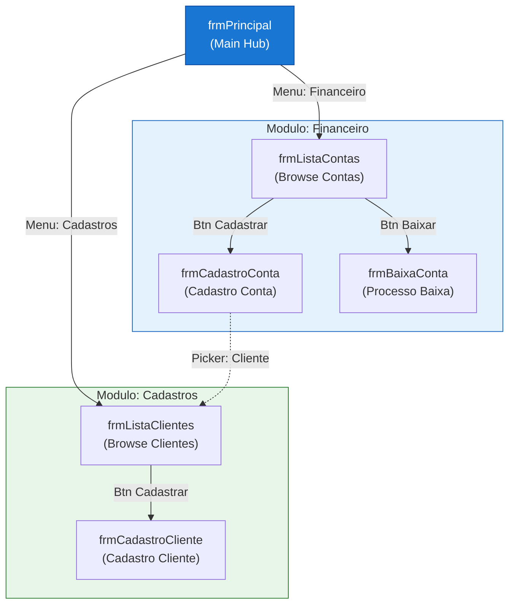

# Screen Navigation Flow — Mermaid Template (Stack-Agnostic)

> Reusable template for any agent/skill that generates `screen-navigation-map.md` or `screen-flow.mmd`.
> Referenced by: `parser-contracts.md`, `documentation-asis.md`, and any future TO-BE screen mapping agents.

---

## Quando Usar

- Skill **Screen Flow Mapper** (`FT`) de qualquer stack (Delphi, .NET, Java, Node, etc.)
- Qualquer agente que produza `screen-navigation-map.md` ou `screen-flow.mmd`
- Diagramas de navegação TO-BE (SPA routes, mobile screens)

---

## Regras de Formato (OBRIGATÓRIO)

### 1. Tipo de Diagrama
- SEMPRE `flowchart TD` (top-down) ou `flowchart LR` (left-right para fluxos lineares)
- NUNCA `graph TB` (legado) — incompatível com Mermaid v11

### 2. Nós (Nodes)
- **ID**: alias curto em UPPER_SNAKE (`CP_BROWSE`, `MAIN`, `LOGIN_SCREEN`)
- **Label**: `"formName (descricao funcional)"` — max 40 chars por linha
- **Hub principal**: destaque visual com `style NODE fill:#1976d2,color:#fff,stroke:#0d47a1`
- IDs permitidos: somente `[A-Za-z0-9_]`

### 3. Arestas (Edges) — Navegabilidade
- **Navegação direta**: `-->|"trigger/ação"|` (ex: `-->|"Btn Cadastrar"|`)
- **Lookup/Picker modal**: `-.->|"Picker: entidade"|` (linha tracejada)
- **Retorno/voltar**: `-->|"Btn Voltar"|` ou omitir se implícito (evita poluição)
- Labels SEMPRE com aspas duplas: `|"texto"|`
- O **trigger** é obrigatório — identifica COMO o usuário chega ao destino (botão, menu, link, rota)

### 4. Agrupamento (Subgraphs)
- `subgraph ALIAS["Modulo: NomeFuncional"]`
- Um subgraph por módulo/bounded context/feature area
- Fechar SEMPRE com `end`
- Estilizar com `style ALIAS fill:#e3f2fd,stroke:#1565c0` (cores por módulo)

### 5. Comentários e Organização
- Separar seções do diagrama com `%% ─── Título ───`
- Declarar TODOS os nós antes das arestas (dentro do subgraph)
- Um nó por linha

---

## Variantes por Stack

| Stack | Nó = | Trigger (edge label) = | Exemplo nó |
|---|---|---|---|
| **Delphi VCL** | frmNome (TForm/TFrame) | imgButton / BtnAction / MenuItem | `CP["frmContasPagar (Cadastro CP)"]` |
| **Angular/React SPA** | Route path / Component | routerLink / navigate() / onClick | `DASH["/dashboard (Dashboard)"]` |
| **ASP.NET MVC** | Controller/Action | ActionLink / form submit / redirect | `EDIT["Edit/5 (Edit Customer)"]` |
| **API-first (headless)** | Endpoint group | HTTP verb + route | `POST_CP["POST /contas-pagar (Create Payable)"]` |
| **Mobile iOS** | ViewController / Screen | segue / pushViewController | `HOME["HomeVC (Home Screen)"]` |
| **Mobile Android** | Fragment / Activity | NavController / Intent | `LIST["ListFragment (Lista Items)"]` |

---

## Template Exemplar Completo

---

## Mermaid v11.14.0 Guardrails (OBRIGATÓRIO)

> Ver regras completas: [MermaidGuardrails](../../../modules/ava-fabric-agents/shared/mermaid-guardrails.md)
>
> **Complemento específico deste template:** usar SEMPRE `flowchart TD` (nunca `flowchart TB`) para screen-navigation — fluxo top-down é requisito de legibilidade de navegação de telas.

---

## Checklist de Validação

Antes de considerar o diagrama completo, verificar:

- [ ] Todos os forms/screens do inventário estão representados como nós
- [ ] Cada aresta tem label descritivo do trigger (botão, menu, link, rota)
- [ ] Lookups/pickers usam linha tracejada (`-.->`)
- [ ] Subgraphs agrupam por módulo funcional
- [ ] Hub principal tem estilo visual destacado
- [ ] Nenhum nó órfão (sem conexão)
- [ ] IDs usam apenas `[A-Za-z0-9_]`
- [ ] Labels não excedem 40 chars por linha (usar ` ` para quebra)

---

## Anti-Patterns (NÃO FAZER)

| Errado | Correto | Motivo |
|---|---|---|
| Nós sem label descritivo (`A --> B`) | `A -->\|"Btn Salvar"\| B` | Sem trigger = sem navegabilidade |
| Só módulo e nome (`Financeiro → Contas Pagar`) | Forms reais com ação | Perde rastreabilidade para código |
| `graph TB` | `flowchart TD` | `graph` é legado Mermaid |
| Label sem aspas: `\|label\|` | `\|"label"\|` | Aspas obrigatórias para compatibilidade |
| Subgraph genérico sem nós internos | Subgraph com forms declarados | Evita diagrama vazio |
| Tilde em label: `A ~B` | `A["B"]` | `~` quebra lexer v11 fora de classDiagram |
| Aspas curvas: `"label"` | `["label"]` | Aspas curvas (U+201C/201D) corrompem tokenização |
| `→` em label de aresta | `-->` | Seta unicode não é operador Mermaid válido |
| **Self-loop: `A -->\|"btnNova"\| A`** | **Omitir a aresta completamente** | Auto-arestas (nó → mesmo nó) causam artefatos de layout no motor de renderização e representam erro lógico no mapa de navegação — um botão "Nova" dentro de um form não navega para esse mesmo form |
| `subgraph "Nome com Espaço"` | `subgraph NomeSemEspaco["Nome com Espaço"]` | Subgraph sem alias ID causa parse error em Mermaid v11 quando o nome contém espaços ou caracteres especiais |
